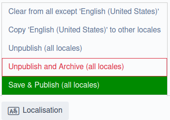

Silverstripe only commercially supports version 4.x of [tractorcow/silverstripe-fluent](https://github.com/tractorcow-farm/silverstripe-fluent) with the 4.x major release line of Silverstripe CMS - however, the fluent module also has versions 5.x and 6.x which are compatible with Silverstripe CMS 4.x.

This documents some of the breaking and functional changes across these three major release lines of the fluent module, as well as some key things to look out for and general guidelines on how to adapt your code to be compatible with the latest version.

- [Breaking API changes](#breaking-api-changes)
- [Localisation settings](#localisation-settings)
  - [Locale fallback](#locale-fallback)
  - [User permissions](#user-permissions)
  - [Enhanced CMS UI](#enhanced-cms-ui)
- [Localised versioned history](#localised-versioned-history)
  - [Standard Versioned methods](#standard-versioned-methods)
- [Localised relations](#localised-relations)
- [Quality of life changes](#quality-of-life-changes)
- [Unit tests](#unit-tests)
- [Further reading](#further-reading)

## Breaking API changes

Fluent v5 and v6 both introduced some breaking API changes.

### Fluent v5 {#breaking-api-changes-v5}

- `TractorCow\Fluent\Extension\FluentBadgeExtension` class was removed (use `TractorCow\Fluent\Extension\Traits\FluentBadgeTrait` instead)
- `TractorCow\Fluent\Extension\FluentExtension::LocaleInformation()` returns `RecordLocale` (used to be `ArrayData`)
- `TractorCow\Fluent\Extension\FluentExtension::getSelectedLanguage()` returns `RecordLocale` (used to be `ArrayData`)
- `TractorCow\Fluent\Model\CachableModel::getCached()` (this is a trait so by extension everything which uses it) returns `ArrayList|static[]` (used to be `ArrayList`)
- `TractorCow\Fluent\Model\Domain::getLocales()` returns `ArrayList|Locale[]` (used to be just `ArrayList`)
- `TractorCow\Fluent\Model\Locale::getLocales()` returns `ArrayList|Locale[]` (used to be just `ArrayList`)

#### Deprecated {#deprecated-v5}

- `TractorCow\Fluent\Extension\FluentExtension::getLinkingMode()` (Use `LocaleInformation()` instead)
- `TractorCow\Fluent\Extension\FluentExtension::LocaleLink()` (Use `LocaleInformation()` instead)

### Fluent v6 {#breaking-api-changes-v6}

- `TractorCow\Fluent\Extension\FluentExtension::requireSavedInLocale()` method was removed (use `getInheritanceMode()` instead)
- `TractorCow\Fluent\Extension\Traits\FluentObjectTrait::LinkedLocales()` now returns `ArrayList|Locale[]` (used to be `DataList|Locale[]`)
- `TractorCow\Fluent\Model\Locale::getCurrentLocale()` now explicitly returns `?Locale` (used to be dynamic)
- `TractorCow\Fluent\Model\Locale::getByLocale()` now explicitly returns `?Locale` (used to be dynamic)
- `TractorCow\Fluent\Extension\FluentExtension::updateLocalisationTabConfig()` no longer does permissions checks - it expects those checks to be handled by the relevant `GridField` components
- `TractorCow\Fluent\Forms\GroupActionMenu::getColumnContent()` no longer includes disabled actions in the returned markup

## Localisation settings

Changes to various localisation settings.

### Locale fallback

Locale fallback logic and options have changed significantly.

In Fluent v5, the `DataObject.cms_publish_required` configuration property was renamed to `DataObject.cms_localisation_required`.

[info]
If you have set `cms_publish_required` configuration in your yaml configuration files, `Extension` class, or `DataObject` models, change these to `cms_localisation_required` instead.
[/info]

#### Fallback changes in Fluent v6 {#locale-fallback-v6}

The values for the `DataObject.frontend_publish_required` and `DataObject.cms_localisation_required` config properties changed from boolean to the strings "any", "fallback", and "exact".

If you had set either property to `true` in previous versions, this is the equivalent of the new "exact" value, where `false` is the equivalent of "any".

[hint]
If you're setting these values in an extension or model with the private static properties, you can use the constants from `FluentExtension` (e.g. `FluentExtension::INHERITANCE_MODE_EXACT`).
[/hint]

|             | `frontend_publish_required`    | `cms_localisation_required`   |
|-------------|--------------------------------|-------------------------------|
| Old default | `true` (equivalent of "exact") | `false` (equivalent of "any") |
| New default | "fallback"                     | "any"                         |

Here's what the new values actually mean:

| "any" | "fallback" | "exact"
|-----|-----|-----|
| Content for this record must exist in any locale _or the base (unlocalised) record_. | Content for this record must exist in the current locale _or_ a specific fallback locale, as defined through the Locales admin section. | Content for this record _must_ exist in the current locale to be used. |

[notice]
Review localisation settings on all of your models and migrate to the correct value. _Do not_ just swap to the new equivalent of your old value unless you explicitly want to keep that behaviour. Instead, consider whether the new functionality warrants a change to a different option.
[/notice]

### User permissions

Fluent v5 introduced more granular permission management.

|                           | **Fluent 4** | **Fluent 5** | **Fluent 6** |
|---------------------------|--------------|--------------|--------------|
| Locale permission support | No           | Yes          | Yes          |

[hint]
If you're upgrading from Fluent v4, review your requirements for user permissions in the context of locales and update the permissions as needed. For example you may have content authors who should only be allowed to edit content for specific locales.
[/hint]

### Enhanced CMS UI

Fluent 5 introduced some new configurable UI actions, including a new `Localisation` tab in the edit form for localised models where you see and manage the localisation status of each record. The `Localisation` tab is referred to in documentation as the "localisation manager".

|               | `localise_actions_enabled` | `batch_actions_enabled` | `copy_from_locale_enabled` | `copy_to_locale_enabled` |
|---------------|--------|--------|--------|--------|
| Default value | `true` | `true` | `true` | `true` |
| Functionality | Enable localise actions for records which are not available in the current locale (copy to draft, copy & publish and Localise actions) | Enable "Localisation" actions in the edit form. More about this below. | Enable "copy from locale" action in the localisation manager | Enable "copy to locale" action in the localisation manager |

As mentioned in the table above, the `batch_actions_enabled` configuration value controls whether a new "Localisation" action group appears in the edit form. This is not to be confused with the "batch actions" menu in the site tree.



[hint]
Review available CMS UI components and enable those that you need.
[/hint]

## Localised versioned history

One of the major improvements in Fluent v6 is that version history actually works correctly _out of the box_ now. For example, you can see all of the version history for a record _for each locale_, and rollback changes _per locale_. This wasn't possible in version 4 and 5.

The following actions in the history tab in the CMS are affected:

- view version
- compare version
- rollback to version

|       | **Fluent v4** | **Fluent v5** | **Fluent v6** |
|-------|--------------|--------------|--------------|
| Versioned history support | No | No | Yes |
| Out of the box support of [Versioned snapshots module](https://github.com/silverstripe/silverstripe-versioned-snapshot-admin) | No | No | Yes |
| Data source of standard Versioned methods | Base record | Base record | Localised record |

### Standard Versioned methods

Fluent 6 alters how many of the [`Versioned`](api:SilverStripe\Versioned\Versioned) methods work as the data source is changed to use the localised tables. This has a large impact on the CMS UI and behaviour (as mentioned in the previous section).

Examples of impacted methods:

- [`isOnDraft()`](api:SilverStripe\Versioned\Versioned::isOnDraft())
- [`isPublished()`](api:SilverStripe\Versioned\Versioned::isPublished())
- [`isArchived()`](api:SilverStripe\Versioned\Versioned::isArchived())
- [`stagesDiffer()`](api:SilverStripe\Versioned\Versioned::stagesDiffer())

Simply put, any code you have checking the versioned state of a record used to return results for the base (unlocalised) record. To get the result for the localised record, specialised methods had to be called.

Now the result for the _localised_ record is returned instead. To get the result for the unlocalised record, you must wrap the call with `FluentState::singleton()->withState()` and set the temporary state to null. For example:

#### Code examples {#fluent-versioned-examples}

##### Fluent v4 and v5 {#fluent-versioned-example-v4-v5}

```php
// Data source: base (unlocalised) record
$model->isPublished();

// Data source: localised record
$model->isPublishedInLocale();
```

##### Fluent v6 {#fluent-versioned-example-v6}

```php
// Data source: base (unlocalised) record
FluentState::singleton()->withState(function (FluentState $state): bool {
    $state->setLocale(null);
    return $model->isPublished();
});

// Data source: localised record (both give the same result)
$model->isPublished();
$model->isPublishedInLocale();
```

[/warning]
It's common for Fluent 4 projects to have a lot of custom code to
achieve the same result as this feature. Any such custom code needs to be
identified and removed as a part of the upgrade as it's likely going to
clash with this feature.
[/warning]

## Localised relations

This feature allows relations to be localised without having to add custom functionality to support it.

|                             | **Fluent 4** | **Fluent 5** | **Fluent 6** |
|-----------------------------|--------------|--------------|--------------|
| Localised relations support | No           | Yes          | Yes          |

If you have implemented custom functionality to support localising relations, you will need to remove that code. There are a couple of different strategies available for localising relations, and your specific localisation requirements will help you decide which is more appropriate.

Regardless of which strategy you choose, you will need to apply `FluentExtension` (or `FluentVersionedExtension` for versioned models) to both classes.

If the locales you support in your project all have the same structure (i.e. you want to keep all the same related objects in the same places) then this is all you need to do. This strategy is called "localise by content" AKA "direct localisation".

If your locales have a different structure (i.e. you may want different related objects in different locales), you will need to set the `$localised_copy` configuration for the relation. This works very similarly to [`$cascade_duplicates`](/developer_guides/model/relations/#cascading-duplications), except it is explicitly for when you copy content across locales.

```php
class HomePage extends Page
{
    private static $db = [
        'Title' => 'Varchar',
    ];

    private static $has_one = [
        'Banner' => Banner::class,
    ];

    private static $localised_copy = [
        'Banner',
    ];
}
```

[note]
You cannot simply localise the `BannerID` field and expect the relation to be localised, as that won't copy the `Banner` object to the new locale.
[/note]

This strategy is called "localise by relation" AKA "indirect localisation". We recommend this approach in most cases.

See [localised copy](https://github.com/tractorcow-farm/silverstripe-fluent/blob/6/docs/en/localised-copy.md) for more details.

## Quality of life changes

These changes aren't likely to break anything in your project, but we recommend you review them as you may be implementing some of these features in custom code. If that's the case, you can now remove that custom code in favour of the new API, which reduces your maintenance burden.

|                       | **Fluent 4** | **Fluent 5** | **Fluent 6** |
|-----------------------|--------------|--------------|--------------|
| Record locale         | No           | Yes          | Yes          |
| Current locale object | No           | Yes          | Yes          |
| Copy to locale        | No           | No           | Yes          |

- **Record locale** - Object that represents details of a specific `DataObject` record in a specific locale
  - returned from the `LocaleInformation()` method on every localised model
  - you can also get the `RecordLocale` for _all locales_ available for a record by calling `Locales()`
- **Current locale object** - The current locale model available as a global template provider
  - use `$CurrentLocaleObject` in a template
  - provides all the information about the current locale, not just the locale code or title
- **Copy to locale** - The ability to copy a record to another locale via a single method call
  - available via the `copyToLocale()` method on every localised model

## Unit tests

Some unit tests may break. There's no one solution for problems you may encounter, but some general recommendations that might help are:

- avoid localised tables in yaml fixtures
  - localise models in your PHP code instead, either in the `setUp()` method or via ORM calls (for example explicitly calling [`$obj->write()`](api:SilverStripe\ORM\DataObject::write()) after fetching the fixture object)
- avoid including version history in your yaml fixtures
  - use ORM methods like [`$obj->publishRecursive()`](api:SilverStripe\Versioned\RecursivePublishable:publishRecursive()) after fetching the fixture objects instead

## Further reading

- [Fluent 6 documentation](https://github.com/tractorcow-farm/silverstripe-fluent/tree/6/docs)
