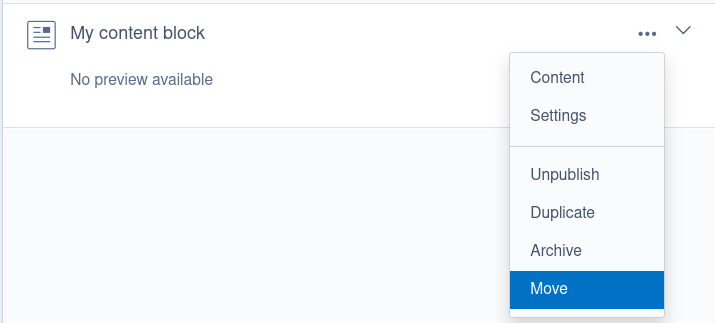
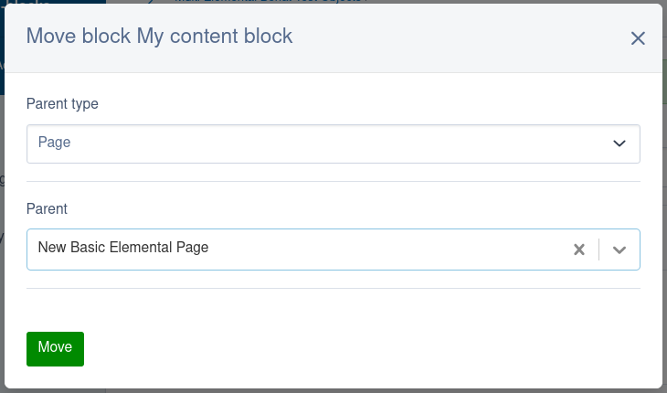

# 6.2.0

## Overview

<details>

<summary>Included module versions</summary>

<!-- markdownlint-disable enhanced-proper-names -->

| Module | Version |
| ------ | ------- |
| colymba/gridfield-bulk-editing-tools | 5.2.0 |
| dnadesign/silverstripe-elemental | 6.2.0 |
| dnadesign/silverstripe-elemental-userforms | 5.1.0 |
| silverstripe/admin | 3.2.0 |
| silverstripe/asset-admin | 3.2.0 |
| silverstripe/assets | 3.2.0 |
| silverstripe/campaign-admin | 3.2.0 |
| silverstripe/cms | 6.2.0 |
| silverstripe/config | 3.1.0 |
| silverstripe/dynamodb | 6.0.0 |
| silverstripe/environmentcheck | 4.1.0 |
| silverstripe/errorpage | 3.1.0 |
| silverstripe/framework | 6.2.0 |
| silverstripe/graphql | 6.1.1 |
| silverstripe/gridfieldqueuedexport | 4.1.0 |
| silverstripe/htmleditor-tinymce | 1.1.0 |
| silverstripe/installer | 6.2.0 |
| silverstripe/linkfield | 5.2.0 |
| silverstripe/login-forms | 6.2.0 |
| silverstripe/lumberjack | 4.1.0 |
| silverstripe/mfa | 6.2.0 |
| silverstripe/mimevalidator | 4.0.0 |
| silverstripe/realme | 6.0.3 |
| silverstripe/recipe-cms | 6.2.0 |
| silverstripe/recipe-core | 6.2.0 |
| silverstripe/recipe-kitchen-sink | 6.2.0 |
| silverstripe/recipe-plugin | 2.1.0 |
| silverstripe/reports | 6.2.0 |
| silverstripe/segment-field | 4.1.0 |
| silverstripe/session-manager | 3.1.1 |
| silverstripe/sharedraftcontent | 4.2.0 |
| silverstripe/siteconfig | 6.1.1 |
| silverstripe/spamprotection | 5.0.0 |
| silverstripe/startup-theme | 1.0.12 |
| silverstripe/staticpublishqueue | 7.0.2 |
| silverstripe/tagfield | 4.2.0 |
| silverstripe/taxonomy | 4.2.0 |
| silverstripe/template-engine | 1.0.0 |
| silverstripe/textextraction | 5.0.1 |
| silverstripe/totp-authenticator | 6.1.0 |
| silverstripe/userforms | 7.1.0 |
| silverstripe/vendor-plugin | 3.0.0 |
| silverstripe/versioned | 3.2.0 |
| silverstripe/versioned-admin | 3.2.0 |
| symbiote/silverstripe-advancedworkflow | 7.2.0 |
| symbiote/silverstripe-gridfieldextensions | 5.2.0 |
| symbiote/silverstripe-queuedjobs | 6.2.0 |
| tractorcow/silverstripe-fluent | 8.2.0 |

<!-- markdownlint-enable enhanced-proper-names -->

</details>

## Security considerations {#security-considerations}

This release includes one security fix. Review the vulnerability disclosure for a more detailed description of the security fix. We highly encourage upgrading your project to include the latest security patch.

We have provided a severity rating of the vulnerability below based on the CVSS score. Note that the impact of the vulnerability could vary based on the specifics of each project. You can [read the severity rating definitions in the Silverstripe CMS release process](/contributing/release_process/#severity-rating).

- [CVE-2026-24749 DBFile permission bypass](https://www.silverstripe.org/download/security-releases/cve-2026-24749) Severity: Medium

This security fix has also been released in patches for `silverstripe/assets` 2.4 and 3.1.

## Accessibility improvements

### Skip nav link added

A skip link has been added to the CMS to allow users to skip past the main navigation. This is primarily for users who use a screen reader or who navigate via the keyboard. The link is visually hidden until it receives focus by pressing the tab key.

### Roving tabindex

We've implemented roving tabindex for some UI regions within the CMS. These areas now act as a single tab stop, allowing users to navigate internal items with arrow keys and skip the entire section with a single tab. This aligns with standard ARIA practices for keyboard-accessible navigation.

### Keyboard navigation for the site tree

Keyboard navigation has been added for the site tree within the CMS, which now uses a [roving tabindex](#roving-tabindex). Users can now navigate, expand, and collapse tree nodes using arrow keys or the tab key. The "End" and "Home" keys move focus to the top and bottom page in the current nesting level. The "Enter" key opens the edit form for the page, and (when "batch actions" mode has been activated) the space bar selects the page.

### Keyboard navigation for "Files" admin section

Keyboard navigation has been improved in the "Files" admin section. The files gallery and table views both now use a [roving tabindex](#roving-tabindex).

Users can now navigate between files and folders in the gallery view using arrow keys. The "End" and "Home" keys move focus to the first and last items in the current row, and holding control with those keys moves focus to the first and last items in the gallery respectively.

In the table view, the up and down arrow keys navigate between rows, with "Home" and "End" navigating to the top and bottom row respectively. The left and right arrow keys allow users to focus on individual cells in the table, which is useful for screen reader users.

In both views, pressing "Space" on a focused file or folder selects it. Pressing "Enter" on a focused file or folder is the same as clicking on it.

Various other attributes have also been added as appropriate so that screen reader users can navigate the asset admin.

### Keyboard sorting for elemental blocks

Elemental blocks can now be reordered using the keyboard in the CMS. There is now a keyboard focusable drag handle which can be activated using the "Space" or "Enter" keys, and sorted using the "Up" and "Down" arrow keys.

### Improved keyboard navigation for tabs

The CMS now supports keyboard navigation between tabs using the left and right arrow keys (go to the previous or next tab) and the Home and End keys (go to the first and last tab). When a user sets focus on a tab using the keyboard, the relevant tab panel is automatically displayed, removing the need to press Enter or Space to activate the tab.

Previously, keyboard navigation for tabs was inconsistent.

### Campaign admin help menu improvements

The help menu in campaign admin has been improved to make it easier to use for keyboard and screen reader users. The help icon is no longer shown when the help menu is open as it's not required as the close button is sufficient.

When the help menu is opened or closed, focus is moved to the relevant button so that keyboard users can easily find it.

### Sortable header ARIA attributes

Sortable headers on a grid field and asset-admin table view now include `aria-sort` attributes that indicate the current sort direction of the column.

### Screen reader improvements for pagination

Pagination controls in grid fields and asset-admin now have an improved experience for screen reader users, with the use of a `nav` tag with an `aria-label` attribute instead of a `div`, and a more descriptive `title` attribute on the pagination control showing the current page.

### Changes to admin section HTML markup

- The `.cms-menu` element tag has been changed from a `div` to a `nav`.
- Inside `.cms-panel` elements, the `a.toggle-collapse` and `a.toggle-expand` links have been replaced with a single `button.cms-panel-toggle__button` element.
- In the `silverstripe/linkfield` module, the `.link-picker__delete` element has been moved up a level so that it is now a child of `.link-picker__link` and its tag has changed from `span` to `button`.
- The viewport meta tag no longer includes `maximum-scale=1.0`, which prevented users from zooming in on mobile devices. It now includes `initial-scale=1.0` instead.
- The `.cms-container` element has a new child `.cms-container-skip-link-target` element which contains the main content of the CMS, excluding the left-hand navigation.
- The `a.campaign-info__close` element in campaign admin has been changed to `button.campaign-info__close`.
- The child elements of `.campaign-info` have been reordered.
- The `ins.jstree-icon` elements now have `tabindex="0"` so they can receive keyboard focus.
- The site tree expander arrows have been changed from `<ins>` to `<span>` to remove the incorrect semantic markup.
- The "Go to previous record" and "Go to next record" buttons in a GridField detail form, when disabled, have changed from a `span` element to an `a` element with an `aria-disabled="true"` attribute.
- `.grid-field__paginator__controls` and `.paginator-footer` elements have been changed from using a `div` tag to a `nav` tag.

### Changes to HTML markup elsewhere

- In the `silverstripe/sharedraftcontent` module, the markup for the message on the front-end has changed to use `<details>` and `<summary>` elements for the expand/collapse functionality and a `<dl>` list instead of a `<ul>` list.

### Changes to usage of `font-icon-*` CSS classes

The `font-icon-*` CSS classes are used to add icons through the CMS use a font to render normal characters as icons.

This is very useful for sighted users, but represents a problem for screen reader users, since screen readers want to read the icons like normal characters. For example, the `font-icon-search` icon uses the character "s", so screen readers will read out "s" whenever they encounter that icon.

In many places in the CMS markup we have added `aria-hidden="true"` to elements using `font-icon-*` CSS classes. Often this has required removing the CSS class from the element it was on, and adding it instead to a child `<span>` element. We have also changed some `<i>` elements into `<span>` elements for consistency.

The [`FormAction::setIcon()`](api:SilverStripe\Forms\FormAction::setIcon()) (and through inheritance [`GridField_FormAction::setIcon()`](api:SilverStripe\Forms\GridField\GridField_FormAction::setIcon())) method is now used to define the `font-icon-*` class which will be added to the button's child `<span>` element.

Built-in grid field components implementing [`GridField_ActionMenuItem`](api:SilverStripe\Forms\GridField\GridField_ActionMenuItem) or [`GridField_ActionMenuLink`](api:SilverStripe\Forms\GridField\GridField_ActionMenuLink) now include the icon (without the `font-icon-` prefix) in the associative array returned from `getExtraData()`. Custom classes implementing these interfaces should do the same, so that the icon can be rendered in an accessible way.

If you were relying on an element having a CSS class that starts with `font-icon-` in the CMS, please review your code, as the CSS class you're looking for may be on a child element now.

If your own code uses a `font-icon-*` CSS class, we recommend adding `aria-hidden="true"` if the icon is purely decorative. If the icon is needed to present information that isn't presented with text, we recommend moving the icon into a child element, and adding an `aria-label` attribute to your parent element so screen readers have the same context as sighted users.

If your icon is being added to a `FormAction` or `GridField_FormAction`, we recommend using `setIcon()`. Pass the icon name without the `font-icon-` prefix.

If you are using the `Modal` component from `react-strap` inside the CMS, the close button icon may be missing. We recommend using the `components/Modal/Modal` component provided by `silverstripe/admin` instead, which wraps the `react-strap` modal but adds an accessible close button that matches the CMS styling. See [using Silverstripe CMS react components](/developer_guides/customising_the_admin_interface/reactjs_and_redux/#using-cms-react-components) for more details.

Functionality has also been added to allow swapping icons in an accessible way for alternating buttons (e.g. the save and publish buttons). See [how to implement an alternating button](/developer_guides/customising_the_admin_interface/how_tos/cms_alternating_button/) (which has been updated) for details.

### Improved contrast and focus states

Contrast has been improved in various areas, including in the TinyMCE HTML editor. In some cases the contrast improvement has also included a change in the colour used.

Focus states across the CMS have also been standardised, using a blue outline for most elements. Where the blue outline was too dark, a white outline is now used.

These changes, especially the change to focus state styling, may result in styles in your custom components no longer matching the CMS styles. We recommend checking if your styles match the CMS styles after upgrading.

The new focus styling uses CSS variables, so you can easily change the values and use them to style your own components. The CSS variables in use are:

|CSS variable name|usage|
|---|---|
|`--focus-outline-width`|Used with the first argument to the `outline` CSS property, or as the value for the `outline-width` CSS property.|
|`--focus-outline-style`|Used with the second argument to the `outline` CSS property, or as the value for the `outline-style` CSS property.|
|`--focus-outline-color`|Used with the third argument to the `outline` CSS property, or as the value for the `outline-color` CSS property.|
|`--focus-outline-color-inverted`|Used when `--focus-outline-color` is too dark. Set `--focus-outline-color: var(--focus-outline-color-inverted)` or set the `outline-color` property directly.|
|`--focus-outline-offset`|Used with the `outline-offset` CSS property.|
|`--focus-outline-offset-inset`|Places the outline inside the element - used when there isn't enough space for an outline outside the element's bounds. Set `--focus-outline-offset: var(--focus-outline-offset-inset)` or set the `outline-offset` property directly.|

## Features and enhancements

### Unsaved changes indicator {#unsaved-changes-indicator}

A new unsaved changes indicator has been introduced to CMS edit forms. The indicator appears after a configurable amount of time after starting to edit a form, providing real-time visual alerts when changes have been made but not yet saved. This helps users keep track of their work and prevent accidental data loss by making unsaved modifications more apparent.


The indicator appears as a "notice" after a configurable initial period (defaulting to five minutes) and escalates to a more prominent "warning" after a second configurable interval (defaulting to ten minutes). This escalation ensures users are increasingly aware of long-standing unsaved changes.

See [unsaved changes indicator](/developer_guides/customising_the_admin_interface/unsaved_changes_indicator/) instructions on how to configure the indicator.

### PHP 8.5 support {#php-8-5-support}

All [supported modules](/project_governance/supported_modules/) have been updated to support PHP 8.5, this means that Silverstripe CMS 6.2.0 can be run on PHP 8.5 without issues.

Note that some third-party modules may not yet support PHP 8.5, so PHP deprecation warnings may still show for those if your PHP error reporting is set to report all deprecations.

### Move elemental blocks

The [dnadesign/silverstripe-elemental](/optional_features/elemental/) module now includes functionality that allows elemental blocks to be moved from one parent record to another. This includes moving blocks between different elemental areas on the same parent record.



The move form has been designed for flexibility and will automatically hide fields if there's only one option available. For example:

- If your selected parent record has only one elemental area relation, the dropdown for selecting an elemental area won't be displayed.
- If there are multiple elemental area relations, the dropdown will be available.



### Automatic retries for queued jobs

The [symbiote/silverstripe-queuedjobs](/optional_features/queuedjobs/) module now has the ability to automatically retry broken or paused jobs. By default no jobs will be retried, but you can easily enable this for all jobs by setting [`AbstractQueuedJob.retry_max_attempts`](api:Symbiote\QueuedJobs\Services\AbstractQueuedJob->retry_max_attempts) to the maximum number of times you want to retry jobs.

Using the new configuration properties, you have a lot of control over the number of retries, how long each retry takes, etc. The example below makes each retry attempt take exponentially longer than the previous one. You can also randomise that delay to prevent clobbering your site and any external services your jobs might connect to.

```yml
Symbiote\QueuedJobs\Services\AbstractQueuedJob:
  # Exponential retry pattern
  # First retry attempt - Retry after 10 minutes
  # Second retry attempt - Retry after 20 minutes
  # Third retry attempt - Retry after 40 minutes
  # Fourth retry attempt - Retry after 80 minutes
  retry_max_attempts: 4
  retry_initial_delay: 600
  retry_falloff_multiplier: 2
  retry_falloff_multiplier_variance: 0
```

This new configuration can also be set for individual job classes, allowing for a lot of flexibility in how jobs are rerun - as well as several new configuration options on [`QueuedJobService`](api:Symbiote\QueuedJobs\Services\QueuedJobService) which define how it manages queuing up automatic retry runs.

See [the queued jobs troubleshooting guide](/optional_features/queuedjobs/troubleshooting/#stuck-jobs) for examples and more details.

### Pass arbitrary attributes with requirements API {#requirements-attributes}

When using [`Requirements_Backend`](api:SilverStripe\View\Requirements_Backend) as your requirements API backend (which is the default), you can now pass arbitrary attributes for JavaScript and CSS (`<script>` and `<link>` tags) using the `$options` argument in various methods.

This is supported through the [`Requirements_Backend::javascript()`](api:SilverStripe\View\Requirements_Backend::javascript()), [`Requirements_Backend::customScriptWithAttributes()`](api:SilverStripe\View\Requirements_Backend::customScriptWithAttributes()),[`Requirements_Backend::combine_files()`](api:SilverStripe\View\Requirements_Backend::combine_files()), and [`Requirements_Backend::css()`](api:SilverStripe\View\Requirements_Backend::css()) methods - as well as the corresponding methods in the [`Requirements`](api:SilverStripe\View\Requirements) class.

The [requirements API documentation](/developer_guides/templates/requirements/) has been updated to reflect these changes.

Note that the order of attributes in the `<script>` and `<link>` HTML elements injected by the Requirements API may change as a result of this.

If you have implemented a custom requirements backend, we recommend updating it to handle arbitrary attributes passed into the various `$options` parameters.

### Filter archived records

The "Archive" admin section now uses [`GridFieldFilterHeader`](api:SilverStripe\Forms\GridField\GridFieldFilterHeader) and [`SearchContext`](api:SilverStripe\ORM\Search\SearchContext) to allow filtering archived records. The available filters are whatever is defined in [`searchable_fields`](/developer_guides/model/scaffolding/#searchable-fields) for that class, with the below changes:

- For page records, the "Page status" filter field is removed in the archive admin filter form. That filter is used in the "Pages" section to filter by different versioned states, but isn't needed here.
- For all archived records a "Date Archived" filter is added to filter by a range of archive dates.

To facilitate this functionality, we've added a way to add extra searchable field configuration to a `SearchContext` instance through [`SearchContext::addAdditionalFieldSpecs()`](api:SilverStripe\ORM\Search\SearchContext::addAdditionalFieldSpecs()) and [`SearchContext::setAdditionalFieldSpecs()`](api:SilverStripe\ORM\Search\SearchContext::setAdditionalFieldSpecs()). If you implement a custom `SearchContext` subclass, you should use [`SearchContext::getSearchFieldsSpec()`](api:SilverStripe\ORM\Search\SearchContext::getSearchFieldsSpec()) instead of directly calling [`searchableFields()`](api:SilverStripe\ORM\DataObject::searchableFields()).

### Filter campaigns

The "Campaigns" admin section which is added through [`silverstripe/campaign-admin`](https://github.com/silverstripe/silverstripe-campaign-admin/) now uses [`GridFieldFilterHeader`](api:SilverStripe\Forms\GridField\GridFieldFilterHeader) and [`SearchContext`](api:SilverStripe\ORM\Search\SearchContext) to allow filtering campaigns.

You can filter by the name and description of the campaign, its status, and the publish date. This is all powered by [`searchable_fields`](/developer_guides/model/scaffolding/#searchable-fields) configuration for the [`ChangeSet`](api:SilverStripe\Versioned\ChangeSet) class, so you can customise the search fields by changing that configuration if you want to.

### Good bye, base tag

The `<base>` tag that Silverstripe CMS has long since used can cause issues, for example with server configuration, reverse proxies, and fragment links. It is not actually necessary for Silverstripe CMS to function. In this release, we have fixed the remaining bugs in the admin UI that necessitated the base tag, and have deprecated it.

The admin UI still includes the base tag by default, and will do so until a future major release. You can remove that with the following configuration:

```yml
SilverStripe\View\SSViewer:
  enable_base_tag: false
  rewrite_hash_links: false
```

We encourage everyone to remove the `<% base_tag %>` directive from their templates, and to make this configuration change.

> [!NOTE]
> When [`SSViewer.enable_base_tag`](api:SilverStripe\View\SSViewer->enable_base_tag) is set to false, the [`AdminRootController::admin_url()`](api:SilverStripe\Admin\AdminRootController::admin_url()) method now returns URLs of the form `/admin/pages` (or `/mysite/admin/pages` if you site runs in a subfolder) instead of `admin/pages`. If you call this method directly, it might pay to make sure your logic can handle this scenario (e.g. if doing string-matching on the value).

### Rate-limited password strength checking no longer blocks password changes {#rate-limit-strength-exclusion}

The password strength meter on the change password form fires AJAX requests on every keystroke to provide real-time feedback to users. With the default Security controller rate limit of 10 requests per minute, users found themselves blocked with HTTP 429 ("Too Many Requests") after typing just 10 characters, making the form unusable until the rate limit reset.

We've resolved this by adding URL pattern exclusion support to `RateLimitMiddleware`. This allows specific low-risk endpoints to bypass rate limiting entirely. The password strength endpoint is now excluded from rate limiting by default, since it only returns an entropy score and does not expose sensitive data or perform authentication-sensitive operations.

If you've configured custom rate limiting and need to exclude additional endpoints, you can do so by setting `ExcludedURLPatterns` in your middleware configuration:

```yml
SilverStripe\Core\Injector\Injector:
  SecurityRateLimitMiddleware:
    properties:
      ExcludedURLPatterns:
        - '#^path/to/endpoint$#'
        - '#^another/endpoint.*#'
```

Patterns are matched as regex against the request URL path and are validated at configuration time to catch invalid patterns early.

### Other new features and enhancements {#other-new}

- A new [`ChildFieldManager`](api:SilverStripe\Forms\ChildFieldManager) interface has been added to allow a parent form field to strictly control its children, but still allow setting/getting values for those fields let them handle AJAX requests. See [`ChildFieldManager` docs](/developer_guides/forms/field_types/childfieldmanager/) for more details.
- The `help` plugin is now added by default to all [`TinyMCEConfig`](api:SilverStripe\TinyMCE\TinyMCEConfig) instances. If you were adding it manually, you can remove that custom code. If for some reason you don't want that plugin in one of your configs, you can use [`TinyMCEConfig::disablePlugins()`](api:SilverStripe\TinyMCE\TinyMCEConfig::disablePlugins()) to remove it - but be aware that it is extremely useful for screen reader users to keep this plugin installed.
- [`HTML::createTag()`](api:SilverStripe\View\HTML::createTag()) now supports value-less boolean attributes. For example if you pass `HTML::create('input', ['readonly' => true])`, the result will be `<input readonly>`. Previously it would output as `<input readonly="1">`.
- The built-in session handlers [`FileSessionHandler`](api:SilverStripe\Control\SessionHandler\FileSessionHandler), [`CacheSessionHandler`](api:SilverStripe\Control\SessionHandler\CacheSessionHandler), and [`DatabaseSessionHandler`](api:SilverStripe\Control\SessionHandler\DatabaseSessionHandler) all now validate the session ID `PHPSESSID` to ensure it matches a valid format, otherwise a `RuntimeException` will be thrown.
- [`Hierarchy::duplicateWithChildren()`](api:SilverStripe\ORM\Hierarchy\Hierarchy::duplicateWithChildren()) used to set new sort values for duplicated children - it now uses the sort values from the original records.
- Fields returned from [`QueuedJobDescriptor::getCMSFields()`](api:Symbiote\QueuedJobs\DataObjects\QueuedJobDescriptor::getCMSFields()) have changed to improve the UX. If you were changing those fields (e.g. with a subclass or an extension implementing `updateCMSFields()`) you may need to adjust your code to account for these changes.
- In a [`GridField`](api:SilverStripe\Forms\GridField\GridField), if there are no actions in the [`GridField_ActionMenu`](api:SilverStripe\Forms\GridField\GridField_ActionMenu) component, the empty actions column (the column with the `col-Actions` CSS class) will be ommitted.
- Added the phone link option to the existing linking options in TinyMCE.
- The [`GridFieldAddNewInlineButton`](api:Symbiote\GridFieldExtensions\GridFieldAddNewInlineButton) component now adds rows to the top of your gridfield instead of the bottom, making them easier to edit right away without scrolling.
- The text for various buttons in the CMS have changed from "Add {record}" to "Add new {record}". The text uses new localisation keys:

    |Old key|New key|
    |---|---|
    |`SilverStripe\Forms\GridField\GridField.Add`|`SilverStripe\Forms\GridField\GridField.AddNew`|
    |`AssetAdmin.ADD_FOLDER_BUTTON`|`AssetAdmin.ADD_NEW_FOLDER_BUTTON`|
    |`CampaignAdmin.ADDCAMPAIGN`|`CampaignAdmin.ADDNEWCAMPAIGN`|
    |`SilverStripe\UserForms.ADDEMAILRECIPIENT`|`SilverStripe\UserForms.ADDNEWEMAILRECIPIENT`|
    |`SilverStripe\UserForms\Extension\UserFormFieldEditorExtension.ADD_FIELD`|`SilverStripe\UserForms\Extension\UserFormFieldEditorExtension.ADD_NEW_FIELD`|
    |`SilverStripe\UserForms\Extension\UserFormFieldEditorExtension.ADD_FIELD_GROUP`|`SilverStripe\UserForms\Extension\UserFormFieldEditorExtension.ADD_NEW_FIELD_GROUP`|
    |`SilverStripe\UserForms\Extension\UserFormFieldEditorExtension.ADD_PAGE_BREAK`|`SilverStripe\UserForms\Extension\UserFormFieldEditorExtension.ADD_NEW_PAGE_BREAK`|
    |`SilverStripe\UserForms\Model\UserDefinedForm.ADDEMAILRECIPIENT`|`SilverStripe\UserForms\Model\UserDefinedForm.ADDNEWEMAILRECIPIENT`|
    |`ElementAddNewButton.ADD_BLOCK`|`ElementAddNewButton.ADD_NEW_BLOCK`|
    |`LinkField.ADD_LINK`|`LinkField.ADD_NEW_LINK`|

- On a [`MultiLinkField`](api:SilverStripe\LinkField\Form\MultiLinkField), you can now set the maximum number of links that can be set on that field. See the [linkfield configuration documentation](/optional_features/linkfield/configuration/) for details.
- The [`DataObjectSchema::tableForField()`](api:SilverStripe\ORM\DataObjectSchema::tableForField()) method now uses a per-request in-memory cache to improve performance. If you adjust `DataObject` tables/fields mid-request, you may need to call `DataObject::getSchema()->reset()` after making those adjustments.
- The `silverstripe/framework` now allows `sebastian/diff` ^6, ^7, or ^8 to support projects using PHPUnit 12 or 13 instead of PHPUnit 11 which core uses.

## API changes

### Deprecated API

The following API has been deprecated in this release, and will be removed or replaced in a future major release.

It's best practice to avoid using deprecated code where possible, but sometimes it's unavoidable. This API will all continue to be available at least until the next major release.

- The [`DataList::getIDList()`](api:SilverStripe\ORM\DataList::getIDList()) method has been deprecated. Use `$list->sort(null)->column('ID')` instead.
- The [`Relation::getIDList()`](api:SilverStripe\ORM\Relation::getIDList()) method has been deprecated. Use `$list->sort(null)->column('ID')` instead.
- The [`EagerLoadedList::getIDList()`](api:SilverStripe\ORM\EagerLoadedList::getIDList()) method has been deprecated. Use `$list->column('ID')` instead.
- The [`UnsavedRelationList::getIDList()`](api:SilverStripe\ORM\UnsavedRelationList::getIDList()) method has been deprecated. Use `$list->column('ID')` instead.
- The `IconHOC` react component has been deprecated and will be removed in a future major release without a replacement. The `Button` component's `icon` prop will still remain.
- The [`FieldList::dataFields()`](api:SilverStripe\Forms\FieldList::dataFields()) method has been deprecated. Use[`FieldList::getDataFields()`](api:SilverStripe\Forms\FieldList::getDataFields()) instead.
- Use of `<% base_tag %>` in templates has been deprecated, as the base tag is not necessary for Silverstripe CMS to work.

## Bug fixes

This release includes a number of bug fixes to improve a broad range of areas. Check the change logs for full details of these fixes split by module. Thank you to the community members that helped contribute these fixes as part of the release!

### `DBField` options array

Some [`DBField`](api:SilverStripe\ORM\FieldType\DBField) implementations take an array of options in the constructor. This is notably used to set default values for [`DBString`](api:SilverStripe\ORM\FieldType\DBString) subclasses as documented in the [default values documentation](/developer_guides/model/data_types_and_casting/#default-values) but can be used for other purposes as well.

When creating columns in the database, the options array wasn't being correctly passed through to the constructor, which made setting default values for string columns impossible among other things. This has been fixed.
<!--- Changes below this line will be automatically regenerated -->
<!-- markdownlint-disable proper-names enhanced-proper-names -->## Full commits list

<details>
<summary>Reveal full list of commits</summary>

### Security {#changelog-security}

- silverstripe/assets (3.1.0 -&gt; 3.2.0)
  - 2026-01-27 [22087b8](https://github.com/silverstripe/silverstripe-assets/commit/22087b82a37539144db640ca34b0c13c5084c133) Do not grant access to files by default (Guy Sartorelli) - See [cve-2026-24749](https://www.silverstripe.org/download/security-releases/cve-2026-24749)

### Features and enhancements {#changelog-features-and-enhancements}

- silverstripe/assets (3.1.0 -&gt; 3.2.0)
  - 2026-01-16 [efc1a91](https://github.com/silverstripe/silverstripe-assets/commit/efc1a91bd41e246baf64ace0e4cfed569ff04113) Avoid loading already converted images into memory (Loz Calver)

- silverstripe/config (3.0.0 -&gt; 3.1.0)
  - 2025-11-26 [c678ad4](https://github.com/silverstripe/silverstripe-config/commit/c678ad4bb1e05d81d7867004cea88274e6b7daa5) PHP 8.5 Support (Steve Boyd)

- silverstripe/framework (6.1.0 -&gt; 6.2.0)
  - 2026-02-10 [8596bcea5](https://github.com/silverstripe/silverstripe-framework/commit/8596bcea5d8af118ce975b8a234f5bb9492c51fb) Add config to disable base tag output (Sam Minnée)
  - 2026-01-23 [13d995fa3](https://github.com/silverstripe/silverstripe-framework/commit/13d995fa3fbeee0497322798854416773b80de0b) Don&apos;t create unnecessary singletons when checking if database is ready (Loz Calver)
  - 2026-01-09 [2d9a2c276](https://github.com/silverstripe/silverstripe-framework/commit/2d9a2c276982f62da2266d69b1c4d45a8e50d0f5) Cache DataObjectSchema::tableForField() lookups (Loz Calver)
  - 2026-01-09 [467ad142c](https://github.com/silverstripe/silverstripe-framework/commit/467ad142c583fe8bf023c85c6c7c767bc0646255) Reduce unnecessary object construction in selectColumnsFromTable() (Loz Calver)
  - 2025-12-10 [3e5fd4fa2](https://github.com/silverstripe/silverstripe-framework/commit/3e5fd4fa29b46f3e5209cb6e84ff549667d13616) Load Parser over Injector to allow extending (#11824) (Steve Boyd)
  - 2025-11-26 [05b2722e5](https://github.com/silverstripe/silverstripe-framework/commit/05b2722e5c32c6901e4186920d9bbff2574a5428) PHP 8.5 Support (Steve Boyd)
  - 2025-11-16 [b2f3092f2](https://github.com/silverstripe/silverstripe-framework/commit/b2f3092f203bd99e81f6c50c9d06d1e3a215a224) Allow fields to pass actions down to child-fields (Guy Sartorelli)
  - 2025-11-13 [c72d63723](https://github.com/silverstripe/silverstripe-framework/commit/c72d63723a2e673011acbc959faa7e12b7d2d69c) Add schema type for special form fields (Guy Sartorelli)
  - 2025-11-05 [d3fa9e1ba](https://github.com/silverstripe/silverstripe-framework/commit/d3fa9e1ba833f53698b41b2e4d5f943106ca0bcd) Improve screen reader support of pagination (Steve Boyd)
  - 2025-11-03 [fc8451a60](https://github.com/silverstripe/silverstripe-framework/commit/fc8451a601f1be8163f88a350113b9778550b265) Add aria-sort to sortable gridfield headers (Steve Boyd)
  - 2025-11-03 [17190ba68](https://github.com/silverstripe/silverstripe-framework/commit/17190ba687ab5ccf20421656ba8366ae4ad7b59a) Allow adding additional searchable field specs (Guy Sartorelli)
  - 2025-11-03 [9a6e43914](https://github.com/silverstripe/silverstripe-framework/commit/9a6e4391498329e931f321674446083d55f6391f) Move range form transformation into filter class. (Guy Sartorelli)
  - 2025-11-02 [88e82e0e8](https://github.com/silverstripe/silverstripe-framework/commit/88e82e0e8e541515de3e989918f4780231674e77) Add row role to gridfield rows (Steve Boyd)
  - 2025-10-30 [1da0d0964](https://github.com/silverstripe/silverstripe-framework/commit/1da0d0964831748098a9a92ee9393d0e9a5e6075) Use link element for disabled gridfield button (Steve Boyd)
  - 2025-10-28 [184512c28](https://github.com/silverstripe/silverstripe-framework/commit/184512c2815444fbfca943f7d164a8055e8ab552) Add icon property to Tab (#11885) (Guy Sartorelli)
  - 2025-10-23 [001377987](https://github.com/silverstripe/silverstripe-framework/commit/001377987b252cccf88701f7240f19f16c7523b7) Hide font-icon in GridField import modal (#11886) (Guy Sartorelli)
  - 2025-10-16 [c60c4d0de](https://github.com/silverstripe/silverstripe-framework/commit/c60c4d0de28fb53d6bbf46acf7d855323ad3304a) Allow arbitrary attributes for js/css (#11869) (Steve Boyd)
  - 2025-10-15 [1ccb1ea3d](https://github.com/silverstripe/silverstripe-framework/commit/1ccb1ea3d1fde4e3bd520ba0f5bab1dd70fc1351) Hide PHP font icons from screen readers (#11862) (Guy Sartorelli)
  - 2025-10-14 [3126ecefa](https://github.com/silverstripe/silverstripe-framework/commit/3126ecefa4756cc515c0bbb0687c98857f82c6f6) Disallow non-standard session ids (#11871) (Guy Sartorelli)
  - 2025-10-14 [bfef1c752](https://github.com/silverstripe/silverstripe-framework/commit/bfef1c752bd3b647c10a93cb07bdf1bca6e02ce3) Don&apos;t write session data with incorrect perms (#11868) (Guy Sartorelli)
  - 2025-10-14 [383e7daba](https://github.com/silverstripe/silverstripe-framework/commit/383e7daba002d4904a0def4ae6021ffc42642007) Allow value-less boolean attributes in HTML (Guy Sartorelli)
  - 2025-10-14 [dfcf1fb7a](https://github.com/silverstripe/silverstripe-framework/commit/dfcf1fb7ac40135661a710f946e921f458241928) Disallow non-standard session ids (Steve Boyd)
  - 2025-10-14 [fa520fc6b](https://github.com/silverstripe/silverstripe-framework/commit/fa520fc6b23c1585617fd8a87effe066b97f37a8) Allow arbitrary attributes for js/css (Guy Sartorelli)
  - 2025-10-03 [334b79889](https://github.com/silverstripe/silverstripe-framework/commit/334b79889c24b653950f30124a7c2c3dd44e4cf1) Update text for GridFieldAddNewButton (#11854) (Curig Parrott)
  - 2025-09-01 [0d55a7208](https://github.com/silverstripe/silverstripe-framework/commit/0d55a7208bf877254cf9781efc9a21026a03b38d) Hide font icons from screen readers (#11843) (Guy Sartorelli)
  - 2025-08-28 [72dbfea4b](https://github.com/silverstripe/silverstripe-framework/commit/72dbfea4be2cf1323d7719c39134f8805ced16a7) Add role attribute to CheckboxSet and Optionset fields (Steve Boyd)
  - 2025-08-27 [bb2075ca0](https://github.com/silverstripe/silverstripe-framework/commit/bb2075ca076a52af56b08d10322646ac2484daf4) Add accessible attributes to readonly fields (Steve Boyd)
  - 2025-08-27 [31fccf507](https://github.com/silverstripe/silverstripe-framework/commit/31fccf50735d4fba3e44633a1a18b453e351ba4e) Improve performance of Hierarchy::duplicateWithChildren() (#11840) (Guy Sartorelli)
  - 2025-08-27 [a048248b9](https://github.com/silverstripe/silverstripe-framework/commit/a048248b9dda6f30c995b1f00276300acb427cf8) Disable sorting on queries where sort order doesn&apos;t matter (#11834) (Guy Sartorelli)
  - 2025-08-21 [20cfa311e](https://github.com/silverstripe/silverstripe-framework/commit/20cfa311eb427a52b2ca7d7503e79d81bb107116) `Skip calling __call for ModelData when unnecessary (#11826)` (Guy Sartorelli)
  - 2025-08-13 [18c26c9f5](https://github.com/silverstripe/silverstripe-framework/commit/18c26c9f5e004ff140e2172b1b0c9fe9dc645c6f) Load Parser over Injector to allow extending (Dominik Beerbohm)

- silverstripe/admin (3.1.0 -&gt; 3.2.0)
  - 2026-02-11 [9ac5f186](https://github.com/silverstripe/silverstripe-admin/commit/9ac5f186a0d76b99c07964f898c97150aecc7794) Make admin JS resilient to missing base tag (Sam Minnée)
  - 2026-02-10 [98806d29](https://github.com/silverstripe/silverstripe-admin/commit/98806d29dfaf2cbc9c583c97a8fd0c38cdfbb683) Change tree ins tags to span (Steve Boyd)
  - 2026-01-23 [89bd55e9](https://github.com/silverstripe/silverstripe-admin/commit/89bd55e9ff76ba12b62b5d6a9bb166a3980546bc) Refactor react components from class to functional (Steve Boyd)
  - 2026-01-21 [f56f0a23](https://github.com/silverstripe/silverstripe-admin/commit/f56f0a2323e73938f5493f167eb388edf0d0ea22) Tidy up functional components refactor (Guy Sartorelli)
  - 2026-01-15 [f74f1b8d](https://github.com/silverstripe/silverstripe-admin/commit/f74f1b8d55d8c5af0c332b575fbfa53d99236e03) Refactor yet more react components from class to functional (Steve Boyd)
  - 2026-01-14 [1e8caf5d](https://github.com/silverstripe/silverstripe-admin/commit/1e8caf5db0dae1f518c844a9bba32fe32d74b914) Update focus states to be consistent (#2089) (Guy Sartorelli)
  - 2026-01-12 [4edde4d9](https://github.com/silverstripe/silverstripe-admin/commit/4edde4d9d27af5fc2d048219a23673c0e8cf47f6) Update usage of deprecated KeyboardEvent and MouseEvent properties (Steve Boyd)
  - 2026-01-12 [8c912ff4](https://github.com/silverstripe/silverstripe-admin/commit/8c912ff4378e62a70ab1c2fea6a6bbb5d064493a) Add border to active item in left menu. (#2082) (Guy Sartorelli)
  - 2026-01-11 [e90669a0](https://github.com/silverstripe/silverstripe-admin/commit/e90669a0b832ffde6907fc3bf4d781e9c18d4d8e) Refactor react components from class to functional (Steve Boyd)
  - 2026-01-08 [e281e0d9](https://github.com/silverstripe/silverstripe-admin/commit/e281e0d923bf8cdc01d527e54bcbf674c9535e8a) `Move search form after &quot;search options&quot; button (#2091)` (Guy Sartorelli)
  - 2026-01-06 [1529feaa](https://github.com/silverstripe/silverstripe-admin/commit/1529feaa8cbfa73d1359b6ca5f06147242eedc31) Update version badge colours for better contrast (#2084) (Guy Sartorelli)
  - 2025-12-12 [cb115787](https://github.com/silverstripe/silverstripe-admin/commit/cb1157875432c6d58f0067b042655c86ba53ec91) Automatically add hidden ID field to SingleRecordAdmin forms (Loz Calver)
  - 2025-12-10 [1cca1fa5](https://github.com/silverstripe/silverstripe-admin/commit/1cca1fa50a1c06ea0310d3dabe9c0e741ac64dfb) Refactor react class components to functional component (Steve Boyd)
  - 2025-12-08 [ac4bb9d4](https://github.com/silverstripe/silverstripe-admin/commit/ac4bb9d4cf0ffb76bf426561fc6ea2430b38cd48) Add DependentCompositeField for complex dropdown updates. (#2056) (Guy Sartorelli)
  - 2025-12-04 [7a82ac80](https://github.com/silverstripe/silverstripe-admin/commit/7a82ac8019b5b5d166dbac878c4c344d0420ce9f) Improve contrast of icons in left menu (#2075) (Guy Sartorelli)
  - 2025-12-04 [c501dfd4](https://github.com/silverstripe/silverstripe-admin/commit/c501dfd4d08936af31125e1724f80399d0df1025) Convert more react components to functional (Steve Boyd)
  - 2025-12-02 [2f2b821f](https://github.com/silverstripe/silverstripe-admin/commit/2f2b821f2e0d382076df053c07b406bf46a88095) Add roving tab index to tree (Steve Boyd)
  - 2025-11-27 [78c94c2d](https://github.com/silverstripe/silverstripe-admin/commit/78c94c2de709abe0e622a08caf6611a2d9e3029f) Convert some react class components to functional components (Steve Boyd)
  - 2025-11-19 [a5e14dbf](https://github.com/silverstripe/silverstripe-admin/commit/a5e14dbf8f267a0b1cbfcb87f7b0efdff0d5d1e9) Refactor GridField from class to functional component (Steve Boyd)
  - 2025-11-12 [a6ff4c34](https://github.com/silverstripe/silverstripe-admin/commit/a6ff4c34a93f9567e0099479a92fd2076583189d) Create UnsavedChangesIndicator (Steve Boyd)
  - 2025-11-10 [077d4a0a](https://github.com/silverstripe/silverstripe-admin/commit/077d4a0a5f8365268c2dbd4fdbee288b8ed83948) Allow adding filter prefix to filter props (#2054) (Guy Sartorelli)
  - 2025-11-05 [ed9c7196](https://github.com/silverstripe/silverstripe-admin/commit/ed9c7196f6e93fd6b2c72d2ee0af202f9d3a101e) Improve screen reader support of pagination (Steve Boyd)
  - 2025-11-04 [48968f54](https://github.com/silverstripe/silverstripe-admin/commit/48968f54241dc0a997ce65594b843fa974d48957) Use W3C site tree pattern keys (Steve Boyd)
  - 2025-11-03 [3fb3cd69](https://github.com/silverstripe/silverstripe-admin/commit/3fb3cd694ff9cfcfeb5b75cccadc6f196e86997d) Convert UsedOnTable to functional component (Steve Boyd)
  - 2025-10-30 [2e8d406b](https://github.com/silverstripe/silverstripe-admin/commit/2e8d406bb9a2be73b49ee36b8996e39376492d45) Inherit colour for disabled secondary btn (Steve Boyd)
  - 2025-10-29 [9c23e97f](https://github.com/silverstripe/silverstripe-admin/commit/9c23e97f4e300f24a5e8757ab54ffda4677b92cf) Use javascript default parameters instead of defaultProps (Steve Boyd)
  - 2025-10-29 [0c9bd01e](https://github.com/silverstripe/silverstripe-admin/commit/0c9bd01e7d22b3978caea00bae6f9177124644c1) Hide remaining font-icons from screen readers (#2024) (Guy Sartorelli)
  - 2025-10-27 [9edfa2fa](https://github.com/silverstripe/silverstripe-admin/commit/9edfa2fa12ba778ce4fb539684a58d6ef7411fd2) Add phone link form for TinyMCE link option phone (#2029) (Oliver)
  - 2025-10-23 [c8059d20](https://github.com/silverstripe/silverstripe-admin/commit/c8059d2007c94a9eb5b5748a60c032892fc666e7) Improve accessibility and consistency of modals (#2026) (Guy Sartorelli)
  - 2025-10-15 [cb8d940b](https://github.com/silverstripe/silverstripe-admin/commit/cb8d940b0589cb5ed1a6fcac0dc69b7fbbc6b2ef) Hide PHP font icons from screen readers (#2013) (Guy Sartorelli)
  - 2025-10-06 [22775c8f](https://github.com/silverstripe/silverstripe-admin/commit/22775c8f8a8d640acabb342a4e60204aa760bfa8) Add keyboard navigation to tabs (Steve Boyd)
  - 2025-10-02 [3ab48be3](https://github.com/silverstripe/silverstripe-admin/commit/3ab48be39799bda00317f3f3dbd202ee7e834c7e) Hide JS font icons from screen readers (#2009) (Guy Sartorelli)
  - 2025-09-26 [51a17e71](https://github.com/silverstripe/silverstripe-admin/commit/51a17e7147beee13ea1ad6f7469f0e3159f5469f) Keyboard navigation for site tree (Steve Boyd)
  - 2025-09-02 [9d454f30](https://github.com/silverstripe/silverstripe-admin/commit/9d454f30712dc2f81802651cf7268ec62c3e53f1) Add main nav skip link (Steve Boyd)
  - 2025-09-01 [d7331be6](https://github.com/silverstripe/silverstripe-admin/commit/d7331be6f789a801be64fab96de41681084878cb) Hide font icons from screen readers (#1988) (Guy Sartorelli)
  - 2025-08-28 [ee5aab4a](https://github.com/silverstripe/silverstripe-admin/commit/ee5aab4aaf229e5e58e23019ce4870263da9a245) Use initial-scale instead of maximum-scale (Steve Boyd)
  - 2025-08-28 [bab37633](https://github.com/silverstripe/silverstripe-admin/commit/bab37633163d20b54c2d9f0e13bc9a8164aed726) Add role attribute to CheckboxSet and Optionset fields (Steve Boyd)
  - 2025-08-27 [edfa70ee](https://github.com/silverstripe/silverstripe-admin/commit/edfa70eed12a8b31963b103262c4eff313da2fe1) Add accessible attributes to readonly fields (Steve Boyd)
  - 2025-08-26 [d689bb7f](https://github.com/silverstripe/silverstripe-admin/commit/d689bb7fb965c072a467321664ab10cd73b0e8a6) Use nav element for cms-menu (Steve Boyd)
  - 2025-08-26 [ebb9e0cd](https://github.com/silverstripe/silverstripe-admin/commit/ebb9e0cdaf5efe9a18cdbdecbe9dee7955987f21) Use button and aria attrs for cms menu toggle (Steve Boyd)
  - 2025-08-25 [d40b0736](https://github.com/silverstripe/silverstripe-admin/commit/d40b07369cb394d306cdaf0895e23bf236f639f8) Focus the sudo mode field after clicking button (Steve Boyd)

- silverstripe/asset-admin (3.1.0 -&gt; 3.2.0)
  - 2026-02-03 [4bf44f2c](https://github.com/silverstripe/silverstripe-asset-admin/commit/4bf44f2cf08a553eb5d70fdf618dc2a260bc50e8) Use arrow keys to navigate asset table view (Guy Sartorelli)
  - 2026-02-02 [9a774674](https://github.com/silverstripe/silverstripe-asset-admin/commit/9a77467429aeeba157804a6b85a6ea815e276e05) Refactor react components from class to functional (Steve Boyd)
  - 2026-01-28 [a15abd00](https://github.com/silverstripe/silverstripe-asset-admin/commit/a15abd0021067c7e4854325770378c91b052c022) Use arrow keys to navigate asset gallery (#1643) (Guy Sartorelli)
  - 2026-01-12 [e5b418b4](https://github.com/silverstripe/silverstripe-asset-admin/commit/e5b418b4e80c5b674a67655368392c25c4844891) Update usage of deprecated event properties (Steve Boyd)
  - 2025-11-24 [2fff8ed7](https://github.com/silverstripe/silverstripe-asset-admin/commit/2fff8ed75f83268243afebbfec3e4ab59c1abc49) Refactor components from class to functional (Steve Boyd)
  - 2025-11-20 [6abd9856](https://github.com/silverstripe/silverstripe-asset-admin/commit/6abd985698ec6f23a461b9e391208fd8f53b4c55) Refactor Gallery from class to functional component (Steve Boyd)
  - 2025-11-13 [1b8accab](https://github.com/silverstripe/silverstripe-asset-admin/commit/1b8accab626b02865f876a3c72dbabcbdb39f9d9) Add UnsavedChangesIndicator to file edit form (Steve Boyd)
  - 2025-11-10 [3abc2295](https://github.com/silverstripe/silverstripe-asset-admin/commit/3abc22954dfe9434070170787371763bcba22c16) Improve screen reader support of pagination (Steve Boyd)
  - 2025-11-03 [be6c4119](https://github.com/silverstripe/silverstripe-asset-admin/commit/be6c4119b1994d722b08a7b222c62a0398a03309) Add aria-sort to table view headers (Steve Boyd)
  - 2025-10-29 [daf404d8](https://github.com/silverstripe/silverstripe-asset-admin/commit/daf404d895c2de01556192ed27711c5f8017c264) Use javascript default parameters instead of defaultProps (Steve Boyd)
  - 2025-10-28 [1f231fb3](https://github.com/silverstripe/silverstripe-asset-admin/commit/1f231fb3ff1597c7374ee7ef156b14a53ddfbfae) Hide remaining font-icons from screen readers (#1623) (Guy Sartorelli)
  - 2025-10-23 [5440967a](https://github.com/silverstripe/silverstripe-asset-admin/commit/5440967a1a871eff923e667a75f0d728314af25e) Use new accessible modal close button (#1624) (Guy Sartorelli)
  - 2025-10-15 [a212ea49](https://github.com/silverstripe/silverstripe-asset-admin/commit/a212ea49a2eb3bbc85218c8d95eb6f4cbc280f3b) Hide PHP font icons from screen readers (#1617) (Guy Sartorelli)
  - 2025-10-06 [4e84c07c](https://github.com/silverstripe/silverstripe-asset-admin/commit/4e84c07c768b8eb197edf8eba68fa82b700f3263) Hide JS font icons from screen readers (#1613) (Guy Sartorelli)
  - 2025-10-03 [15084607](https://github.com/silverstripe/silverstripe-asset-admin/commit/15084607f657d15bc9f5bed66fc14d76933bbb8c) `Update &quot;add folder&quot; text to &quot;add new folder&quot; (#1612)` (Guy Sartorelli)
  - 2025-09-01 [f3f9cca2](https://github.com/silverstripe/silverstripe-asset-admin/commit/f3f9cca2df6b4e54548363012311b166b2ec4318) Hide font icons from screen readers (#1608) (Guy Sartorelli)
  - 2025-08-27 [0b883602](https://github.com/silverstripe/silverstripe-asset-admin/commit/0b8836024cd15b67057d8ba88785fb039044fa3a) Disable sorting on queries where sort order doesn&apos;t matter (#1605) (Guy Sartorelli)
  - 2025-08-13 [c725a98b](https://github.com/silverstripe/silverstripe-asset-admin/commit/c725a98bb68e7ec4db76bda45325bcde8f82e801) Add accessibility attributes to edit folder icon (Steve Boyd)

- silverstripe/versioned-admin (3.1.0 -&gt; 3.2.0)
  - 2026-01-14 [f718ebd](https://github.com/silverstripe/silverstripe-versioned-admin/commit/f718ebdc003aac132416258fbf3a15deac71a9c1) Update focus states to be consistent (#449) (Guy Sartorelli)
  - 2026-01-12 [b1071ca](https://github.com/silverstripe/silverstripe-versioned-admin/commit/b1071cab34a623d27212f4969fea57b30cd1b8d8) Update usage of deprecated event properties (Steve Boyd)
  - 2026-01-06 [624fdd2](https://github.com/silverstripe/silverstripe-versioned-admin/commit/624fdd2b28d1bc0b8fd7ea607fcd1d11f8913d18) Improve contrast for status badges (#448) (Guy Sartorelli)
  - 2025-11-23 [7c6ca26](https://github.com/silverstripe/silverstripe-versioned-admin/commit/7c6ca2625804f7e426701242a93935a422aab82f) Wrap components in React.memo (Steve Boyd)
  - 2025-11-11 [49930ec](https://github.com/silverstripe/silverstripe-versioned-admin/commit/49930ecbff8cf56961cf7286fd0b289613ca9e37) Refactor versioned-admin from class to functional components (Steve Boyd)
  - 2025-11-10 [cd0ec14](https://github.com/silverstripe/silverstripe-versioned-admin/commit/cd0ec14d1105696db40f68b8a30bda910da0dc48) Improve screen reader support of pagination (Steve Boyd)
  - 2025-11-05 [1f49217](https://github.com/silverstripe/silverstripe-versioned-admin/commit/1f49217a0b6b1b2fa2db620dfcee2680c1071236) Allow filtering archived records (#431) (Guy Sartorelli)
  - 2025-10-15 [c5560c9](https://github.com/silverstripe/silverstripe-versioned-admin/commit/c5560c908ef9bce8be46a7d767d1a1aac9a6fa9a) Hide PHP font icons from screen readers (#428) (Guy Sartorelli)
  - 2025-10-02 [216b7f2](https://github.com/silverstripe/silverstripe-versioned-admin/commit/216b7f2be88acdb8e400155eb42add4be10c32b2) Hide JS font icons from screen readers (#427) (Guy Sartorelli)

- silverstripe/cms (6.1.0 -&gt; 6.2.0)
  - 2026-02-10 [bfe0e4f2](https://github.com/silverstripe/silverstripe-cms/commit/bfe0e4f2aa3b4217ad18160279b815986835b9f7) Change tree ins tags to span (Steve Boyd)
  - 2026-01-12 [3b97d7c7](https://github.com/silverstripe/silverstripe-cms/commit/3b97d7c7b65234f5659dcecc6d6cb5a6beacf26c) Update usage of deprecated event properties (Steve Boyd)
  - 2025-12-15 [97c4b927](https://github.com/silverstripe/silverstripe-cms/commit/97c4b92792749d2a4903826224e5d4b299464fef) `Don&apos;t use deprecated FieldList::dataFields() (#3138)` (Guy Sartorelli)
  - 2025-12-02 [91eb4e0a](https://github.com/silverstripe/silverstripe-cms/commit/91eb4e0ac8937e340e578724aaebc6b3b3093920) Make site tree a tab-island (Steve Boyd)
  - 2025-11-10 [82450d7c](https://github.com/silverstripe/silverstripe-cms/commit/82450d7c153ea52e7d1bcc973c54145c55366cc0) Refactor AnchorSelectorField from class to functional component (Steve Boyd)
  - 2025-11-05 [23398a1a](https://github.com/silverstripe/silverstripe-cms/commit/23398a1a294ca32dad965070ee28c164c0669780) Don&apos;t add default filterclass if explicitly removed. (#3127) (Guy Sartorelli)
  - 2025-10-28 [d2788cec](https://github.com/silverstripe/silverstripe-cms/commit/d2788ceccb24ebcb4fc702aa841114a82e7712a0) Hide font-icons from screen readers in site tree (#3125) (Guy Sartorelli)
  - 2025-10-15 [a83db51f](https://github.com/silverstripe/silverstripe-cms/commit/a83db51f8b1d9fff84c62cf621f79369bfcee59a) Hide PHP font icons from screen readers (#3119) (Guy Sartorelli)
  - 2025-10-02 [bdd442bf](https://github.com/silverstripe/silverstripe-cms/commit/bdd442bf7c21e385adf0060e8e3417bfafaedd89) Add tabindex to tree icon (Steve Boyd)
  - 2025-09-01 [cdb4f570](https://github.com/silverstripe/silverstripe-cms/commit/cdb4f5703f63586131ee8a6fabb6fde101dc4f4c) Hide font icons from screen readers (#3112) (Guy Sartorelli)
  - 2025-08-27 [a69fae17](https://github.com/silverstripe/silverstripe-cms/commit/a69fae1791ff7ad819f9aaf0d0350363505873b4) Include title and aria-label attrs on URL segment field link (Steve Boyd)
  - 2025-08-27 [5d166c4c](https://github.com/silverstripe/silverstripe-cms/commit/5d166c4c4260afebb13463e6377bd0d0c9e22d1d) Disable sorting on queries where sort order doesn&apos;t matter (#3109) (Guy Sartorelli)
  - 2025-08-25 [ac0d0309](https://github.com/silverstripe/silverstripe-cms/commit/ac0d03096f05babacf6a509f9d62f59d92b71b20) Use button and aria attrs for cms menu toggle (Steve Boyd)
  - 2025-08-21 [606dd9fd](https://github.com/silverstripe/silverstripe-cms/commit/606dd9fd52fb1227423c87ed57ba79212e262cb2) Improve performance of SiteTree (#3107) (Guy Sartorelli)

- silverstripe/reports (6.1.0 -&gt; 6.2.0)
  - 2025-08-27 [4868ffdd](https://github.com/silverstripe/silverstripe-reports/commit/4868ffdde4fa974444afb6cad697e3427fd29246) Disable sorting on queries where sort order doesn&apos;t matter (#233) (Guy Sartorelli)

- silverstripe/versioned (3.1.0 -&gt; 3.2.0)
  - 2025-11-10 [62a8053](https://github.com/silverstripe/silverstripe-versioned/commit/62a80537efd575b28be77274e2b79e04ab3d8c29) Add searchable fields for ChangeSet. (#533) (Guy Sartorelli)
  - 2025-10-28 [a3aa461](https://github.com/silverstripe/silverstripe-versioned/commit/a3aa461440f1097f82a51ccf7197c04c6201d26f) `Hide font-icon from screen reader in &quot;more options&quot; (#528)` (Guy Sartorelli)
  - 2025-10-22 [3c9941b](https://github.com/silverstripe/silverstripe-versioned/commit/3c9941b0569ccff659d75e301747fdc6598fadac) Exclude versioned GridField components when not needed (#529) (Guy Sartorelli)
  - 2025-10-15 [ee2ef75](https://github.com/silverstripe/silverstripe-versioned/commit/ee2ef758ea5e4757cca44a96c8d365f927b72bca) Hide PHP font icons from screen readers (#527) (Guy Sartorelli)
  - 2025-08-27 [5ba8e58](https://github.com/silverstripe/silverstripe-versioned/commit/5ba8e58e59aead47385f60e3fa87e671ff72c42f) Disable sorting on queries where sort order doesn&apos;t matter (#524) (Guy Sartorelli)

- silverstripe/login-forms (6.1.0 -&gt; 6.2.0)
  - 2026-01-14 [aa250a6](https://github.com/silverstripe/silverstripe-login-forms/commit/aa250a6af8fe0951769ca88dbe1ebfe814f8d07e) Update focus states to be consistent (#232) (Guy Sartorelli)
  - 2025-09-01 [677eb45](https://github.com/silverstripe/silverstripe-login-forms/commit/677eb45d8f538432e66705cbec044aefd4835fef) Hide font icons from screen readers (#228) (Guy Sartorelli)

- silverstripe/htmleditor-tinymce (1.0.2 -&gt; 1.1.0)
  - 2026-01-12 [e478166](https://github.com/silverstripe/silverstripe-htmleditor-tinymce/commit/e478166402cfd7137da85bef5156c6c8192779dc) Improve contrast in TinyMCE skin (#37) (Guy Sartorelli)
  - 2025-11-04 [a880058](https://github.com/silverstripe/silverstripe-htmleditor-tinymce/commit/a88005830fcea24174a2322f3aa53fd7b7862357) Add help plugin by default for accessibility. (#33) (Guy Sartorelli)
  - 2025-10-27 [bed15d6](https://github.com/silverstripe/silverstripe-htmleditor-tinymce/commit/bed15d63a2ad8d450e1e12afbfc9d330fffd3d25) Added sslink phone plugin to TinyMCE (#29) (Oliver)

- silverstripe/totp-authenticator (6.0.2 -&gt; 6.1.0)
  - 2026-01-20 [2683744](https://github.com/silverstripe/silverstripe-totp-authenticator/commit/26837449b04c7b6a66cd5ff23c304bd9a74dd9cc) Update link to userhelp site (Steve Boyd)
  - 2026-01-12 [85a36fa](https://github.com/silverstripe/silverstripe-totp-authenticator/commit/85a36fadda520062502f5bb24192f5e15f895592) Update usage of deprecated event properties (Steve Boyd)

- silverstripe/mfa (6.1.0 -&gt; 6.2.0)
  - 2026-01-20 [11eacdd](https://github.com/silverstripe/silverstripe-mfa/commit/11eacdd6ef2532078e00b5685ffe2fc3c1b33e06) Update links to userhelp site (Steve Boyd)
  - 2026-01-14 [a6eef4a](https://github.com/silverstripe/silverstripe-mfa/commit/a6eef4adc719097192a93437e8a28f1a69180e08) Update focus states to be consistent (#628) (Guy Sartorelli)
  - 2026-01-12 [daea0a5](https://github.com/silverstripe/silverstripe-mfa/commit/daea0a5c093a6b40fd4764c4d6c1dfe844d876cd) Update usage of deprecated event properties (Steve Boyd)
  - 2025-10-29 [b41ccd3](https://github.com/silverstripe/silverstripe-mfa/commit/b41ccd3694d03326768907dc8fa1b336f7c93ed0) Use javascript default parameters instead of defaultProps (Steve Boyd)
  - 2025-10-02 [4a04ce3](https://github.com/silverstripe/silverstripe-mfa/commit/4a04ce3274d16f697af2b0b51138077885e1ffc6) Hide JS font icons from screen readers (#621) (Guy Sartorelli)

- silverstripe/gridfieldqueuedexport (4.0.2 -&gt; 4.1.0)
  - 2025-11-26 [e1be298](https://github.com/silverstripe/silverstripe-gridfieldqueuedexport/commit/e1be29828802b16eeef8dab1d12c3aef442be5ee) PHP 8.5 Support (Steve Boyd)
  - 2025-10-15 [7211438](https://github.com/silverstripe/silverstripe-gridfieldqueuedexport/commit/7211438929b7a192572dacbc8ab074c0c3ade817) Hide PHP font icons from screen readers (#148) (Guy Sartorelli)
  - 2025-10-02 [8f86b09](https://github.com/silverstripe/silverstripe-gridfieldqueuedexport/commit/8f86b09c0fd86ed926a59750c01788838ddb43ee) Hide JS font icons from screen readers (#147) (Guy Sartorelli)
  - 2025-09-01 [a41edf5](https://github.com/silverstripe/silverstripe-gridfieldqueuedexport/commit/a41edf5498885bfc466c2a3c383e73e6a2e2163d) Hide font icons from screen readers (#146) (Guy Sartorelli)

- silverstripe/segment-field (4.0.2 -&gt; 4.1.0)
  - 2026-01-12 [409a24e](https://github.com/silverstripe/silverstripe-segment-field/commit/409a24ee12462ba2415a5d35c464538b6707dc24) Update usage of deprecated event properties (Steve Boyd)

- silverstripe/sharedraftcontent (4.1.0 -&gt; 4.2.0)
  - 2026-01-20 [9c3a8a3](https://github.com/silverstripe/silverstripe-sharedraftcontent/commit/9c3a8a364e24776d72ecd8db429fdb06a278652d) Update link to userhelp site (Steve Boyd)
  - 2025-11-05 [5327d04](https://github.com/silverstripe/silverstripe-sharedraftcontent/commit/5327d04c9041de20f0af90a2f69c257806295420) Convert ShareDraftContent to functional component (Steve Boyd)
  - 2025-11-04 [1d5d1e7](https://github.com/silverstripe/silverstripe-sharedraftcontent/commit/1d5d1e7e8ff3024834797da143ea716a38269577) Improve accessibility of front-end status info (#297) (Guy Sartorelli)
  - 2025-10-02 [0e0b2ab](https://github.com/silverstripe/silverstripe-sharedraftcontent/commit/0e0b2ab0ca25a13e80c2cc256546fdb7615d6ea2) Hide JS font icons from screen readers (#295) (Guy Sartorelli)
  - 2025-09-01 [fef433f](https://github.com/silverstripe/silverstripe-sharedraftcontent/commit/fef433f03f349b8218f46337c07058e541917e6a) Hide font icons from screen readers (#294) (Guy Sartorelli)

- silverstripe/lumberjack (4.0.3 -&gt; 4.1.0)
  - 2025-10-15 [1b2eef0](https://github.com/silverstripe/silverstripe-lumberjack/commit/1b2eef0e0f3f48265902a2f2f91de9bbea68af47) Hide PHP font icons from screen readers (#205) (Guy Sartorelli)

- silverstripe/tagfield (4.1.0 -&gt; 4.2.0)
  - 2026-01-14 [a0255c4](https://github.com/silverstripe/silverstripe-tagfield/commit/a0255c4a8a2778ba72160cc1dfd619bc63944f1b) Update focus states to be consistent (#340) (Guy Sartorelli)
  - 2025-11-06 [3ab28d8](https://github.com/silverstripe/silverstripe-tagfield/commit/3ab28d83c030d8280d2f37416b4d42b4737194bc) Refactor TagField from class to functional component (Steve Boyd)

- silverstripe/taxonomy (4.1.0 -&gt; 4.2.0)
  - 2025-08-21 [4fd2d05](https://github.com/silverstripe/silverstripe-taxonomy/commit/4fd2d05218a5b9fbaa73d5832b4be4971f812d6d) Reduce count queries for scaffolding relations (#135) (Guy Sartorelli)

- silverstripe/userforms (7.0.2 -&gt; 7.1.0)
  - 2025-11-26 [a301406](https://github.com/silverstripe/silverstripe-userforms/commit/a301406be871eb85c5f0f3f675c64ba888327e97) PHP 8.5 Support (Steve Boyd)
  - 2025-10-15 [cf9180e](https://github.com/silverstripe/silverstripe-userforms/commit/cf9180e7bb4f4dc836cc9e8a62b5ef8c1b13bade) Hide PHP font icons from screen readers (#1410) (Guy Sartorelli)
  - 2025-10-03 [8af55ff](https://github.com/silverstripe/silverstripe-userforms/commit/8af55ff2b4dc33f75ce58c07bf98489b7e835677) `Update &quot;add&quot; buttons text to &quot;add new&quot; (#1409)` (Guy Sartorelli)
  - 2025-09-01 [54046a5](https://github.com/silverstripe/silverstripe-userforms/commit/54046a5e2e974d8f4e6d4d55739c53762e9407d7) Trim aria-desribedby (Steve Boyd)
  - 2025-07-02 [5dfe3ef](https://github.com/silverstripe/silverstripe-userforms/commit/5dfe3ef4d0ecf05ce88dfe684f90c23124de37fe) Use new DataList caching (#1392) (Guy Sartorelli)

- dnadesign/silverstripe-elemental (6.1.0 -&gt; 6.2.0)
  - 2026-02-10 [a9c4355](https://github.com/silverstripe/silverstripe-elemental/commit/a9c43552f1733e76090468e1501044e4a270f7af) Allow reordering elements with space (Steve Boyd)
  - 2026-01-23 [effa46f](https://github.com/silverstripe/silverstripe-elemental/commit/effa46f3c78bb5d8c9a2fca3855a31b11692615f) Remove unused prop from ElementEditor (Steve Boyd)
  - 2026-01-22 [6167c9e](https://github.com/silverstripe/silverstripe-elemental/commit/6167c9e51c7e724583a178f9ece748f073f4695f) Add link to toast when moving block (#1400) (Guy Sartorelli)
  - 2026-01-14 [eb9f34b](https://github.com/silverstripe/silverstripe-elemental/commit/eb9f34b5b1415db70be1c658fd0fbd7d88586884) Update focus states to be consistent (#1397) (Guy Sartorelli)
  - 2025-12-16 [8a966fd](https://github.com/silverstripe/silverstripe-elemental/commit/8a966fd43689d25763ea58ecb7c54c92a1b13bfc) Refactor react components from class to functional https://github.com/silverstripe/silverstripe-elemental/issues/1393 refactor-func-comp (Steve Boyd)
  - 2025-12-15 [8c896e2](https://github.com/silverstripe/silverstripe-elemental/commit/8c896e28a9463e0bd6d003f77e6626c7132faa64) Add action to move block to another elemental area (#1386) (Steve Boyd)
  - 2025-12-14 [01af620](https://github.com/silverstripe/silverstripe-elemental/commit/01af6202ce9a8fe29cc3f71169caa58d4f44b928) Don&apos;t use null as array index (PHP 8.5 compat) (Guy Sartorelli)
  - 2025-11-26 [f15b739](https://github.com/silverstripe/silverstripe-elemental/commit/f15b7391ef9e3c4601f625437213ed47bb4ad382) PHP 8.5 Support (Steve Boyd)
  - 2025-11-10 [1eac26e](https://github.com/silverstripe/silverstripe-elemental/commit/1eac26e026efad54b9a359f2bde123ca6a7380df) Add action to move block to another elemental area (Guy Sartorelli)
  - 2025-10-29 [280f110](https://github.com/silverstripe/silverstripe-elemental/commit/280f1103dc9dc79adff726f74fd8dbe2edabb5a3) Use javascript default parameters instead of defaultProps (Steve Boyd)
  - 2025-10-16 [13dfb41](https://github.com/silverstripe/silverstripe-elemental/commit/13dfb41a0206cbd656a950fb2d821ba49400bafc) Hide PHP font icons from screen readers (#1381) (Guy Sartorelli)
  - 2025-10-03 [13815d9](https://github.com/silverstripe/silverstripe-elemental/commit/13815d935cf2cea21cc1c75ad19a666e13212858) `Update &quot;add block&quot; text to &quot;add new block&quot; (#1375)` (Guy Sartorelli)
  - 2025-10-02 [55883a3](https://github.com/silverstripe/silverstripe-elemental/commit/55883a3d21856a11ab3d2f4f5d0e131524721565) Hide JS font icons from screen readers (#1376) (Guy Sartorelli)

- symbiote/silverstripe-advancedworkflow (7.1.0 -&gt; 7.2.0)
  - 2026-01-14 [a707080](https://github.com/silverstripe/silverstripe-advancedworkflow/commit/a7070802bb61fb61c1472dd27aeeb72eb482846d) Update focus states to be consistent (#616) (Guy Sartorelli)
  - 2025-10-23 [deb6a9d](https://github.com/silverstripe/silverstripe-advancedworkflow/commit/deb6a9dbcd6bbd00ec1ffa54f0bbf969ef99216f) Improve usage of jQuery UI modal (#612) (Guy Sartorelli)
  - 2025-10-15 [500beb5](https://github.com/silverstripe/silverstripe-advancedworkflow/commit/500beb5f9079c947f972bd80fadd10c93e13f999) Hide PHP font icons from screen readers (#611) (Guy Sartorelli)
  - 2025-09-01 [f6ca755](https://github.com/silverstripe/silverstripe-advancedworkflow/commit/f6ca755c61d778631725b285d07e2fc9d0e201a0) Hide font icons from screen readers (#610) (Guy Sartorelli)
  - 2025-08-27 [2b58b54](https://github.com/silverstripe/silverstripe-advancedworkflow/commit/2b58b546573091313eedff918fcb56b7bd3a6b26) Add accessible attributes to readonly fields (Steve Boyd)

- symbiote/silverstripe-gridfieldextensions (5.1.0 -&gt; 5.2.0)
  - 2026-01-12 [8af68be](https://github.com/silverstripe/silverstripe-gridfieldextensions/commit/8af68beae70d28afe3cad102fb3008a3c8dc1328) Update usage of deprecated event properties (Steve Boyd)
  - 2025-10-23 [6d2367b](https://github.com/silverstripe/silverstripe-gridfieldextensions/commit/6d2367be37154bdf2023702c106229ff31162f2f) Improve usage of jQuery UI modal (#461) (Guy Sartorelli)
  - 2025-10-15 [b6d17cf](https://github.com/silverstripe/silverstripe-gridfieldextensions/commit/b6d17cfb182f0544a11ed9f91f71debbd1f7633b) Hide PHP font icons from screen readers (#459) (Guy Sartorelli)
  - 2025-10-02 [26466bc](https://github.com/silverstripe/silverstripe-gridfieldextensions/commit/26466bcc92d67d7fe672a2eb30c737db42b00c35) Hide JS font icons from screen readers (#458) (Guy Sartorelli)
  - 2025-09-01 [be29759](https://github.com/silverstripe/silverstripe-gridfieldextensions/commit/be297591a86e05f66f854f88bc2bf8d794c77e1a) Hide font icons from screen readers (#456) (Guy Sartorelli)

- symbiote/silverstripe-queuedjobs (6.1.0 -&gt; 6.2.0)
  - 2025-11-26 [aae69ae](https://github.com/silverstripe/silverstripe-queuedjobs/commit/aae69ae3420d5df73d6b3a690952bca6eecc4d72) PHP 8.5 Support (Steve Boyd)
  - 2025-10-21 [e8cebf7](https://github.com/silverstripe/silverstripe-queuedjobs/commit/e8cebf78ad842dc8af07dcf417854a95a41091ca) Queued job automatic retries. (Mojmir Fendek)
  - 2025-10-15 [7fd2cb2](https://github.com/silverstripe/silverstripe-queuedjobs/commit/7fd2cb29cd77fa9968d0c39c4e2dbf156659d33c) Hide PHP font icons from screen readers (#486) (Guy Sartorelli)
  - 2025-08-24 [c06c57b](https://github.com/silverstripe/silverstripe-queuedjobs/commit/c06c57b54b2809e5d22ff144845a2cf20ebdec51) CMS fields cleanup. (Mojmir Fendek)

- colymba/gridfield-bulk-editing-tools (5.1.0 -&gt; 5.2.0)
  - 2025-12-15 [3c97ec3](https://github.com/silverstripe/silverstripe-gridfield-bulk-editing-tools/commit/3c97ec33c787a826fff9204ed7ec5f9e504e8020) `Don&apos;t use deprecated FieldList::dataFields() (#351)` (Guy Sartorelli)
  - 2025-10-15 [c0d5351](https://github.com/silverstripe/silverstripe-gridfield-bulk-editing-tools/commit/c0d5351d7930cb87b3527af999d170a785c24b9a) Hide PHP font icons from screen readers (#349) (Guy Sartorelli)

- tractorcow/silverstripe-fluent (8.1.0 -&gt; 8.2.0)
  - 2025-10-08 [d6255dd](https://github.com/tractorcow-farm/silverstripe-fluent/commit/d6255dd072e016590a7cf76a420622588027853b) Hide PHP font icons from screen readers (Guy Sartorelli)
  - 2025-08-27 [e3b3402](https://github.com/tractorcow-farm/silverstripe-fluent/commit/e3b3402d95be296f09b079e6913f7767b4a33eda) Hide font icons from screen readers (Guy Sartorelli)

- silverstripe/linkfield (5.1.0 -&gt; 5.2.0)
  - 2025-11-09 [00ef847](https://github.com/silverstripe/silverstripe-linkfield/commit/00ef847d6625ac744699dd6ba8e49ea3fd278d5f) Allow setting max number of links in MultiLinkField (Daniel Hurd)
  - 2025-10-29 [12f8340](https://github.com/silverstripe/silverstripe-linkfield/commit/12f834026207210a96b08eb0f98f585428237833) Use javascript default parameters instead of defaultProps (Steve Boyd)
  - 2025-10-15 [3e55329](https://github.com/silverstripe/silverstripe-linkfield/commit/3e55329d4718105a92556094defb5d60d7ff72bf) Hide PHP font icons from screen readers (#416) (Guy Sartorelli)
  - 2025-10-03 [83a7216](https://github.com/silverstripe/silverstripe-linkfield/commit/83a72165d59f91a6c5ef90c0f909740aec6d5039) `Update text for &quot;add link&quot; button to &quot;add new link&quot; (#410)` (Guy Sartorelli)
  - 2025-10-02 [967df70](https://github.com/silverstripe/silverstripe-linkfield/commit/967df70368a5d740ae75f69d54f715d7789e9961) Hide JS font icons from screen readers (#411) (Guy Sartorelli)
  - 2025-09-01 [4b607fe](https://github.com/silverstripe/silverstripe-linkfield/commit/4b607fedd1940a67547f68bd15c1dd639c42d672) Hide font icons from screen readers (#407) (Guy Sartorelli)
  - 2025-08-27 [b2e2b5f](https://github.com/silverstripe/silverstripe-linkfield/commit/b2e2b5fc950099d3d2711962e02ebaba20d24575) Use button element for delete button (Steve Boyd)
  - 2025-08-27 [76e30a9](https://github.com/silverstripe/silverstripe-linkfield/commit/76e30a9b0896b98969e80e4748424aad7907674d) Disable sorting on queries where sort order doesn&apos;t matter (#405) (Guy Sartorelli)
  - 2025-06-11 [3acb1ae](https://github.com/silverstripe/silverstripe-linkfield/commit/3acb1ae10e76849d2766e244e2e3c2c15d7c64fe) Allow adding link(s) to unsaved DataObjects (closes #387) (Loz Calver)

- silverstripe/campaign-admin (3.1.0 -&gt; 3.2.0)
  - 2026-01-14 [a59bd13](https://github.com/silverstripe/silverstripe-campaign-admin/commit/a59bd13dcf6d0a5dad1f9a4e66d58d564adb439e) Update focus states to be consistent (#386) (Guy Sartorelli)
  - 2025-11-19 [c1c3104](https://github.com/silverstripe/silverstripe-campaign-admin/commit/c1c3104be4f814c6c6a9562e056b9ebc64529771) Add UnsavedChangesIndicator to edit form (Steve Boyd)
  - 2025-11-10 [24cef99](https://github.com/silverstripe/silverstripe-campaign-admin/commit/24cef995cdfa492d9c0a05f1b739ca9a66e21757) Refactor campaign-admin from class to functional component (Steve Boyd)
  - 2025-11-10 [bac3091](https://github.com/silverstripe/silverstripe-campaign-admin/commit/bac309116c2d156d7432f29e9e4a324906b432ef) Add search/filter to campaign admin (#380) (Guy Sartorelli)
  - 2025-10-03 [203b548](https://github.com/silverstripe/silverstripe-campaign-admin/commit/203b5482311699d718ee49cc39435091f7d49541) `Update &quot;add campaign&quot; text to &quot;add new campaign&quot; (#372)` (Guy Sartorelli)
  - 2025-10-02 [7268a4a](https://github.com/silverstripe/silverstripe-campaign-admin/commit/7268a4aa321147231018a90608c0739bfe929b2d) Hide JS font icons from screen readers (#373) (Guy Sartorelli)
  - 2025-09-02 [89c9322](https://github.com/silverstripe/silverstripe-campaign-admin/commit/89c93225fb1d41122db5e525d93639c4f893859e) Improve help button accessibility (Steve Boyd)

### Bugfixes {#changelog-bugfixes}

- silverstripe/recipe-kitchen-sink (6.1.0 -&gt; 6.2.0)
  - 2026-02-09 [d431b59](https://github.com/silverstripe/recipe-kitchen-sink/commit/d431b596ccab4163b40c75fdf99339e147104eb1) Remove redundant files that other recipes add (#100) (Guy Sartorelli)

- silverstripe/installer (6.1.0 -&gt; 6.2.0)
  - 2026-02-09 [57d9e07](https://github.com/silverstripe/silverstripe-installer/commit/57d9e07c648b49d709508a04cf79d896dd5910e4) Allow files with dots in the name (#399) (Guy Sartorelli)

- silverstripe/recipe-cms (6.1.0 -&gt; 6.2.0)
  - 2026-02-09 [3f4fd75](https://github.com/silverstripe/recipe-cms/commit/3f4fd75266e92c7590b9bd99e98e21500e966d30) Remove redudant file that recipe-core adds (#103) (Guy Sartorelli)

- silverstripe/assets (3.1.0 -&gt; 3.2.0)
  - 2026-02-24 [5b549af](https://github.com/silverstripe/silverstripe-assets/commit/5b549af111250a0d7d4f2b8207c11056b1a1b6b9) Fall back to icon for image preview link (#707) (Guy Sartorelli)
  - 2026-01-27 [d3c47b0](https://github.com/silverstripe/silverstripe-assets/commit/d3c47b0d1a27e944c6c7dca470a1868929ba81c0) Typos in exception message (Loz Calver)

- silverstripe/framework (6.1.0 -&gt; 6.2.0)
  - 2026-03-17 [6c63a890e](https://github.com/silverstripe/silverstripe-framework/commit/6c63a890e047f811b5eec5f38bb03a42ea6aa5bc) Correct typos with codespell in code, comments and documentation (#11975) (Lukas)
  - 2026-02-25 [02216bc75](https://github.com/silverstripe/silverstripe-framework/commit/02216bc750f540d99f9b68eaf5b55e96965977cc) ListboxField discarding mixed-type values (Steve Boyd)
  - 2026-02-24 [f43af36a9](https://github.com/silverstripe/silverstripe-framework/commit/f43af36a9cb556ebe0926588f83bb67e95b790c4) `Suppress deprecation notice for SSViewer.enable_base_tag (#11970)` (Guy Sartorelli)
  - 2026-02-11 [3c3b77c85](https://github.com/silverstripe/silverstripe-framework/commit/3c3b77c853d6c8b737bde81f7873b3b11776f3d6) Only show DatetimeField format description for non-HTML5 inputs (James Cocker)
  - 2026-02-11 [710f00bdc](https://github.com/silverstripe/silverstripe-framework/commit/710f00bdccbc55de2e1e0232431b84440bfd3b77) Don&apos;t rely on component order to toggle rendering content (#11962) (Guy Sartorelli)
  - 2026-02-09 [92c60abe6](https://github.com/silverstripe/silverstripe-framework/commit/92c60abe6e6018ba57c3017fb5ae0145186edbb1) Exclude password strength endpoint from RateLimitMiddleware (Steve Boyd)
  - 2026-02-04 [3ded2ca51](https://github.com/silverstripe/silverstripe-framework/commit/3ded2ca51b47eb579908e754e8519a04194ac382) fix: add &apos;Republic of Kosovo&apos; to country list (Florian Thoma)
  - 2026-02-04 [41662875d](https://github.com/silverstripe/silverstripe-framework/commit/41662875d2e25c3b1b661bced9c885f2dccd5094) fix: rename country &apos;Turkey&apos; to &apos;Republic of Türkiye&apos; (Florian Thoma)
  - 2026-01-23 [aa4f7458a](https://github.com/silverstripe/silverstripe-framework/commit/aa4f7458a4c7e58344d56ea1750a23bed70ced67) Correctly set/remove container fieldlist (#11938) (Guy Sartorelli)
  - 2026-01-05 [6c1998769](https://github.com/silverstripe/silverstripe-framework/commit/6c1998769f183ed3e477866bb8c72abb755253a6) Revert disabling sort order for tree cache (Steve Boyd)
  - 2025-12-01 [cf94f1b84](https://github.com/silverstripe/silverstripe-framework/commit/cf94f1b8430a358dbf4a69dab6fa86e328b696b9) Ensure we can set titles in the child password fields (#11926) (Guy Sartorelli)
  - 2025-12-01 [ff5831514](https://github.com/silverstripe/silverstripe-framework/commit/ff58315143749b745197e857fc0662d95bae93a6) Don&apos;t choke on weird submitted values in NumericField (#11922) (Guy Sartorelli)
  - 2025-12-01 [4f3bfc8e8](https://github.com/silverstripe/silverstripe-framework/commit/4f3bfc8e8ef06f8ef0707cc88598a34d9c2dc1f1) Get valid link with CompositeField::Link() method (#11918) (Guy Sartorelli)
  - 2025-12-01 [b8d3cdfb1](https://github.com/silverstripe/silverstripe-framework/commit/b8d3cdfb11bf598b51a38df2c9fd44a47bcb1bfb) Make SearchableDropdownTrait::dataValue() return correct value (#11920) (Guy Sartorelli)
  - 2025-11-24 [142efa67a](https://github.com/silverstripe/silverstripe-framework/commit/142efa67a8c2826a3583a952a2374c4a3d4ff2f3) SearchableDropdownTrait failing to filter empty values (fixes #11910) (Loz Calver)
  - 2025-11-04 [479bac6a4](https://github.com/silverstripe/silverstripe-framework/commit/479bac6a47748b9d2c3f37c89bd5ee32be17b265) Clone GridState when cloning a GridField (Steve Boyd)
  - 2025-11-03 [f7cf9e950](https://github.com/silverstripe/silverstripe-framework/commit/f7cf9e9504c121cc1879f7421081270b387212ad) Allow default value and other options in DBFields (#11891) (Steve Boyd)
  - 2025-10-29 [24615b399](https://github.com/silverstripe/silverstripe-framework/commit/24615b399bbeee8fec75039d0f28b0829f625f6c) Allow default value and other options in DBFields (Guy Sartorelli)
  - 2025-10-27 [3130ab613](https://github.com/silverstripe/silverstripe-framework/commit/3130ab6139569de3f1add34e4a585bd74ac3959c) Set params on BasicSearchContext when querying (#11890) (Guy Sartorelli)
  - 2025-10-23 [5f18bb612](https://github.com/silverstripe/silverstripe-framework/commit/5f18bb612ce9d42b297b6a8f743bbcb12e35a11c) Use application/json for Content-Type (Steve Boyd)
  - 2025-10-22 [d80cf4ac7](https://github.com/silverstripe/silverstripe-framework/commit/d80cf4ac724ae0fc6044c83266ddba23e37050ca) Don&apos;t render empty actions column in GridField (#11882) (Guy Sartorelli)
  - 2025-10-15 [20a38c226](https://github.com/silverstripe/silverstripe-framework/commit/20a38c22660ee14618b413467ad88dcf5facd0bd) Use tmp dir if session.save_path is empty (#11876) (Guy Sartorelli)
  - 2025-10-14 [412a784f2](https://github.com/silverstripe/silverstripe-framework/commit/412a784f21b3b0516cfea13d6ab4b024d0fc81c9) Don&apos;t spam logs about deprecated session config (#11878) (Guy Sartorelli)

- silverstripe/admin (3.1.0 -&gt; 3.2.0)
  - 2026-02-24 [cf3c4afb](https://github.com/silverstripe/silverstripe-admin/commit/cf3c4afbc24bf59e941b32ebd61f2be29af5c272) Normalise reactRoutePath to always provide leading slash (Steve Boyd)
  - 2026-02-24 [b8b197e3](https://github.com/silverstripe/silverstripe-admin/commit/b8b197e3b7fd6d5aec154d564d18a16894d14300) Use absolute URLs for Security ping and login in LeftAndMain.Ping.js (Sam Minnée)
  - 2026-02-24 [bc7af026](https://github.com/silverstripe/silverstripe-admin/commit/bc7af02624436af42d03edc4bc16481166e1fb80) `Suppress deprecation notice for SSViewer.enable_base_tag (#2127)` (Guy Sartorelli)
  - 2026-02-24 [58022a47](https://github.com/silverstripe/silverstripe-admin/commit/58022a47bc94b6cee88a7c48dfa3c3016844ad49) Correctly set frame loaded state for react preview (#2126) (Guy Sartorelli)
  - 2026-02-23 [8d7f1ea2](https://github.com/silverstripe/silverstripe-admin/commit/8d7f1ea2d4058c92e9700c0cd92ae4feef290831) Adjust menu icon vertical alignment for increased font size (James Cocker)
  - 2026-02-23 [1ed01cfd](https://github.com/silverstripe/silverstripe-admin/commit/1ed01cfd0a42542dfe3620f67fdb12bdaee1fb27) Vertically centre CMS logo icon in menu (James Cocker)
  - 2026-01-20 [24b387df](https://github.com/silverstripe/silverstripe-admin/commit/24b387dfb917e2bd354655d8bd0dc2367a7f2587) Get search filter close button working again. (#2097) (Guy Sartorelli)
  - 2026-01-08 [5c7c7193](https://github.com/silverstripe/silverstripe-admin/commit/5c7c7193092aa9c207a96a03e24d29b1c96ca2f9) Don&apos;t reload page when clearing an empty search (#2090) (Guy Sartorelli)
  - 2025-11-14 [f61636ef](https://github.com/silverstripe/silverstripe-admin/commit/f61636ef7635221cbfd64d70e0c3e06249886794) Add default templates for SingleRecordAdmin (fixes #2057) (Loz Calver)
  - 2025-11-04 [460eae94](https://github.com/silverstripe/silverstripe-admin/commit/460eae94d9d0c049792ac952a0c0779f8e09958a) Make History tab in CMSMain responsive (#2051) (Guy Sartorelli)
  - 2025-10-28 [bc6405d5](https://github.com/silverstripe/silverstripe-admin/commit/bc6405d50c1cb67ea38a20bc74a81a87a1eca179) Use application/json for Content-Type (#2031) (Guy Sartorelli)
  - 2025-10-27 [2ee95c6a](https://github.com/silverstripe/silverstripe-admin/commit/2ee95c6a3ceb29167c6989cf73b6894825d10e48) Ensure arg is integer like (Steve Boyd)
  - 2025-10-23 [c2b32317](https://github.com/silverstripe/silverstripe-admin/commit/c2b323178b8ea1bdcd4ff56d9f35698a01f01ba1) Use application/json for Content-Type (Steve Boyd)
  - 2025-10-22 [c1356b84](https://github.com/silverstripe/silverstripe-admin/commit/c1356b84ef9e96a96f9e54b6a23fcb3d07ed147e) Don&apos;t add unnecessary column to grid field (#2020) (Guy Sartorelli)
  - 2025-10-22 [420f6fdf](https://github.com/silverstripe/silverstripe-admin/commit/420f6fdf7ce2ab5a3a996d08e3c4d7676f0e64a1) Make jQueryUI icon render nicely (#2025) (Guy Sartorelli)
  - 2025-10-22 [7a36eed9](https://github.com/silverstripe/silverstripe-admin/commit/7a36eed93420dd894c6744a64d6e6400d91f21f3) `Ensure &quot;search&quot; and &quot;clear&quot; text is localised. (#2028)` (Guy Sartorelli)
  - 2025-10-14 [d77f7c3f](https://github.com/silverstripe/silverstripe-admin/commit/d77f7c3fb9ba407f52c0621c05cedffa15cb61f0) Restore correct widths to main CMS panel. (#2017) (Guy Sartorelli)
  - 2025-10-01 [9c8369cf](https://github.com/silverstripe/silverstripe-admin/commit/9c8369cf57b9cbac69c19fd6dac9074a4481625d) Hide main content when preview mode is active (Steve Boyd)
  - 2025-09-01 [ba318144](https://github.com/silverstripe/silverstripe-admin/commit/ba31814461703289a2135561985010cdd8e2a579) Trim blank spaces from aria attribute values (Steve Boyd)
  - 2025-08-27 [2aa84c84](https://github.com/silverstripe/silverstripe-admin/commit/2aa84c84dcd10e3ecc096ba742df993915792338) Keep aria-expanded on the button and remove from the nav (#1990) (Guy Sartorelli)
  - 2025-08-13 [b33639e5](https://github.com/silverstripe/silverstripe-admin/commit/b33639e50f700953bf25e5d527fc838320471ca3) Do not over extend icon hover area (Steve Boyd)

- silverstripe/asset-admin (3.1.0 -&gt; 3.2.0)
  - 2026-03-25 [2c46dd23](https://github.com/silverstripe/silverstripe-asset-admin/commit/2c46dd23f8b642ead231fee1e4af6852fe554e66) Ensure focus moves to folder when adding new folder. (#1677) (Guy Sartorelli)
  - 2026-03-24 [3600632f](https://github.com/silverstripe/silverstripe-asset-admin/commit/3600632fb7d404b3456744c3551a98e84a96aad2) Defer updating focus until navigation is complete (#1676) (Guy Sartorelli)
  - 2026-02-27 [7013f656](https://github.com/silverstripe/silverstripe-asset-admin/commit/7013f656904686ca9250e7a9f3f87e27657be5e4) Avoid focus race condition when opening form for new file (#1678) (Guy Sartorelli)
  - 2026-02-17 [16b1a9fa](https://github.com/silverstripe/silverstripe-asset-admin/commit/16b1a9fa6b66a501be5a8c4ce98ae4593ebf2283) Resolve race condition when navigating to new folder (#1673) (Guy Sartorelli)
  - 2026-01-29 [d729371e](https://github.com/silverstripe/silverstripe-asset-admin/commit/d729371ed4a1f83ec3e16a6368dc9325090dba33) Use our custom close button component for delete files modal (#1657) (Guy Sartorelli)
  - 2026-01-13 [5a870a9a](https://github.com/silverstripe/silverstripe-asset-admin/commit/5a870a9a13d38e6be053547378870e08e8356a20) Clean up merge conflict (#1650) (Guy Sartorelli)
  - 2025-12-01 [678f43a1](https://github.com/silverstripe/silverstripe-asset-admin/commit/678f43a1fc5955a4698a405096888c9ecd739421) Ensure default values are passed through (Steve Boyd)
  - 2025-11-04 [7f39238f](https://github.com/silverstripe/silverstripe-asset-admin/commit/7f39238f82255b02a61b962e3257de67ab7efd9f) Don&apos;t pass null query (#1629) (Guy Sartorelli)
  - 2025-11-02 [de1dbb89](https://github.com/silverstripe/silverstripe-asset-admin/commit/de1dbb89df3cc13f47d9372fc4aa8256071799fb) Autofocus on form fields when opening asset edit form (#1630) (Guy Sartorelli)
  - 2025-10-23 [051645cd](https://github.com/silverstripe/silverstripe-asset-admin/commit/051645cddc7ee23e9a000a412f1cfa52a88eacbd) Use application/json for Content-Type (Steve Boyd)
  - 2025-10-20 [75b1c328](https://github.com/silverstripe/silverstripe-asset-admin/commit/75b1c328204b5d70d85896cf3b6f39066e0c1221) Get option based on button even if event target is child (#1622) (Guy Sartorelli)

- silverstripe/versioned-admin (3.1.0 -&gt; 3.2.0)
  - 2026-01-07 [bd383ac](https://github.com/silverstripe/silverstripe-versioned-admin/commit/bd383ac2b3638285cd74e4ec601a10f7d5ba25a6) Don&apos;t try to render preview for history with no URL (#451) (Guy Sartorelli)
  - 2026-01-05 [02b5fcd](https://github.com/silverstripe/silverstripe-versioned-admin/commit/02b5fcdd2eb090d551218c933063557e21e6bad3) Don&apos;t retain global history viewer state (#447) (Guy Sartorelli)
  - 2025-11-04 [8eecb7d](https://github.com/silverstripe/silverstripe-versioned-admin/commit/8eecb7d1a60caadb7c208bb9a0a7df200bd1ba5f) Focus states for compare mode (Steve Boyd)
  - 2025-10-28 [00ac20d](https://github.com/silverstripe/silverstripe-versioned-admin/commit/00ac20d1bb8d47082b5f13c9899c2eba5296f1a6) Disable revert button for archived versions (Steve Boyd)

- silverstripe/cms (6.1.0 -&gt; 6.2.0)
  - 2026-02-24 [0feafe2b](https://github.com/silverstripe/silverstripe-cms/commit/0feafe2bd3ff755cea285de0ae5c751e82a94b81) Use absolute URLs for Security login/logout in SilverStripeNavigator (Sam Minnée)
  - 2026-02-19 [3fabb42e](https://github.com/silverstripe/silverstripe-cms/commit/3fabb42e87a9ffea7c5e51d4f2dda80509a208ff) Submit add record form with sitetree context menu (#3161) (Guy Sartorelli)
  - 2026-02-10 [a35549a1](https://github.com/silverstripe/silverstripe-cms/commit/a35549a16fcdb95b27d41202faf425757e775ccf) Restore adding child page via tree context menu (Steve Boyd)
  - 2026-02-02 [33790247](https://github.com/silverstripe/silverstripe-cms/commit/337902476331f1da83e8a0df1d4df87703e5d1b1) Show validation errors for add record form. (#3149) (Guy Sartorelli)
  - 2026-01-29 [054701c6](https://github.com/silverstripe/silverstripe-cms/commit/054701c610f192b0bd9e31e59f7dd0597a447df2) Respect value of PageType optionsetfield in AddForm (#3145) (Guy Sartorelli)
  - 2025-11-25 [c3496ba1](https://github.com/silverstripe/silverstripe-cms/commit/c3496ba1b781e67ecd6d02c7a102a7703d276500) Do not lowercase singular name (Steve Boyd)

- silverstripe/versioned (3.1.0 -&gt; 3.2.0)
  - 2026-02-24 [5727788](https://github.com/silverstripe/silverstripe-versioned/commit/5727788bfd4732abb8576beae1c0d6cd1979789d) Allow a null object when getting changeset edit link (#538) (Guy Sartorelli)
  - 2025-12-02 [5a30b8c](https://github.com/silverstripe/silverstripe-versioned/commit/5a30b8cc71c277a857ff75ac3190194e581ebd6e) Only query live stage if object has stages (Steve Boyd)
  - 2025-11-03 [905e3d9](https://github.com/silverstripe/silverstripe-versioned/commit/905e3d99afc7eadf3a8f68199039c42e7e5296ad) Do not show More Options when no actions (Bart van Irsel)
  - 2025-10-28 [bec922a](https://github.com/silverstripe/silverstripe-versioned/commit/bec922a51be0250e0f5d2a2b1f1247b80fec0483) Don&apos;t crash if there&apos;s no model class in gridfield (#530) (Guy Sartorelli)

- silverstripe/startup-theme (1.0.11 -&gt; 1.0.12)
  - 2025-10-20 [93ed626](https://github.com/silverstripe/startup-theme/commit/93ed626dd7282182f6f67c5ceb4d0c38f8014265) menu chevron padding (TheSceneman)

- silverstripe/mfa (6.1.0 -&gt; 6.2.0)
  - 2026-01-08 [4c0141b](https://github.com/silverstripe/silverstripe-mfa/commit/4c0141ba2028dee19fd39ec13b83de0248f538f3) Add back icon for modal close button (#629) (Guy Sartorelli)

- silverstripe/lumberjack (4.0.3 -&gt; 4.1.0)
  - 2025-12-05 [a20cdfa](https://github.com/silverstripe/silverstripe-lumberjack/commit/a20cdfa5654a87b5d22be554277bf7fd94db3934) Update capitalisation of state variable (Michal Kleiner)

- silverstripe/tagfield (4.1.0 -&gt; 4.2.0)
  - 2025-11-26 [ac2c2cf](https://github.com/silverstripe/silverstripe-tagfield/commit/ac2c2cfb4beea4433aeb6f11f3d327b292a8cc12) Allow non-multi TagField to be cleared (Steve Boyd)

- silverstripe/userforms (7.0.2 -&gt; 7.1.0)
  - 2026-01-14 [52edb5c](https://github.com/silverstripe/silverstripe-userforms/commit/52edb5c95eab58aa432576cbc81c58aacb01b145) Server error when email subject is NULL (fixes #1420) (Loz Calver)

- dnadesign/silverstripe-elemental (6.1.0 -&gt; 6.2.0)
  - 2026-01-20 [d367d44](https://github.com/silverstripe/silverstripe-elemental/commit/d367d44553b383b5b2fe10a480bbb7be25fd50f7) Get valid CMS edit link for non-page data object (#1401) (Guy Sartorelli)
  - 2025-12-03 [9899572](https://github.com/silverstripe/silverstripe-elemental/commit/9899572ea8ae00f9636cdb9955f32fd622d8a4ff) `remove -&gt;owner where not needed (#1373)` (Sunny Side Up)

- dnadesign/silverstripe-elemental-userforms (5.0.0 -&gt; 5.1.0)
  - 2025-12-10 [5ddc64f](https://github.com/silverstripe/silverstripe-elemental-userforms/commit/5ddc64fd46c560729b77731f34c05d9db651288e) Check for current controller before calling getRequest() (#124) (Michal Kleiner)

- symbiote/silverstripe-gridfieldextensions (5.1.0 -&gt; 5.2.0)
  - 2026-02-08 [e51ada3](https://github.com/silverstripe/silverstripe-gridfieldextensions/commit/e51ada37d3ae6de25d611873c47b3f5941dc206f) fix error when getContainerFieldList() returns null (Florian Thoma)
  - 2025-10-22 [b7b2199](https://github.com/silverstripe/silverstripe-gridfieldextensions/commit/b7b2199ac2c1b3fe1189b0c60dd7ab64011ed300) Remove code that deals with non-existent legacy filter (#460) (Guy Sartorelli)

- symbiote/silverstripe-queuedjobs (6.1.0 -&gt; 6.2.0)
  - 2025-10-31 [97a9476](https://github.com/silverstripe/silverstripe-queuedjobs/commit/97a947668f6b31b11e222de90476b92d67e713b8) Fix linting. (Mojmir Fendek)

- colymba/gridfield-bulk-editing-tools (5.1.0 -&gt; 5.2.0)
  - 2025-09-01 [954c41c](https://github.com/silverstripe/silverstripe-gridfield-bulk-editing-tools/commit/954c41ce72ed664576c93b7c145d69048f422b2f) Adjust CSS to account for improved font-icon handling (#348) (Guy Sartorelli)

- silverstripe/linkfield (5.1.0 -&gt; 5.2.0)
  - 2025-12-16 [abf59c2](https://github.com/silverstripe/silverstripe-linkfield/commit/abf59c2f4f9bc7d22d80873a4af035940f031e73) Allow altering scaffoolded multilink fields (#427) (Guy Sartorelli)

- silverstripe/graphql (6.1.0 -&gt; 6.1.1)
  - 2026-03-22 [4c9111c](https://github.com/silverstripe/silverstripe-graphql/commit/4c9111c4587210aa4e6865f27f64edd6ab9987c3) AbstractTypeRegistry should be able to handle scalar types (fixes #646) (#647) (Loz Calver)

- silverstripe/campaign-admin (3.1.0 -&gt; 3.2.0)
  - 2024-10-31 [93dc1c3](https://github.com/silverstripe/silverstripe-campaign-admin/commit/93dc1c3d08d8c726fc7b21b220469b8cf0e404db) Use updated FormField::validate() signature (Steve Boyd)

### Api changes {#changelog-api-changes}

- silverstripe/framework (6.1.0 -&gt; 6.2.0)
  - 2025-12-03 [b8c33cc21](https://github.com/silverstripe/silverstripe-framework/commit/b8c33cc21f0a0b91c36210f9af6cd16e135ca3e5) Deprecate FieldList::dataFields() and rename its replacement (Guy Sartorelli)
  - 2025-11-20 [88d27daa8](https://github.com/silverstripe/silverstripe-framework/commit/88d27daa8aa5c7464a3d69996a3c69180be1ffb9) `Add getSourceList() method to searchable dropdowns` (Guy Sartorelli)
  - 2025-11-18 [2dc3ebf1e](https://github.com/silverstripe/silverstripe-framework/commit/2dc3ebf1ea952e92617d92be70d6b29cd767a350) Move fieldset-related API into new trait (Guy Sartorelli)
  - 2025-10-30 [70f577bfc](https://github.com/silverstripe/silverstripe-framework/commit/70f577bfc776f377c84133bc53f0ad65610f9c4d) Deprecate redundant methods in DBFields (Guy Sartorelli)

- silverstripe/userforms (7.0.2 -&gt; 7.1.0)
  - 2025-08-21 [6409ed2](https://github.com/silverstripe/silverstripe-userforms/commit/6409ed250e1c7d26c4e536efe92e3f58fd8d605f) `Deprecate UpgradePolymorphicExtension (#1405)` (Guy Sartorelli)

### Dependencies {#changelog-dependencies}

- silverstripe/framework (6.1.0 -&gt; 6.2.0)
  - 2026-02-10 [be635bbd4](https://github.com/silverstripe/silverstripe-framework/commit/be635bbd42b433d55b8632cfc2b8e0bbfa776c04) Allow multiple versions of sebastian/diff (Steve Boyd)
  - 2025-11-27 [dd14cc8c0](https://github.com/silverstripe/silverstripe-framework/commit/dd14cc8c0816cc7fcb556a674c29876daa764dbb) Add symfony/event-dispatcher:^7 to requirements (fixes #11913) (Loz Calver)

- silverstripe/admin (3.1.0 -&gt; 3.2.0)
  - 2026-02-14 [afcf195a](https://github.com/silverstripe/silverstripe-admin/commit/afcf195a54eebebf95b4e4d3e7b214313bcf1ab8) Bump qs from 6.14.1 to 6.14.2 (dependabot[bot])
  - 2026-02-01 [b472ac5f](https://github.com/silverstripe/silverstripe-admin/commit/b472ac5f3b7c3f9c8dfadc1a51a014ed9cc87c39) Update JS dependencies (github-actions)
  - 2026-02-01 [4a54556b](https://github.com/silverstripe/silverstripe-admin/commit/4a54556bc678318b476d35621b08914c23c24ce3) Update JS dependencies (github-actions)
  - 2025-11-04 [4407242d](https://github.com/silverstripe/silverstripe-admin/commit/4407242d25366d169d9e371731379e3e143db48b) Update JS dependencies (Steve Boyd)

- silverstripe/asset-admin (3.1.0 -&gt; 3.2.0)
  - 2026-02-14 [e3f05dce](https://github.com/silverstripe/silverstripe-asset-admin/commit/e3f05dce265e95fac17db3f0d31880008c0cc1e0) Bump qs from 6.14.1 to 6.14.2 (dependabot[bot])
  - 2026-02-05 [8674c913](https://github.com/silverstripe/silverstripe-asset-admin/commit/8674c91354ea3514ebf89ad04deed7d6b09907c2) Update JS dependencies (github-actions)
  - 2026-02-05 [7f3f9a0d](https://github.com/silverstripe/silverstripe-asset-admin/commit/7f3f9a0dd3447ac93464f11a26cba7faf04c4067) Update JS dependencies (github-actions)
  - 2026-02-05 [f0a4a98c](https://github.com/silverstripe/silverstripe-asset-admin/commit/f0a4a98ce566eaa65a414cd5fed7903e9fd8c49d) Update JS dependencies (github-actions)
  - 2026-02-01 [80aedeb6](https://github.com/silverstripe/silverstripe-asset-admin/commit/80aedeb6ef1e1086ca4b28ce71b1d11cb2d5b5e7) Update JS dependencies (github-actions)
  - 2026-02-01 [6190ccab](https://github.com/silverstripe/silverstripe-asset-admin/commit/6190ccab5b700b5617f6f02834f02556f75f40f5) Update JS dependencies (github-actions)

- silverstripe/versioned-admin (3.1.0 -&gt; 3.2.0)
  - 2026-02-15 [6456362](https://github.com/silverstripe/silverstripe-versioned-admin/commit/6456362b6d0f2900497bae5238546cf1744776f3) Bump qs from 6.14.1 to 6.14.2 (dependabot[bot])
  - 2026-02-01 [3254473](https://github.com/silverstripe/silverstripe-versioned-admin/commit/32544733a9cd1101d51c5074e93b5076cd8aa3db) Update JS dependencies (github-actions)
  - 2026-02-01 [0c8151c](https://github.com/silverstripe/silverstripe-versioned-admin/commit/0c8151c8482b0b6586ca82b10cb3d8d128d9e9f6) Update JS dependencies (github-actions)
  - 2026-02-01 [ce53c4f](https://github.com/silverstripe/silverstripe-versioned-admin/commit/ce53c4f046d6001780a758dfc90ce3dd1a369ec3) Update JS dependencies (github-actions)

- silverstripe/cms (6.1.0 -&gt; 6.2.0)
  - 2026-02-09 [6c1add9a](https://github.com/silverstripe/silverstripe-cms/commit/6c1add9a898e73a2f1a8db798c0e5c1ec917e56b) Update JS dependencies (#3153) (Guy Sartorelli)
  - 2026-02-08 [73e2e486](https://github.com/silverstripe/silverstripe-cms/commit/73e2e48644b98ef95eeedb5b57750be518a7fa6d) Update JS dependencies (#3152) (Guy Sartorelli)
  - 2026-02-01 [acea4dcd](https://github.com/silverstripe/silverstripe-cms/commit/acea4dcd406925c7106be67423db333ee6c8e157) Update JS dependencies (github-actions)

- silverstripe/reports (6.1.0 -&gt; 6.2.0)
  - 2026-02-01 [f61f24f4](https://github.com/silverstripe/silverstripe-reports/commit/f61f24f4bbb67d3a262d2b57d52e51275db3a1f9) Update JS dependencies (github-actions)
  - 2026-02-01 [b278d186](https://github.com/silverstripe/silverstripe-reports/commit/b278d186e6f8d6ddf1e962bd6d3fbbbbdd7d6fa8) Update JS dependencies (github-actions)

- silverstripe/session-manager (3.1.0 -&gt; 3.1.1)
  - 2026-02-01 [fefd71f](https://github.com/silverstripe/silverstripe-session-manager/commit/fefd71f178c0470171b006ebdbb2abd46ac62038) Update JS dependencies (github-actions)

- silverstripe/login-forms (6.1.0 -&gt; 6.2.0)
  - 2026-02-01 [bd54409](https://github.com/silverstripe/silverstripe-login-forms/commit/bd54409c7144118aedb3663dfa44f5e655f6b28d) Update JS dependencies (github-actions)
  - 2026-02-01 [4b1a5e1](https://github.com/silverstripe/silverstripe-login-forms/commit/4b1a5e1f6901d77cd9def70e7901b4df42b62e1a) Update JS dependencies (github-actions)

- silverstripe/htmleditor-tinymce (1.0.2 -&gt; 1.1.0)
  - 2026-02-01 [ed16f49](https://github.com/silverstripe/silverstripe-htmleditor-tinymce/commit/ed16f499a04f0e4ed664aad76be922b4dccb406c) Update JS dependencies (github-actions)
  - 2026-02-01 [9ecb828](https://github.com/silverstripe/silverstripe-htmleditor-tinymce/commit/9ecb82888eba7f12812a154fbaab36564a55b96c) Update JS dependencies (github-actions)
  - 2025-08-20 [d1d3ecb](https://github.com/silverstripe/silverstripe-htmleditor-tinymce/commit/d1d3ecbc67af1e0a2c707a5d9b965ddc71fb6701) Update JS dependencies (Steve Boyd)
  - 2025-04-29 [04fed7e](https://github.com/silverstripe/silverstripe-htmleditor-tinymce/commit/04fed7e030b414879914e3022bae050e3f5937c7) Conflict silverstripe/installer 6.0.0-alpha1 (Steve Boyd)

- silverstripe/totp-authenticator (6.0.2 -&gt; 6.1.0)
  - 2026-02-01 [43829e3](https://github.com/silverstripe/silverstripe-totp-authenticator/commit/43829e33900ea9c0e625c3fa3359516ace46c400) Update JS dependencies (github-actions)
  - 2026-02-01 [9f1c17b](https://github.com/silverstripe/silverstripe-totp-authenticator/commit/9f1c17bc0cd4f277d65f42f8db9c59891c10be94) Update JS dependencies (github-actions)
  - 2026-02-01 [8478659](https://github.com/silverstripe/silverstripe-totp-authenticator/commit/847865945045fb61b76ad34196d7bb4cceac087f) Update JS dependencies (github-actions)
  - 2025-08-20 [ace1b87](https://github.com/silverstripe/silverstripe-totp-authenticator/commit/ace1b877c8027b1c1d9a502ae07df6df87e174b4) Update JS dependencies (Steve Boyd)
  - 2025-06-25 [9b23d8a](https://github.com/silverstripe/silverstripe-totp-authenticator/commit/9b23d8a826ab8cad3bd8d08e2147a25c74551873) Remove alpha conflict (Steve Boyd)

- silverstripe/mfa (6.1.0 -&gt; 6.2.0)
  - 2026-02-01 [9c58d07](https://github.com/silverstripe/silverstripe-mfa/commit/9c58d07dc7a5bb34f4b3ebcb2a4c375beca7ece5) Update JS dependencies (github-actions)
  - 2026-02-01 [f629390](https://github.com/silverstripe/silverstripe-mfa/commit/f629390d5819e514e1e8add86c414c9f8749c045) Update JS dependencies (github-actions)
  - 2026-02-01 [3aba52b](https://github.com/silverstripe/silverstripe-mfa/commit/3aba52b68d1e8c7d37fbe9b8d8e96955dc3f9b47) Update JS dependencies (github-actions)

- silverstripe/gridfieldqueuedexport (4.0.2 -&gt; 4.1.0)
  - 2026-02-01 [1b7e8ad](https://github.com/silverstripe/silverstripe-gridfieldqueuedexport/commit/1b7e8ad266d9549398e82a791b553690a872ed6a) Update JS dependencies (github-actions)
  - 2026-02-01 [da036b1](https://github.com/silverstripe/silverstripe-gridfieldqueuedexport/commit/da036b1c3ab43cd48bb2a236da801325e2ccaaf0) Update JS dependencies (github-actions)
  - 2026-02-01 [64af090](https://github.com/silverstripe/silverstripe-gridfieldqueuedexport/commit/64af09036fbc8b6c41af0320a3979cf1bc364582) Update JS dependencies (github-actions)
  - 2025-08-20 [02b78de](https://github.com/silverstripe/silverstripe-gridfieldqueuedexport/commit/02b78de64681e8b44260a43c6c8e4123b3b600ef) Update JS dependencies (Steve Boyd)

- silverstripe/realme (6.0.2 -&gt; 6.0.3)
  - 2026-02-01 [bea57f5](https://github.com/silverstripe/silverstripe-realme/commit/bea57f500f241be67903bfd63f96c4f1f6b31e5c) Update JS dependencies (github-actions)

- silverstripe/segment-field (4.0.2 -&gt; 4.1.0)
  - 2026-02-01 [92c566b](https://github.com/silverstripe/silverstripe-segment-field/commit/92c566b6b3504766fda646779922ff8fe9df627c) Update JS dependencies (github-actions)
  - 2026-02-01 [5b38412](https://github.com/silverstripe/silverstripe-segment-field/commit/5b38412bac43698d78afb44ac426740f614f5301) Update JS dependencies (github-actions)
  - 2026-02-01 [ea95bb0](https://github.com/silverstripe/silverstripe-segment-field/commit/ea95bb006558ba3bf846e092819dd3c178897283) Update JS dependencies (github-actions)
  - 2025-08-20 [0cc37db](https://github.com/silverstripe/silverstripe-segment-field/commit/0cc37db659656db8d8604914292aeb56d55905f3) Update JS dependencies (Steve Boyd)

- silverstripe/sharedraftcontent (4.1.0 -&gt; 4.2.0)
  - 2026-02-01 [c20112d](https://github.com/silverstripe/silverstripe-sharedraftcontent/commit/c20112d5efa6799333b0fdbc83869af78a4d13f1) Update JS dependencies (github-actions)
  - 2026-02-01 [9811283](https://github.com/silverstripe/silverstripe-sharedraftcontent/commit/9811283191b1e316a729828c7adafa3d76bfa29f) Update JS dependencies (github-actions)
  - 2026-02-01 [2bbc2d2](https://github.com/silverstripe/silverstripe-sharedraftcontent/commit/2bbc2d204c9df25e37838bda674bcb72085d3867) Update JS dependencies (github-actions)

- silverstripe/lumberjack (4.0.3 -&gt; 4.1.0)
  - 2026-02-01 [bb00dda](https://github.com/silverstripe/silverstripe-lumberjack/commit/bb00dda9c03980f6d77435b2682c2a6578690376) Update JS dependencies (github-actions)
  - 2026-02-01 [d77edce](https://github.com/silverstripe/silverstripe-lumberjack/commit/d77edceaff541c6ed61094a0f2aac2845ce5208b) Update JS dependencies (github-actions)
  - 2026-02-01 [7d8e682](https://github.com/silverstripe/silverstripe-lumberjack/commit/7d8e682d74e3d9793cc34f9f1eebda39c4d7f7f0) Update JS dependencies (github-actions)
  - 2025-08-20 [1a1ab44](https://github.com/silverstripe/silverstripe-lumberjack/commit/1a1ab445e33fed206f9b435694db3a2d37317826) Update JS dependencies (Steve Boyd)

- silverstripe/tagfield (4.1.0 -&gt; 4.2.0)
  - 2026-02-14 [86a6fb3](https://github.com/silverstripe/silverstripe-tagfield/commit/86a6fb33ea61faf23e0ce90db2624ab0d95a9da8) Bump qs from 6.14.1 to 6.14.2 (dependabot[bot])
  - 2026-02-01 [83918d3](https://github.com/silverstripe/silverstripe-tagfield/commit/83918d341d7e1b89349b0279b30113dd53de1b57) Update JS dependencies (github-actions)
  - 2026-02-01 [a55cf6e](https://github.com/silverstripe/silverstripe-tagfield/commit/a55cf6eda9beedbffa50bd6d62049419dcd19483) Update JS dependencies (github-actions)
  - 2026-01-21 [58c2e4b](https://github.com/silverstripe/silverstripe-tagfield/commit/58c2e4b6ac221bfee59d941e764fc3f90968c64a) Bump lodash from 4.17.21 to 4.17.23 (dependabot[bot])

- silverstripe/userforms (7.0.2 -&gt; 7.1.0)
  - 2026-02-15 [dccfd5c](https://github.com/silverstripe/silverstripe-userforms/commit/dccfd5cf032b970f34130561054b53002c6a28e2) Bump qs from 6.14.1 to 6.14.2 (dependabot[bot])
  - 2026-02-01 [fbc2b65](https://github.com/silverstripe/silverstripe-userforms/commit/fbc2b652999c298c1c1a874c1164f1bcef9a3eda) Update JS dependencies (github-actions)
  - 2026-02-01 [a64e852](https://github.com/silverstripe/silverstripe-userforms/commit/a64e852ac4ffeadcf49070a91ff0b228c4a0785a) Update JS dependencies (github-actions)
  - 2026-02-01 [1a9df5b](https://github.com/silverstripe/silverstripe-userforms/commit/1a9df5b043e8c06e6596effcecd9135b7675829a) Update JS dependencies (github-actions)
  - 2026-01-21 [f407e0f](https://github.com/silverstripe/silverstripe-userforms/commit/f407e0fbc969bed18ec6d45a65794014a6d5c6d5) Bump lodash from 4.17.21 to 4.17.23 (dependabot[bot])
  - 2025-08-20 [0c0e905](https://github.com/silverstripe/silverstripe-userforms/commit/0c0e905293a18c87258e916a6f8edb4eaf050a2f) Update JS dependencies (Steve Boyd)

- dnadesign/silverstripe-elemental (6.1.0 -&gt; 6.2.0)
  - 2026-02-01 [58225c6](https://github.com/silverstripe/silverstripe-elemental/commit/58225c65901de2957b24fd94cb39011e4abf90fc) Update JS dependencies (github-actions)
  - 2026-02-01 [adc6533](https://github.com/silverstripe/silverstripe-elemental/commit/adc6533ccb0fc20d41ae3d1d640cd512dd34de09) Update JS dependencies (github-actions)
  - 2026-02-01 [465e984](https://github.com/silverstripe/silverstripe-elemental/commit/465e984ff4b03cf732f008445a8073f83a3b0181) Update JS dependencies (github-actions)

- dnadesign/silverstripe-elemental-userforms (5.0.0 -&gt; 5.1.0)
  - 2025-10-09 [06c4e93](https://github.com/silverstripe/silverstripe-elemental-userforms/commit/06c4e933c531400e348bce41450c95428aad53d7) Update dependencies (Steve Boyd)
  - 2025-06-25 [3d01cc8](https://github.com/silverstripe/silverstripe-elemental-userforms/commit/3d01cc862481042ca388e6556c2542a004f2a491) Remove alpha conflict (Steve Boyd)

- symbiote/silverstripe-advancedworkflow (7.1.0 -&gt; 7.2.0)
  - 2026-02-01 [b4ef7cb](https://github.com/silverstripe/silverstripe-advancedworkflow/commit/b4ef7cb8aa68b6afe49f4bc75332b6e02dbde776) Update JS dependencies (github-actions)
  - 2026-02-01 [7256b3b](https://github.com/silverstripe/silverstripe-advancedworkflow/commit/7256b3b751692ce2865ad26b5e63fc71b425c283) Update JS dependencies (github-actions)
  - 2026-02-01 [ce64add](https://github.com/silverstripe/silverstripe-advancedworkflow/commit/ce64add3dca2512726896959d1e4dcf205b5bc76) Update JS dependencies (github-actions)

- colymba/gridfield-bulk-editing-tools (5.1.0 -&gt; 5.2.0)
  - 2026-02-01 [725aef3](https://github.com/silverstripe/silverstripe-gridfield-bulk-editing-tools/commit/725aef3a7286d363861d5e81791dd383f9c97dd5) Update JS dependencies (github-actions)
  - 2026-02-01 [4ed3739](https://github.com/silverstripe/silverstripe-gridfield-bulk-editing-tools/commit/4ed3739816b49c5bc987c532171ddb43b3668b55) Update JS dependencies (github-actions)
  - 2026-02-01 [d282e25](https://github.com/silverstripe/silverstripe-gridfield-bulk-editing-tools/commit/d282e253cc36d58c94d7e2032e9683b321592d64) Update JS dependencies (github-actions)

- tractorcow/silverstripe-fluent (8.1.0 -&gt; 8.2.0)
  - 2026-02-01 [8a5d663](https://github.com/tractorcow-farm/silverstripe-fluent/commit/8a5d6638d3fbee8c0e9b1ce15fba4ca595c278b5) Update JS dependencies (github-actions)
  - 2026-02-01 [ae5da02](https://github.com/tractorcow-farm/silverstripe-fluent/commit/ae5da02ec3c7f8581bbd0bde16d6ca72df2d85f8) Update JS dependencies (github-actions)
  - 2026-02-01 [bffbc2b](https://github.com/tractorcow-farm/silverstripe-fluent/commit/bffbc2b59534c7dfc9583079193691401dfe0f53) Update JS dependencies (github-actions)

- silverstripe/linkfield (5.1.0 -&gt; 5.2.0)
  - 2026-02-15 [4ba655a](https://github.com/silverstripe/silverstripe-linkfield/commit/4ba655ad6e6a28b21e0cc4ad94422886f91febd4) Bump qs from 6.14.1 to 6.14.2 (dependabot[bot])
  - 2026-02-01 [a125910](https://github.com/silverstripe/silverstripe-linkfield/commit/a1259106f48e27132c7f1a0cb4a8b081beb6ef30) Update JS dependencies (github-actions)
  - 2026-02-01 [678601f](https://github.com/silverstripe/silverstripe-linkfield/commit/678601fcb6058a8b144493cbd716a2655748e3af) Update JS dependencies (github-actions)
  - 2026-02-01 [dcd0a8c](https://github.com/silverstripe/silverstripe-linkfield/commit/dcd0a8cbfbca6bc481e1e90e75a45fe4c177be7c) Update JS dependencies (github-actions)
  - 2025-10-09 [cc723bd](https://github.com/silverstripe/silverstripe-linkfield/commit/cc723bd392ed8203034d8f5dda980f87600f1ea2) Require elemental ^6.2 as dev dependency (Steve Boyd)

- silverstripe/campaign-admin (3.1.0 -&gt; 3.2.0)
  - 2026-02-01 [8c5cc8b](https://github.com/silverstripe/silverstripe-campaign-admin/commit/8c5cc8ba5658241569b4ae2707fb7073682c2f7f) Update JS dependencies (github-actions)
  - 2026-02-01 [17ee91f](https://github.com/silverstripe/silverstripe-campaign-admin/commit/17ee91f34c729c2a596ee842bbf0dc9b5a3ad52d) Update JS dependencies (github-actions)
  - 2026-02-01 [3c224d4](https://github.com/silverstripe/silverstripe-campaign-admin/commit/3c224d49fd97d0b648082e98ec305edb9d759329) Update JS dependencies (github-actions)
  - 2025-11-04 [56e5e1e](https://github.com/silverstripe/silverstripe-campaign-admin/commit/56e5e1eab1af15d1c377aba7506d88ce974d9e44) Update JS dependencies (Steve Boyd)

### Documentation {#changelog-documentation}

- silverstripe/installer (6.1.0 -&gt; 6.2.0)
  - 2025-09-16 [7a1087c](https://github.com/silverstripe/silverstripe-installer/commit/7a1087c17adc337e1a0bec350d9de9af08043175) link to V6 Environment Variables docs page (Christopher Darling)

- silverstripe/admin (3.1.0 -&gt; 3.2.0)
  - 2026-03-17 [221eafc7](https://github.com/silverstripe/silverstripe-admin/commit/221eafc7f0c84a91f2025cd5cb55090ddc9f4511) Correct typos with codespell in code, comments, and tests (#2134) (Lukas)

- silverstripe/asset-admin (3.1.0 -&gt; 3.2.0)
  - 2026-03-17 [80ba49f5](https://github.com/silverstripe/silverstripe-asset-admin/commit/80ba49f5db979b1fd633b106fc44ecd6cf72cfdf) Correct typos  with codespell in comments and test files (#1680) (Lukas)

- silverstripe/versioned-admin (3.1.0 -&gt; 3.2.0)
  - 2026-01-20 [a828fc7](https://github.com/silverstripe/silverstripe-versioned-admin/commit/a828fc77204d3795efcbb73aeaa7b6858956dff1) Update link to userhelp site (Steve Boyd)

- silverstripe/cms (6.1.0 -&gt; 6.2.0)
  - 2026-03-17 [75f7c968](https://github.com/silverstripe/silverstripe-cms/commit/75f7c968ef30e42c7988117784175d8bed7808d4) Fix typos with codespell in comments, annotations (#3165) (Lukas)

- silverstripe/htmleditor-tinymce (1.0.2 -&gt; 1.1.0)
  - 2025-11-13 [227b3a5](https://github.com/silverstripe/silverstripe-htmleditor-tinymce/commit/227b3a5060409a0a7e51ae88c9db54c11f60c5c6) Add composer install command and repository (Steve Boyd)
  - 2025-10-30 [0e404df](https://github.com/silverstripe/silverstripe-htmleditor-tinymce/commit/0e404df6cf91b5906556f1f5c4c8e6543412071e) document premium plugin usage (Andrew Paxley)

- silverstripe/developer-docs (6.1.0 -&gt; 6.2.0)
  - 2026-03-26 [76dbea93](https://github.com/silverstripe/developer-docs/commit/76dbea9398eedbf840ad1c407159ead2c2d71246) Update X-Forwarded-Proto header documentation (Steve Boyd)
  - 2026-02-23 [10dcacf9](https://github.com/silverstripe/developer-docs/commit/10dcacf93f66da1442697252732005e16eab72bb) Fix note about site tree keyboard use (#888) (Guy Sartorelli)
  - 2026-02-19 [9fba6afe](https://github.com/silverstripe/developer-docs/commit/9fba6afe55cbf35a82b9c83a193391d0108c1fb8) Various CMS 6.2 changelog fixes (#886) (Guy Sartorelli)
  - 2026-02-19 [892e1942](https://github.com/silverstripe/developer-docs/commit/892e1942868c92ec945bc58c77cebf2abd95cafe) Fix typo in CMS 6.2.0 changelog (#884) (Guy Sartorelli)
  - 2026-02-17 [f25853cf](https://github.com/silverstripe/developer-docs/commit/f25853cf59f285d700ded4b893866f7476701e0b) Document rate limit middleware bypass (Steve Boyd)
  - 2026-02-16 [62b833a3](https://github.com/silverstripe/developer-docs/commit/62b833a323567dffa85fe0952936276ee776c785) Remove MyISAM requirement from docs (Remy Vaartjes)
  - 2026-02-12 [5e0a1ead](https://github.com/silverstripe/developer-docs/commit/5e0a1eada25ccc4f6ef189c6538b201bffa4320f) Changelog entry for sebastian/diff dependency change (Steve Boyd)
  - 2026-02-12 [20d76e35](https://github.com/silverstripe/developer-docs/commit/20d76e35e1eb030f9332c29b740d4b753c0f1134) Deprecate base tag and update changelog for 6.2.0 (Sam Minnée)
  - 2026-02-10 [909d7648](https://github.com/silverstripe/developer-docs/commit/909d76487320b329d358cf59f2e2a0dcab98e4e9) Change tree ins tags to span (Steve Boyd)
  - 2026-02-09 [dad74a43](https://github.com/silverstripe/developer-docs/commit/dad74a43b0059212e0c9d6369072e2db777dc443) Changelog entry for elemental keyboard sorting (Steve Boyd)
  - 2026-01-28 [ec16746d](https://github.com/silverstripe/developer-docs/commit/ec16746d08d315b3bcc5331b13b740c4ee884f5e) Accessible gallery view (#867) (Guy Sartorelli)
  - 2026-01-27 [de57b1e1](https://github.com/silverstripe/developer-docs/commit/de57b1e19fb6555dd5ed0f73db209174145fa26a) Document new queued job retry feature (#870) (Guy Sartorelli)
  - 2026-01-20 [2e366b49](https://github.com/silverstripe/developer-docs/commit/2e366b498a9304830722dcd4d7d93c9dcba2369c) Add note about changes to DataObjectSchema::tableForField() (Loz Calver)
  - 2026-01-16 [f7daf4e0](https://github.com/silverstripe/developer-docs/commit/f7daf4e02c379e808187a82ac3ec17e03dcaa1de) `Document how FileSessionHandler interacts with open_basedir (#868)` (Guy Sartorelli)
  - 2026-01-14 [5122012f](https://github.com/silverstripe/developer-docs/commit/5122012f3ed74cbd32c15205af55e6ffaa96754a) Note changes to focus states (#862) (Guy Sartorelli)
  - 2026-01-12 [c7288561](https://github.com/silverstripe/developer-docs/commit/c72885617e25f31517ca131cae03b5def2dbcc56) Note changes to contrast (#857) (Guy Sartorelli)
  - 2026-01-08 [172590a9](https://github.com/silverstripe/developer-docs/commit/172590a98829dac2daccf49318ce66a8506b6b60) Remove hardcoded table of contents (#861) (Steve Boyd)
  - 2026-01-08 [b9738bd9](https://github.com/silverstripe/developer-docs/commit/b9738bd9b82ec52b9af2cd831a66a648a021ee02) Remove hardcoded table of contents from 6.2 changelog (#860) (Guy Sartorelli)
  - 2026-01-08 [ba50ec72](https://github.com/silverstripe/developer-docs/commit/ba50ec724848a63479846c1055c4335d6c51f185) Note about close button on modal (#863) (Guy Sartorelli)
  - 2026-01-06 [c9f0ceb7](https://github.com/silverstripe/developer-docs/commit/c9f0ceb7af9d6df03600881148553690f9f35b4f) Wrap commits list in details block (Guy Sartorelli)
  - 2026-01-06 [86bdd7e8](https://github.com/silverstripe/developer-docs/commit/86bdd7e813851dc6ac002c936d4a346532dda67e) Wrap commits list in details block (Guy Sartorelli)
  - 2026-01-06 [b6412d18](https://github.com/silverstripe/developer-docs/commit/b6412d18eeb83f7ed03672fda7bced2ca500b541) Remove hardcoded table of contents (Guy Sartorelli)
  - 2026-01-06 [623e93f1](https://github.com/silverstripe/developer-docs/commit/623e93f12c2c48f5b2d7f8a00bc543beecd728d1) Remove hardcoded table of contents (Guy Sartorelli)
  - 2025-12-11 [5c4d5970](https://github.com/silverstripe/developer-docs/commit/5c4d59705417687d3cc81642f4a26615979f8d04) Fix typo in changelog 6.0 (Mohamed Alsharaf)
  - 2025-12-08 [cbcda8e1](https://github.com/silverstripe/developer-docs/commit/cbcda8e1493e932b822b078212469caa4f756694) `Document new ChildFieldManager interface and move block functionality. (#853)` (Steve Boyd)
  - 2025-12-03 [35099c9b](https://github.com/silverstripe/developer-docs/commit/35099c9b0189f99952181acfa926616dd38cafaa) `Document new ChildFieldManager interface` (Guy Sartorelli)
  - 2025-12-03 [19ade0a4](https://github.com/silverstripe/developer-docs/commit/19ade0a40e9fc98b638550112602c3a8f4aeb466) Document new move block functionality (Guy Sartorelli)
  - 2025-12-01 [c8acdff9](https://github.com/silverstripe/developer-docs/commit/c8acdff9d1fab6b96caae0ef266bd2ee10640c10) PHP 8.5 support (Steve Boyd)
  - 2025-11-30 [c980bc53](https://github.com/silverstripe/developer-docs/commit/c980bc53cb2ae03c4019c0ffe9ecc4a4a4ba1678) Clarify session save handler configuration (#851) (Guy Sartorelli)
  - 2025-11-26 [c4fed005](https://github.com/silverstripe/developer-docs/commit/c4fed005efd35d5ba751fa4d35ccba4f6b4a8a4a) Remove incorrect info about SiteTree form scaffolding (Steve Boyd)
  - 2025-11-18 [ef97c27d](https://github.com/silverstripe/developer-docs/commit/ef97c27dbba098134e848ae8ce9abdcc583653a8) Unsaved changes indcator (Steve Boyd)
  - 2025-11-10 [1e13d85a](https://github.com/silverstripe/developer-docs/commit/1e13d85a4b057114136cb1925faed86ec32849aa) Document campaign admin filter functionality (#844) (Guy Sartorelli)
  - 2025-11-05 [00aa7c63](https://github.com/silverstripe/developer-docs/commit/00aa7c635bcf1d42dcbfd4c366300f3c75b6a7e5) Update keys for site tree navigation in changelog (Steve Boyd)
  - 2025-11-05 [b8e8a543](https://github.com/silverstripe/developer-docs/commit/b8e8a5435566785d83520e54d88a23876fe2c095) Document archive admin filter functionality (#838) (Guy Sartorelli)
  - 2025-11-05 [d5916ded](https://github.com/silverstripe/developer-docs/commit/d5916dedb30d54c0bd6d1481dd8b120fb4b7b32f) Changelog entry for screen reader improvements for pagination (Steve Boyd)
  - 2025-11-04 [d6685c92](https://github.com/silverstripe/developer-docs/commit/d6685c92bf226d872e17afd38790c4f7b4c7b4a7) Document adding the help plugin to TinyMCEConfig (#840) (Guy Sartorelli)
  - 2025-11-04 [3b779a27](https://github.com/silverstripe/developer-docs/commit/3b779a276c9a073391e6e2fc2e676c64927091d2) note change to sharedraftcontent markup (#839) (Guy Sartorelli)
  - 2025-11-03 [6dcac5d5](https://github.com/silverstripe/developer-docs/commit/6dcac5d5d8a899209dd4bc4811dc8498c0df2ecd) Document fixed DBField options array (#835) (Guy Sartorelli)
  - 2025-11-03 [7c56a7e6](https://github.com/silverstripe/developer-docs/commit/7c56a7e6e82f05c18f5ac690affb9e1e07377699) Changelog entry for sortable grid field sortable headers (Steve Boyd)
  - 2025-11-02 [40dd1c07](https://github.com/silverstripe/developer-docs/commit/40dd1c07e6a414ac217ec1b75c4846bba49e262d) Document prepending new rows instead of appending them (#836) (Guy Sartorelli)
  - 2025-10-30 [593971bd](https://github.com/silverstripe/developer-docs/commit/593971bdd8a8960728a6c39db8615faecb0d9eec) Changelog entry for gridfield details disabled buttons (Steve Boyd)
  - 2025-10-29 [cfc7d3af](https://github.com/silverstripe/developer-docs/commit/cfc7d3af4b351909eac20e4004754eb773316180) Document adding new linking option phone to TinyMCE (Oliver)
  - 2025-10-22 [d7b556db](https://github.com/silverstripe/developer-docs/commit/d7b556dbf54480d49fe8c739ab99006f34ca47d6) Document removing empty actions header from gridfield (#830) (Guy Sartorelli)
  - 2025-10-21 [5b048b7e](https://github.com/silverstripe/developer-docs/commit/5b048b7edfb208bfbc446dfa6a124d309c613019) Document that you cannot rely on env vars set in _config.php in yaml (Steve Boyd)
  - 2025-10-16 [a1463d16](https://github.com/silverstripe/developer-docs/commit/a1463d16b655e9cb7266e5a1aca8fde16808c5c8) Document updates to requirements API (#829) (Guy Sartorelli)
  - 2025-10-15 [e453ff57](https://github.com/silverstripe/developer-docs/commit/e453ff5798f95b7d79b404e63c809aca20211704) Update font-icon changelog entry (#826) (Guy Sartorelli)
  - 2025-10-14 [e2f81457](https://github.com/silverstripe/developer-docs/commit/e2f81457a1e83dd2f08762cf4e20f112fc73361c) Add session handler id validation to changelog (Steve Boyd)
  - 2025-10-07 [24e41821](https://github.com/silverstripe/developer-docs/commit/24e418216a662c081995154e0d6123420a6bdbb8) Changelog for tab keyboard navigation (Steve Boyd)
  - 2025-10-05 [e5139860](https://github.com/silverstripe/developer-docs/commit/e51398607d04cca839f09961bda62aed9d50d765) Add note about updated text and localisation key (#817) (Guy Sartorelli)
  - 2025-10-02 [22df80da](https://github.com/silverstripe/developer-docs/commit/22df80da606ec912bc74e828118b09b39ae2e58b) Update changelog for font-icon changes (#822) (Guy Sartorelli)
  - 2025-10-01 [a148a2a8](https://github.com/silverstripe/developer-docs/commit/a148a2a8fcbc7a456a4999d40f559aafd4cbe933) Add changelog entry for site tree keyboard nav (Steve Boyd)
  - 2025-09-30 [7186788c](https://github.com/silverstripe/developer-docs/commit/7186788cc8a9b5f5ea2d01e1b8ebc129b60d6e36) Queued job descriptor CMS fields UI improvement. (Mojmir Fendek)
  - 2025-09-30 [e19ab1f3](https://github.com/silverstripe/developer-docs/commit/e19ab1f352555514f2a1db5bfec22afb4d1b4b47) Add campaign admin help menu improvemets to changelog (Steve Boyd)
  - 2025-09-01 [7d3424c6](https://github.com/silverstripe/developer-docs/commit/7d3424c65dd73b0d72c9d398fb5df6960a1701db) Add skip nav link to changelog (Steve Boyd)
  - 2025-09-01 [01936210](https://github.com/silverstripe/developer-docs/commit/01936210f725686ed4cce75b09343ab3e39fc391) Document changes to usage of font-icon CSS classes (#811) (Guy Sartorelli)
  - 2025-08-28 [bc5f8153](https://github.com/silverstripe/developer-docs/commit/bc5f8153e1de876ffa4b505597ef2e3579b0b223) Use initial-scale instead of maximum scale (Steve Boyd)
  - 2025-08-27 [8d6b379f](https://github.com/silverstripe/developer-docs/commit/8d6b379fa9ff07b0597131a94391d772be3f69b3) Link picker CSS selector change (Steve Boyd)
  - 2025-08-27 [69073d91](https://github.com/silverstripe/developer-docs/commit/69073d918692205bb08a1cf3c81dd82238972fc0) Document very minor change to Hierarchy::duplicateWithChildren() (#808) (Guy Sartorelli)
  - 2025-08-27 [9c8eabe0](https://github.com/silverstripe/developer-docs/commit/9c8eabe02e31fa41459f8bd77a846c4ead6f61cf) Document deprecating getIDList. (#806) (Guy Sartorelli)
  - 2025-08-26 [e4569d73](https://github.com/silverstripe/developer-docs/commit/e4569d7313e74087c259703a3c21239f795aced9) Change tag for cms-menu (Steve Boyd)
  - 2025-08-26 [b9851882](https://github.com/silverstripe/developer-docs/commit/b9851882c3b4b9fa22b2fd6502f9df699fb0d6a0) Document cms panel changes (Steve Boyd)
  - 2025-08-25 [2624624e](https://github.com/silverstripe/developer-docs/commit/2624624e79c8afa6b437fb3a05b905049a72be0f) Add empty changelog for CMS 6.2 (#804) (Guy Sartorelli)
  - 2025-08-21 [09719f83](https://github.com/silverstripe/developer-docs/commit/09719f83398e67d6a0a07e35d5d1427cbff80159) Document deprecated code in changelog (#799) (Guy Sartorelli)

- silverstripe/totp-authenticator (6.0.2 -&gt; 6.1.0)
  - 2025-11-13 [d687284](https://github.com/silverstripe/silverstripe-totp-authenticator/commit/d687284975400fc8f092d76d0c1f389b0ac86520) Add composer install command and repository link (Steve Boyd)

- silverstripe/mfa (6.1.0 -&gt; 6.2.0)
  - 2026-01-06 [2a80546](https://github.com/silverstripe/silverstripe-mfa/commit/2a805464367c866890a858a43fc9978a5adc3dce) Remove authenticators section (Steve Boyd)
  - 2025-11-17 [7a09b5a](https://github.com/silverstripe/silverstripe-mfa/commit/7a09b5a402f919edb2701ef87d6719bbc90565ed) Add composer install command and repository link (Steve Boyd)

- silverstripe/taxonomy (4.1.0 -&gt; 4.2.0)
  - 2025-11-13 [1831005](https://github.com/silverstripe/silverstripe-taxonomy/commit/1831005549d5b54068215f1a27dcd2242f5ed537) Add composer install command and repository link (Steve Boyd)

- silverstripe/userforms (7.0.2 -&gt; 7.1.0)
  - 2026-03-17 [4418856](https://github.com/silverstripe/silverstripe-userforms/commit/4418856b97c398bfe54b4f4f93e100cc7997d06b) Correct typos with codespell (#1431) (Lukas)
  - 2025-11-13 [7b775f0](https://github.com/silverstripe/silverstripe-userforms/commit/7b775f066caaea50d38a62bc4730699193c78e43) Add composer install command and repository link (Steve Boyd)

- dnadesign/silverstripe-elemental (6.1.0 -&gt; 6.2.0)
  - 2026-03-17 [8997353](https://github.com/silverstripe/silverstripe-elemental/commit/8997353d6b7dfbd47fc7aad5b8e794d66b04eb77) Correct typos with codespell (#1420) (Lukas)
  - 2026-01-20 [a43b9f4](https://github.com/silverstripe/silverstripe-elemental/commit/a43b9f44a8e2f4f2223c8122a9f60e5a413bbd6c) Update link to userhelp site (Steve Boyd)
  - 2026-01-08 [2804343](https://github.com/silverstripe/silverstripe-elemental/commit/2804343c0b0a8d41c6ba229e30ea7d3c8aa5fc8d) Remove hardcoded table of contents from documentation (#1396) (Guy Sartorelli)
  - 2025-11-13 [f00fdc1](https://github.com/silverstripe/silverstripe-elemental/commit/f00fdc111136bdd4cc408b5f5466147625a452ee) Add composer install command and repository link (Steve Boyd)

- symbiote/silverstripe-queuedjobs (6.1.0 -&gt; 6.2.0)
  - 2026-02-11 [95ad698](https://github.com/silverstripe/silverstripe-queuedjobs/commit/95ad698017e9c894af11f7ec5ac8f03074b0aeaf) Fix typo in troubleshooting docs (Michal Kleiner)
  - 2026-01-16 [727adf3](https://github.com/silverstripe/silverstripe-queuedjobs/commit/727adf3018772ea08f1ffbf274ee1f5dfb63f043) Docs update. (Mojmir Fendek)
  - 2025-11-02 [5d4b200](https://github.com/silverstripe/silverstripe-queuedjobs/commit/5d4b200d874fcef300d4c3aded2c17c4f89dfeb3) Docs update. (Mojmir Fendek)

- colymba/gridfield-bulk-editing-tools (5.1.0 -&gt; 5.2.0)
  - 2025-12-14 [4ba86c4](https://github.com/silverstripe/silverstripe-gridfield-bulk-editing-tools/commit/4ba86c46df9077808a0d21eccf37187ddf48b275) Fix bulk manager documentation link (#346) (Ed Wilde)

- tractorcow/silverstripe-fluent (8.1.0 -&gt; 8.2.0)
  - 2025-11-17 [be61fb0](https://github.com/tractorcow-farm/silverstripe-fluent/commit/be61fb0aed86e977dc8defeea88bc6a2002e1efc) Add composer install command and repository link (Steve Boyd)

- silverstripe/linkfield (5.1.0 -&gt; 5.2.0)
  - 2025-11-13 [53dd5af](https://github.com/silverstripe/silverstripe-linkfield/commit/53dd5af6c1395ef94a7967809f4121c7d8193819) Add composer install command and repository link (Steve Boyd)

- silverstripe/graphql (6.1.0 -&gt; 6.1.1)
  - 2025-11-17 [f177ee6](https://github.com/silverstripe/silverstripe-graphql/commit/f177ee666d10c8da7460a82073f92efe0abd348d) Use correct package name (Steve Boyd)
  - 2025-11-17 [e37f007](https://github.com/silverstripe/silverstripe-graphql/commit/e37f0078f4879cc9bfc052668063e9fc92a0e53b) Add composer install command and repository link (Steve Boyd)

### Translations {#changelog-translations}

- silverstripe/assets (3.1.0 -&gt; 3.2.0)
  - 2025-11-03 [0b79891](https://github.com/silverstripe/silverstripe-assets/commit/0b79891c0e8dce9673219b4b9fcb6f9d19edc493) Update translations (Steve Boyd)

- silverstripe/framework (6.1.0 -&gt; 6.2.0)
  - 2026-02-03 [0dde2b6b6](https://github.com/silverstripe/silverstripe-framework/commit/0dde2b6b647a58807ada3d951fedb1acc493eb04) Update translations (#11946) (Guy Sartorelli)
  - 2026-02-03 [c3ff97c37](https://github.com/silverstripe/silverstripe-framework/commit/c3ff97c37a890d88d6a963a474c0656ffbf05e65) Update translations (#11945) (Guy Sartorelli)
  - 2025-11-03 [179c4e2ef](https://github.com/silverstripe/silverstripe-framework/commit/179c4e2ef78094c5e80402d686d434c6df89b35d) Update translations (Steve Boyd)
  - 2025-11-03 [20a568271](https://github.com/silverstripe/silverstripe-framework/commit/20a5682714359418dafa0c6e2e3cba53464184c3) Update translations (Steve Boyd)

- silverstripe/admin (3.1.0 -&gt; 3.2.0)
  - 2026-02-03 [0fba2742](https://github.com/silverstripe/silverstripe-admin/commit/0fba27429920c0e4def3aee3aa80559caba60b6d) Update translations (#2106) (Guy Sartorelli)
  - 2026-02-03 [a0cff151](https://github.com/silverstripe/silverstripe-admin/commit/a0cff151baa8bde0055a4d725539e16d587cc9da) Update translations (#2105) (Guy Sartorelli)
  - 2026-01-28 [99edaa6c](https://github.com/silverstripe/silverstripe-admin/commit/99edaa6cbcd09c2e465d622ab46c4d05e464597b) Add translatable text for pagination (#2098) (Guy Sartorelli)
  - 2025-11-03 [76c828b5](https://github.com/silverstripe/silverstripe-admin/commit/76c828b5552d3ec366e4aa0b89a85c3fa4e9fbae) Update translations (Steve Boyd)
  - 2025-11-03 [55d26c6b](https://github.com/silverstripe/silverstripe-admin/commit/55d26c6bb0a2ee6ea0cd38ceb21ea14e604d12f1) Update translations (Steve Boyd)

- silverstripe/asset-admin (3.1.0 -&gt; 3.2.0)
  - 2026-02-17 [e23e2df1](https://github.com/silverstripe/silverstripe-asset-admin/commit/e23e2df1f16bccb785acf3ae5327dcc539b7f4eb) Fix merge-conflict that got committed to the branch (#1674) (Guy Sartorelli)
  - 2026-02-03 [367736b5](https://github.com/silverstripe/silverstripe-asset-admin/commit/367736b508208a3b6041b5d93316b4351d27f9d0) Update translations (#1663) (Guy Sartorelli)
  - 2026-02-03 [77075da4](https://github.com/silverstripe/silverstripe-asset-admin/commit/77075da41b0f8f7c0abde60e800e22d1610bab1e) Update translations (#1662) (Guy Sartorelli)
  - 2025-11-03 [928143e9](https://github.com/silverstripe/silverstripe-asset-admin/commit/928143e949f33e42da45cbdc1ab13606dcc15152) Update translations (Steve Boyd)
  - 2025-11-03 [3d024366](https://github.com/silverstripe/silverstripe-asset-admin/commit/3d024366a9527155ce50d8f093393f4d146b1bcc) Update translations (Steve Boyd)

- silverstripe/versioned-admin (3.1.0 -&gt; 3.2.0)
  - 2026-02-03 [c9241bc](https://github.com/silverstripe/silverstripe-versioned-admin/commit/c9241bc58aec0b6e1b9276cbf996e3cdff04901e) Update translations (#461) (Guy Sartorelli)
  - 2025-11-03 [2874601](https://github.com/silverstripe/silverstripe-versioned-admin/commit/2874601b86a5ad71c9edce0e3359a4480d584538) Update translations (Steve Boyd)

- silverstripe/cms (6.1.0 -&gt; 6.2.0)
  - 2026-02-03 [b7e90777](https://github.com/silverstripe/silverstripe-cms/commit/b7e90777450facdcb16a86ace65666d6b62a895e) Update translations (#3151) (Guy Sartorelli)
  - 2025-11-03 [d109d443](https://github.com/silverstripe/silverstripe-cms/commit/d109d443beb6608f62e47bdf276c75ca3cc66254) Update translations (Steve Boyd)
  - 2025-11-03 [4a475cc2](https://github.com/silverstripe/silverstripe-cms/commit/4a475cc2c6bb9ffa171e251fe965fbc4949f2e6a) Update translations (Steve Boyd)

- silverstripe/siteconfig (6.1.0 -&gt; 6.1.1)
  - 2025-11-03 [be43150f](https://github.com/silverstripe/silverstripe-siteconfig/commit/be43150fc72d8acd857d824975bf7eb8a0bbbb79) Update translations (Steve Boyd)

- silverstripe/versioned (3.1.0 -&gt; 3.2.0)
  - 2025-11-03 [6d767be](https://github.com/silverstripe/silverstripe-versioned/commit/6d767bed0d32efb2a8fc50b6e3ad7ba45c812bdc) Update translations (Steve Boyd)

- silverstripe/gridfieldqueuedexport (4.0.2 -&gt; 4.1.0)
  - 2026-02-03 [8e43970](https://github.com/silverstripe/silverstripe-gridfieldqueuedexport/commit/8e43970c9a8e6cc7f7ecc0765493eb53f2d302d1) Update translations (#157) (Guy Sartorelli)
  - 2025-11-03 [65282ce](https://github.com/silverstripe/silverstripe-gridfieldqueuedexport/commit/65282ceb465d6e75c243c9c21bcb2ceea1342dff) Update translations (Steve Boyd)

- silverstripe/taxonomy (4.1.0 -&gt; 4.2.0)
  - 2025-11-03 [d88b765](https://github.com/silverstripe/silverstripe-taxonomy/commit/d88b7651b3fcd39efb01fb5825ea7b30e6c4ae66) Update translations (Steve Boyd)

- silverstripe/userforms (7.0.2 -&gt; 7.1.0)
  - 2026-02-03 [3409dc0](https://github.com/silverstripe/silverstripe-userforms/commit/3409dc08f709099385fc84e606a85bf78fd23bee) Update translations (#1427) (Guy Sartorelli)
  - 2025-11-03 [266625c](https://github.com/silverstripe/silverstripe-userforms/commit/266625c5d5ceaf0a87df6eb9635e08bc3ef27358) Update translations (Steve Boyd)
  - 2025-11-03 [96eb9e2](https://github.com/silverstripe/silverstripe-userforms/commit/96eb9e2730d9ad7e9411b439cf3a4f095f562a74) Update translations (Steve Boyd)
  - 2025-05-16 [34ffad3](https://github.com/silverstripe/silverstripe-userforms/commit/34ffad3cb9aaaf67eaf4eb1830262fa612094a3a) Update translations (#1387) (Guy Sartorelli)

- dnadesign/silverstripe-elemental (6.1.0 -&gt; 6.2.0)
  - 2026-02-03 [c40a5f6](https://github.com/silverstripe/silverstripe-elemental/commit/c40a5f6c273eeaa3579f347ae6199269809ed705) Update translations (#1414) (Guy Sartorelli)
  - 2026-02-03 [5611643](https://github.com/silverstripe/silverstripe-elemental/commit/561164385755a012e56f8813c6df781e8280c05c) Update translations (#1413) (Guy Sartorelli)
  - 2025-11-03 [9959482](https://github.com/silverstripe/silverstripe-elemental/commit/9959482970a25030d61480f900b350d0744f1193) Update translations (Steve Boyd)

- symbiote/silverstripe-advancedworkflow (7.1.0 -&gt; 7.2.0)
  - 2025-11-03 [de82d3c](https://github.com/silverstripe/silverstripe-advancedworkflow/commit/de82d3c886b785386d7d3b99b86e118243e13e1a) Update translations (Steve Boyd)
  - 2025-11-03 [3f45ac6](https://github.com/silverstripe/silverstripe-advancedworkflow/commit/3f45ac69d37a9fc044587fdf389d5ea7e2e6e245) Update translations (Steve Boyd)

- symbiote/silverstripe-queuedjobs (6.1.0 -&gt; 6.2.0)
  - 2026-02-03 [eb1d31b](https://github.com/silverstripe/silverstripe-queuedjobs/commit/eb1d31b52a62880bafd12bbd1c7414a6eb8370a0) Update translations (#492) (Guy Sartorelli)
  - 2026-02-03 [85fd34c](https://github.com/silverstripe/silverstripe-queuedjobs/commit/85fd34c0745f612dc6ad0a2a42f4611399640794) Update translations (#491) (Guy Sartorelli)

- silverstripe/linkfield (5.1.0 -&gt; 5.2.0)
  - 2026-02-03 [ee6d773](https://github.com/silverstripe/silverstripe-linkfield/commit/ee6d7739ab69a6b8aadd2b52313b7f5260639a55) Update translations (#435) (Guy Sartorelli)
  - 2025-11-03 [b68f8ae](https://github.com/silverstripe/silverstripe-linkfield/commit/b68f8ae560cf5911b04c1aeea59e6ce80e6b4893) Update translations (Steve Boyd)
  - 2025-11-03 [167024d](https://github.com/silverstripe/silverstripe-linkfield/commit/167024d360b47e835f1e48e41af7de71ba5c43e4) Update translations (Steve Boyd)

- silverstripe/campaign-admin (3.1.0 -&gt; 3.2.0)
  - 2026-02-03 [0473b9c](https://github.com/silverstripe/silverstripe-campaign-admin/commit/0473b9cf59a1d2ca4855bd2ed00351241a073552) Update translations (#391) (Guy Sartorelli)
  - 2025-11-03 [5092625](https://github.com/silverstripe/silverstripe-campaign-admin/commit/50926254859f086c864a4b5de2fa2660c3b6b2f5) Update translations (Steve Boyd)

### Other changes {#changelog-other-changes}

- silverstripe/framework (6.1.0 -&gt; 6.2.0)
  - 2025-12-08 [bf4d8eed8](https://github.com/silverstripe/silverstripe-framework/commit/bf4d8eed8daf8ffdbe23ce2bfc4b0e5d7a51855f) Changes required for the dependent dropdown field (#11906) (Steve Boyd)

- silverstripe/versioned (3.1.0 -&gt; 3.2.0)
  - 2025-11-26 [3c30ef4](https://github.com/silverstripe/silverstripe-versioned/commit/3c30ef4a300736bbeb52238e30293773c7d7bb33) suggested fixes (Bart van Irsel)
  - 2025-11-18 [e65c121](https://github.com/silverstripe/silverstripe-versioned/commit/e65c121fbf2f501c94bf064c64afe301c8325921) recursiveWalk (Bart van Irsel)
  - 2025-11-18 [f2f31c5](https://github.com/silverstripe/silverstripe-versioned/commit/f2f31c578094eb41bce34fc3662c2c9cc2315517) tests (Bart van Irsel)
  - 2025-11-12 [330341d](https://github.com/silverstripe/silverstripe-versioned/commit/330341d34836f21b560884b2022226578ef68328) also remove menu after updateFormActions is implemented (Bart van Irsel)

- silverstripe/developer-docs (6.1.0 -&gt; 6.2.0)
  - 2026-01-07 [5a58ae6c](https://github.com/silverstripe/developer-docs/commit/5a58ae6c072002ad81c6ff65092040cd97c2d07d) Update en/08_Changelogs/6.2.0.md (DanielHurdMint)
  - 2025-12-11 [3af4b3cf](https://github.com/silverstripe/developer-docs/commit/3af4b3cf73161243ddbef7b8dd6bd41cb235b67f) Update 6.2.0.md (DanielHurdMint)
  - 2025-11-06 [cab50a5d](https://github.com/silverstripe/developer-docs/commit/cab50a5db4dc83d109a5805ffbf5fd11ef779265) module_priority was moved to ModuleManifest from i18n (Tom)
  - 2025-10-07 [9209c00a](https://github.com/silverstripe/developer-docs/commit/9209c00afbcc368c04b0fbd2638eb7064be848c3) Grammar fix (Gligor Kotushevski)
  - 2025-09-30 [ad01e527](https://github.com/silverstripe/developer-docs/commit/ad01e527ece87071da787d9f7555116cf662841f) Update en/08_Changelogs/6.2.0.md (Mojmir Fendek)

- dnadesign/silverstripe-elemental (6.1.0 -&gt; 6.2.0)
  - 2025-12-02 [42ff70e](https://github.com/silverstripe/silverstripe-elemental/commit/42ff70e21f56dc9900a02fc45c0d0cc81e633f19) Convert some class components to functional (Steve Boyd)

- symbiote/silverstripe-gridfieldextensions (5.1.0 -&gt; 5.2.0)
  - 2026-02-10 [baa7413](https://github.com/silverstripe/silverstripe-gridfieldextensions/commit/baa74139e0a225ae0837f6db82cb8c36b0a4397f) update fix according to recommendation by @GuySartorelli (Florian Thoma)
  - 2025-11-02 [b80c6a6](https://github.com/silverstripe/silverstripe-gridfieldextensions/commit/b80c6a6c96280a5431e2d2bb4cc163af6b47eef1) Prepend new rows instead of appending them (Michael Nowina-Krowicki)

- symbiote/silverstripe-queuedjobs (6.1.0 -&gt; 6.2.0)
  - 2026-01-23 [ed5de4b](https://github.com/silverstripe/silverstripe-queuedjobs/commit/ed5de4bc296e78f8bcf634c67ff2fd1f4f56bfcc) PR fixes. (Mojmir Fendek)
  - 2026-01-23 [94d050a](https://github.com/silverstripe/silverstripe-queuedjobs/commit/94d050a2817a24909b958030cf4cf44eeee1d628) PR fixes. (Mojmir Fendek)
  - 2026-01-16 [46fc2e1](https://github.com/silverstripe/silverstripe-queuedjobs/commit/46fc2e1cfe8542f0ff3993d9a4e214221b900570) Linting. (Mojmir Fendek)
  - 2026-01-16 [fce788a](https://github.com/silverstripe/silverstripe-queuedjobs/commit/fce788a188efb12da88b79f8aab1f88d12784723) PR feedback. (Mojmir Fendek)
  - 2026-01-16 [e36553d](https://github.com/silverstripe/silverstripe-queuedjobs/commit/e36553dad6e04b1dc00cfa0b27ea8760abd5c842) Update docs/en/08_troubleshooting.md (Mojmir Fendek)
  - 2026-01-16 [7938739](https://github.com/silverstripe/silverstripe-queuedjobs/commit/7938739f6da04c04b170f16ece923e8e685a214f) Update src/Services/QueuedJobService.php (Mojmir Fendek)
  - 2026-01-16 [864d65f](https://github.com/silverstripe/silverstripe-queuedjobs/commit/864d65f5fe5be93fded2f4207f384e3ae456018e) Update docs/en/08_troubleshooting.md (Mojmir Fendek)
  - 2026-01-16 [9d01fbf](https://github.com/silverstripe/silverstripe-queuedjobs/commit/9d01fbf5beae3af8551cf27c5110748a3293015e) Update docs/en/08_troubleshooting.md (Mojmir Fendek)
  - 2026-01-16 [cd5adeb](https://github.com/silverstripe/silverstripe-queuedjobs/commit/cd5adeb936040752bc8fa8793bfa9fc9595d32ed) Update src/Services/QueuedJobService.php (Mojmir Fendek)
  - 2025-11-14 [a0a8dd5](https://github.com/silverstripe/silverstripe-queuedjobs/commit/a0a8dd5cfc95006af3c71fecea7016de0b7ea47d) Improved log message condition. (Mojmir Fendek)
  - 2025-11-12 [3eb5ec6](https://github.com/silverstripe/silverstripe-queuedjobs/commit/3eb5ec6d178da73ecd213569f1e1a11a431d0d31) Update default limit. (Mojmir Fendek)
  - 2025-11-12 [1bf5407](https://github.com/silverstripe/silverstripe-queuedjobs/commit/1bf5407f40fe9c0b19373a6975cd8452d6666cc5) Linting fix. (Mojmir Fendek)
  - 2025-11-12 [dff1f3e](https://github.com/silverstripe/silverstripe-queuedjobs/commit/dff1f3ecc932c28f82c2f4dcf700759e4839a03c) PR fixes. (Mojmir Fendek)
  - 2025-11-12 [d13c66d](https://github.com/silverstripe/silverstripe-queuedjobs/commit/d13c66d1a210c86b3276080c1bc892eac54c1277) PR fixes. (Mojmir Fendek)
  - 2025-11-11 [4cb9c6e](https://github.com/silverstripe/silverstripe-queuedjobs/commit/4cb9c6e181307cb7dfb0d4268ee597b40b6d83bc) PR fixes. (Mojmir Fendek)
  - 2025-11-10 [6245474](https://github.com/silverstripe/silverstripe-queuedjobs/commit/6245474d5073e3b158f1dd7c19d76b2871105ee2) PR fixes. (Mojmir Fendek)
  - 2025-11-10 [dbbd638](https://github.com/silverstripe/silverstripe-queuedjobs/commit/dbbd63869799f8d35b3d78ac51d64ba87cacb972) Update docs/en/08_troubleshooting.md (Mojmir Fendek)
  - 2025-11-10 [3d3a2c2](https://github.com/silverstripe/silverstripe-queuedjobs/commit/3d3a2c24c3a2f491a3177fe863a86089bfd5df33) Update docs/en/08_troubleshooting.md (Mojmir Fendek)
  - 2025-11-10 [f0d37da](https://github.com/silverstripe/silverstripe-queuedjobs/commit/f0d37dab16578ced60428bc53af82a67dcc58a8a) PR fixes. (Mojmir Fendek)
  - 2025-11-10 [5600906](https://github.com/silverstripe/silverstripe-queuedjobs/commit/560090676cffc1535f6ebac650efdf4b8c28f61d) Apply suggestion from @GuySartorelli (Mojmir Fendek)
  - 2025-11-10 [694edaf](https://github.com/silverstripe/silverstripe-queuedjobs/commit/694edaf5085a537016ae0456b2051466a2f8d96a) Apply suggestion from @GuySartorelli (Mojmir Fendek)
  - 2025-11-10 [de38fd6](https://github.com/silverstripe/silverstripe-queuedjobs/commit/de38fd65b1af684b8887e2cdc9dd72dfd1c43d73) Apply suggestion from @GuySartorelli (Mojmir Fendek)
  - 2025-11-10 [4f32047](https://github.com/silverstripe/silverstripe-queuedjobs/commit/4f320474ec50295763b8d81b16dde0d760dfca53) Apply suggestion from @GuySartorelli (Mojmir Fendek)
  - 2025-11-10 [cdcf93f](https://github.com/silverstripe/silverstripe-queuedjobs/commit/cdcf93fd4dcc868e7ddb8273a9891bd4d9086794) Apply suggestion from @GuySartorelli (Mojmir Fendek)
  - 2025-11-10 [84ceba1](https://github.com/silverstripe/silverstripe-queuedjobs/commit/84ceba1cf3c2a277b2d8b27b65f67f43bb259858) Apply suggestion from @GuySartorelli (Mojmir Fendek)
  - 2025-11-10 [1647269](https://github.com/silverstripe/silverstripe-queuedjobs/commit/16472690f2cc3200b4399733d7d46bed763a64d6) Apply suggestion from @GuySartorelli (Mojmir Fendek)
  - 2025-11-10 [0819544](https://github.com/silverstripe/silverstripe-queuedjobs/commit/0819544b5a1afe2303879285a9cc99c4206d214a) Apply suggestion from @GuySartorelli (Mojmir Fendek)
  - 2025-11-10 [837a49b](https://github.com/silverstripe/silverstripe-queuedjobs/commit/837a49bc6dab7e2da35c99e3c4999fabf3059555) Apply suggestion from @GuySartorelli (Mojmir Fendek)
  - 2025-11-10 [ec0e74a](https://github.com/silverstripe/silverstripe-queuedjobs/commit/ec0e74a0d414af04c0e635126b84d321e0a4e0d7) Apply suggestion from @GuySartorelli (Mojmir Fendek)
  - 2025-11-02 [5959b3f](https://github.com/silverstripe/silverstripe-queuedjobs/commit/5959b3f457996b4ef30b2500a8525f609e079774) Added additional test cases. (Mojmir Fendek)
  - 2025-11-02 [34feb61](https://github.com/silverstripe/silverstripe-queuedjobs/commit/34feb612ef477ee0b48cd589c7fbeb72f5415374) PR feedback. (Mojmir Fendek)
  - 2025-10-31 [a47f99d](https://github.com/silverstripe/silverstripe-queuedjobs/commit/a47f99d8699bcab5b094cf69995442374725d8b7) Linting fix. (Mojmir Fendek)
  - 2025-10-31 [76b153c](https://github.com/silverstripe/silverstripe-queuedjobs/commit/76b153c1522d70b0c3b8f587f22989a30ac699f7) Code cleanup. (Mojmir Fendek)
  - 2025-10-31 [e732873](https://github.com/silverstripe/silverstripe-queuedjobs/commit/e732873719bbe4df94fc90cfbfc72b79bbb7b282) Linting fixes. (Mojmir Fendek)
  - 2025-10-30 [d5b2440](https://github.com/silverstripe/silverstripe-queuedjobs/commit/d5b244016598fff36ce3d0d7596a58e1931aa634) Fixes. (Mojmir Fendek)
  - 2025-10-30 [f7ae57d](https://github.com/silverstripe/silverstripe-queuedjobs/commit/f7ae57df153d83f4041dce68ad4579fb4969e37e) Fixes. (Mojmir Fendek)
  - 2025-10-30 [f99ce9d](https://github.com/silverstripe/silverstripe-queuedjobs/commit/f99ce9db25576f1e9817348a15bc10222f97d3c0) Fixes. (Mojmir Fendek)
  - 2025-10-30 [07397c2](https://github.com/silverstripe/silverstripe-queuedjobs/commit/07397c2cc73c3c45d364c37126238073bcc13492) Fixes. (Mojmir Fendek)
  - 2025-10-30 [3e71b81](https://github.com/silverstripe/silverstripe-queuedjobs/commit/3e71b81e3779ec40e1fdbe9a9851b498110da13c) Fixes. (Mojmir Fendek)
  - 2025-10-30 [1a0f626](https://github.com/silverstripe/silverstripe-queuedjobs/commit/1a0f6265aea74158b13a39b67f71139fc16f1b11) Fixes. (Mojmir Fendek)
  - 2025-10-29 [838a509](https://github.com/silverstripe/silverstripe-queuedjobs/commit/838a509453fa9e2d696fcf6f375070852b0c997b) Fixes. (Mojmir Fendek)
  - 2025-10-29 [767ded7](https://github.com/silverstripe/silverstripe-queuedjobs/commit/767ded748fdb3ab8313338d93eabbf62b9194758) Fixes. (Mojmir Fendek)
  - 2025-10-22 [545786d](https://github.com/silverstripe/silverstripe-queuedjobs/commit/545786d847b8e3af599364653267bd75780aa67e) Fixes. (Mojmir Fendek)
  - 2025-10-22 [64b357a](https://github.com/silverstripe/silverstripe-queuedjobs/commit/64b357a3bb50d83c484263e81f094fbf44c2bbf3) Fixes. (Mojmir Fendek)
  - 2025-10-22 [f3b2e7d](https://github.com/silverstripe/silverstripe-queuedjobs/commit/f3b2e7ddb5c084e12e0a058623922327a2deb43c) Debug. (Mojmir Fendek)
  - 2025-10-22 [7fe91af](https://github.com/silverstripe/silverstripe-queuedjobs/commit/7fe91af71ea604d43ce630183eb7140f176df512) Debug. (Mojmir Fendek)
  - 2025-10-22 [452282c](https://github.com/silverstripe/silverstripe-queuedjobs/commit/452282cef889a9452b737a5eb9532d876317418e) Debug. (Mojmir Fendek)
  - 2025-10-22 [9fd0e61](https://github.com/silverstripe/silverstripe-queuedjobs/commit/9fd0e616a02b53ffe25a38055d95f67d9f0fd8fc) Debug. (Mojmir Fendek)
  - 2025-10-22 [5143153](https://github.com/silverstripe/silverstripe-queuedjobs/commit/51431537af47b2c733db02ffa12d51d965073619) Debug. (Mojmir Fendek)
  - 2025-10-22 [2045204](https://github.com/silverstripe/silverstripe-queuedjobs/commit/2045204b3cc141a58cce5287275675b4c44dc803) Debug. (Mojmir Fendek)
  - 2025-10-22 [db9c93e](https://github.com/silverstripe/silverstripe-queuedjobs/commit/db9c93e9b216a9c39409be1cfc19f51e101e827a) Linting debug. (Mojmir Fendek)
  - 2025-10-22 [6a767cb](https://github.com/silverstripe/silverstripe-queuedjobs/commit/6a767cb216386909d42d51ede5e5cfb100e2bbdc) Fixes. (Mojmir Fendek)
  - 2025-10-22 [91bcec2](https://github.com/silverstripe/silverstripe-queuedjobs/commit/91bcec258acdc171f867a80e9af10a3358ee9774) Fixes. (Mojmir Fendek)
  - 2025-10-22 [efddf05](https://github.com/silverstripe/silverstripe-queuedjobs/commit/efddf0551380feef088e76dffd55a925c8d079ad) Fixes. (Mojmir Fendek)
  - 2025-10-21 [fd2a510](https://github.com/silverstripe/silverstripe-queuedjobs/commit/fd2a5100e0db9dd8d9eb22ec5ebb1a530d4d976c) Fixes. (Mojmir Fendek)
  - 2025-10-21 [31a8908](https://github.com/silverstripe/silverstripe-queuedjobs/commit/31a890835e5f34b132f39b5a0f7d04096811d7e4) Fixes. (Mojmir Fendek)
  - 2025-09-30 [2af02b5](https://github.com/silverstripe/silverstripe-queuedjobs/commit/2af02b567a850a4332f270d22e9f0caa9fee83af) Apply suggestions from code review (Mojmir Fendek)
  - 2025-09-30 [9295b0d](https://github.com/silverstripe/silverstripe-queuedjobs/commit/9295b0d26bdb133eb8b84770b8ca1fdb7e12a001) PR fixes. (Mojmir Fendek)
  - 2025-09-26 [91bfe8b](https://github.com/silverstripe/silverstripe-queuedjobs/commit/91bfe8b3acf00bf8cbdd23d968efafc349899c14) Fixes. (Mojmir Fendek)
  - 2025-09-26 [96236d1](https://github.com/silverstripe/silverstripe-queuedjobs/commit/96236d165d00736670a8bcf37eb91230170e2e55) PR fixes. (Mojmir Fendek)
  - 2025-09-25 [27d8598](https://github.com/silverstripe/silverstripe-queuedjobs/commit/27d8598bd811ac35da41600fa04da463bfcd86db) PR fixes. (Mojmir Fendek)
  - 2025-08-25 [f371bbc](https://github.com/silverstripe/silverstripe-queuedjobs/commit/f371bbcf71bb424873be003772398746bdfcd9d0) Fixes. (Mojmir Fendek)

- silverstripe/linkfield (5.1.0 -&gt; 5.2.0)
  - 2025-12-09 [b4b01dc](https://github.com/silverstripe/silverstripe-linkfield/commit/b4b01dc78fcb3246cfe4358b8671b18545f913a3) fixing a broken test (Daniel Hurd)
  - 2025-11-09 [44d0a97](https://github.com/silverstripe/silverstripe-linkfield/commit/44d0a97fbe655a412004a632c7deb4e8fce4e88a) Adding a memoized variable with the pre-filtered allowedTypes, updating toggle function to return early and select the first item in the allowedTypes array if only one exists. Updating returned react to exclude caret when only one link type is applicable, using allowedTypes array in the dropdownmenu map (Daniel Hurd)

</details>
<!--- Changes above this line will be automatically regenerated -->