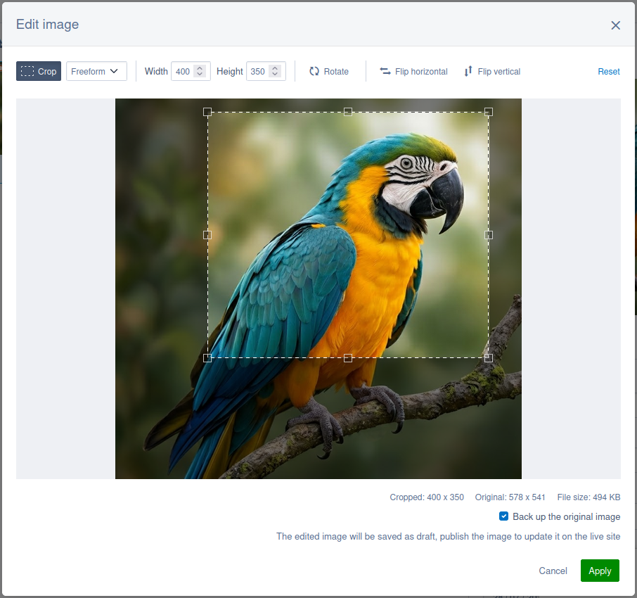

# 6.3.0 (unreleased)

## Overview

<details>

<summary>Included module versions</summary>

<!-- markdownlint-disable enhanced-proper-names -->

| Module | Version |
| ------ | ------- |

<!-- markdownlint-enable enhanced-proper-names -->

</details>

## Security considerations {#security-considerations}

The following fixes were previously released as patches for earlier release lines:

- [CVE-2026-54721 Remote code execution via userforms email subject](https://www.silverstripe.org/download/security-releases/cve-2026-54721) Severity: High
- [CVE-2026-54718 Remote code execution via advanced workflow email template](https://www.silverstripe.org/download/security-releases/cve-2026-54718) Severity: High
- [CVE-2026-54717 XSS in breadcrumbs in page listview](https://www.silverstripe.org/download/security-releases/cve-2026-54717) Severity: Medium
- [CVE-2026-54720 XSS attack through media embed](https://www.silverstripe.org/download/security-releases/cve-2026-54720) Severity: Medium
- [CVE-2026-55779 ArchiveAdmin XSS](https://www.silverstripe.org/download/security-releases/cve-2026-55779) Severity: Medium

The root-cause fix for both remote code execution vulnerabilities lives in the template parser, which now emits single-quoted PHP string literals for `<%t %>` translation blocks so that variables and expressions are no longer interpolated.

The high severity fixes were released in patches for the CMS 5.4, 6.1, and 6.2 release lines. The medium severity fixes were released in patches for the CMS 6.2 release line. That difference follows our [release policy](/project_governance/release_policy/#partial-support): a release line in *partial support* only receives fixes for high and critical impact vulnerabilities, meaning those with a CVSS score of 7.0 or above, while a release line in *full support* receives fixes at any severity. The [Silverstripe CMS security patches June 2026](https://www.silverstripe.org/blog/silverstripe-cms-security-patches-june-2026) blog post lists the same distribution.

### Action may be required for media embeds {#media-embed-sandboxing}

The fix for [CVE-2026-54720](https://www.silverstripe.org/download/security-releases/cve-2026-54720) now strips event-handler and other unsafe attributes from a non-sandboxed `<iframe>` returned by an oEmbed provider. If stripping an attribute breaks a legitimate embed, you can exempt a fully trusted provider's domain from sandboxing with the [`EmbedShortcodeProvider.domains_excluded_from_sandboxing`](api:SilverStripe\View\Shortcodes\EmbedShortcodeProvider->domains_excluded_from_sandboxing) configuration property:

```yml
# app/_config/embed.yml
SilverStripe\View\Shortcodes\EmbedShortcodeProvider:
  domains_excluded_from_sandboxing:
    - trusted-provider.com
```

The domain is matched by suffix, so the value above also matches subdomains such as `embed.trusted-provider.com` - and any other domain ending in the same string, including an unrelated `nottrusted-provider.com`. Give the full domain, so you don't match a domain you don't control.

Embeds from an excluded domain render exactly as the provider sends them, and are no longer wrapped in a sandboxed iframe, so only add domains you fully trust. See [sandboxing oembed HTML](/developer_guides/forms/field_types/htmleditorfield/#sandboxing-oembed-html) for more about how sandboxing works.

## Features and enhancements

### Image editing {#image-editing}

Content authors can now make simple composition changes to images without leaving the CMS: crop, rotate in 90 degree steps, flip horizontally or vertically, and resize.

In the "Files" section, click an image to open its detail view, then click the "Other actions" button - the three dots next to "Save" and "Publish" - and select "Edit image". The action only appears for raster images you have permission to edit.



The editor is focused on image composition (where the subject sits in the frame) rather than retouching i.e. there are no brightness, colour, filter, or background removal controls.

Note the following behaviours:

- **The original file is replaced in place.** Applying an edit writes the rendered result over the origin file. The record keeps its ID, folder, and filename, so everything already using that image picks up the edited pixels with nothing to repoint.
- **The original can be backed up first.** A checkbox in the editor - ticked by default - copies the pre-edit bytes into a new draft file in the same folder before the replacement is written, named by the CMS's usual de-duplication, so `beach.jpg` is backed up as `beach-v2.jpg`. Untick it and the original bytes are gone for good.
- **The edit is saved as a draft.** The published version of the file is untouched, so the live site keeps serving the pre-edit image until you publish it yourself.
- **Resizing keeps the aspect ratio.** Type a width or a height and the other is derived. The output can only be made smaller than the cropped image, never larger.
- **Raster images only.** SVG files are not editable through the image editor.

Being able to edit an image requires permission to edit the original - its bytes are modified - and permission to create files in the folder it lives in, for the backup copy.

Edited images are encoded in the same format as their source, at the same quality used for [resampled images](/developer_guides/files/images/#resampled-image-quality), or at a quality you configure for the editor alone.

Extension hooks are called either side of each write the editor makes, so you can alter the rendered image before it is saved - to add a watermark, for example - or react once it has been.

See [image editor](/developer_guides/customising_the_admin_interface/image_editor/) for the rest of the configuration options.

### React class components converted to functional components {#react-functional-components}

Form field components in the CMS have been converted from React class components to functional components. This is part of an ongoing modernisation effort - functional components are simpler, have better tooling support, and align with current React best practices.

For most projects this change is invisible. However, if your project extends any of these components as an ES6 class (`extends TextField`), that pattern will no longer work because functional components cannot be subclassed.

To ease migration, the original class-based implementations are preserved as `Legacy`-prefixed copies in `client/src/legacy/ReactComponents/`. Only class components that were previously defined in the [`client/src/bundles/bundle.js`](https://github.com/silverstripe/silverstripe-admin/blob/3.2/client/src/bundles/bundle.js) file in `silverstripe/admin`, or were a parent class of an exported component, are available as legacy components. If your project subclasses a converted component, update the import to use the legacy version:

Before:

```js
import TextField from 'components/TextField/TextField';

class MyCustomField extends TextField {
  // ...
}
```

After:

```js
import LegacyTextField from 'legacy/ReactComponents/LegacyTextField';

class MyCustomField extends LegacyTextField {
  // ...
}
```

You will need the latest version of [@silverstripe/webpack-config](https://www.npmjs.com/package/@silverstripe/webpack-config) to use the legacy components, which includes an updated externals configuration to support the new import paths.

Note that these legacy class components are provided as a short-term migration aid and will be removed in CMS 7. Projects should plan to move away from class inheritance before then.

The new functional components provide exports (for example `getInputProps()`, `handleChange()`, and `render()`) that were previously provided via class inheritance. If you previously extended class components, migrate to functional components by composing the exported helpers in your own components.

## API changes

### Deprecated API

The following API has been deprecated in this release, and will be removed or replaced in a future major release.

It's best practice to avoid using deprecated code where possible, but sometimes it's unavoidable. This API will all continue to be available at least until the next major release.

- The [`Director::is_cli()`](api:SilverStripe\Control\Director::is_cli()) method has been deprecated. Use [`Environment::isCli()`](api:SilverStripe\Core\Environment::isCli()) instead.

## Bug fixes

This release includes a number of bug fixes to improve a broad range of areas. Check the change logs for full details of these fixes split by module. Thank you to the community members that helped contribute these fixes as part of the release!

### SingleRecordAdmin permission generation {#singlerecordadmin-permissions}

Previously, [`SingleRecordAdmin`](api:SilverStripe\Admin\SingleRecordAdmin) subclasses did not generate CMS access permissions in the way that [`ModelAdmin`](api:SilverStripe\Admin\ModelAdmin) subclasses did. This meant it was difficult to grant non-admin users access to custom `SingleRecordAdmin` sections through the CMS security permissions interface - they were only visible to users with administrator privileges without adding custom code.

We've now updated the permission generation system in [`LeftAndMain::providePermissions()`](api:SilverStripe\Admin\LeftAndMain::providePermissions()) to include both `ModelAdmin` and `SingleRecordAdmin` subclasses. Any custom `SingleRecordAdmin` implementation will now automatically generate a permission that allows you to control access via groups and roles, just as you would for `ModelAdmin` sections. By default these permission will be disabled for non-admin users, so you will need to explicitly grant access to the relevant user groups via the CMS.

If you have a custom `SingleRecordAdmin` that should not appear in the permissions interface, set the [`LeftAndMain.skip_permission_generation`](api:SilverStripe\Admin\LeftAndMain->skip_permission_generation) configuration property value to `true`:

```php
namespace App\Admins;

class MySpecialAdmin extends SingleRecordAdmin
{
    private static bool $skip_permission_generation = true;
    // ...
}
```
