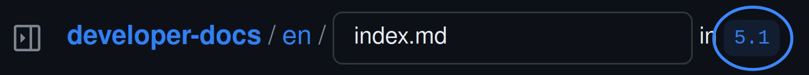
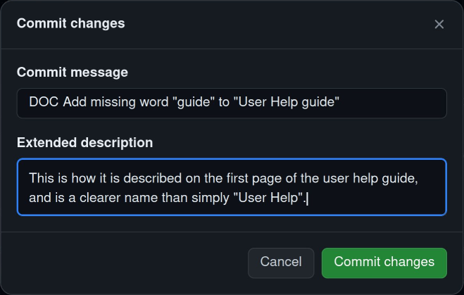
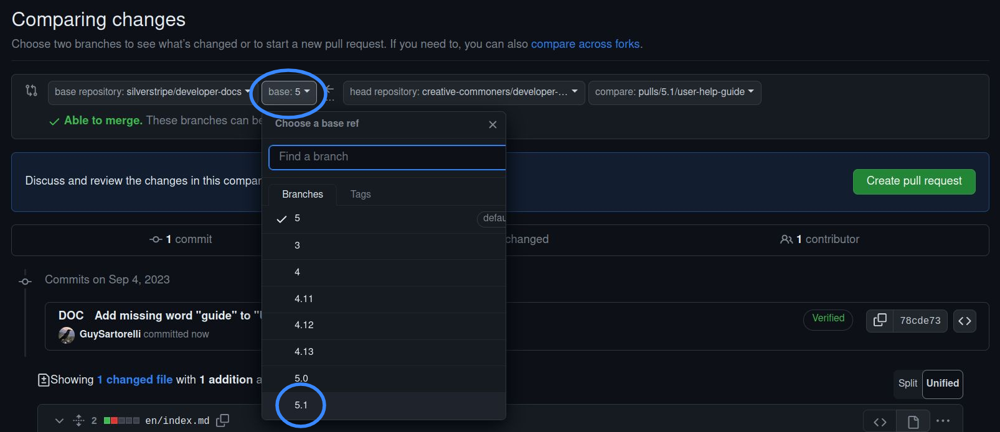

# Contributing documentation

Documentation for a software project is a continuous, collaborative effort. We encourage everybody to contribute in any way they can whether it's fixing a typo, updating some outdated documentation, or adding missing documentation.

Modifying documentation requires basic knowledge of [markdown](https://www.markdownguide.org/). Our documentation also includes some additional syntax which you can read about in the [extended markdown syntax](#extended-markdown-syntax) section below.

In order to contribute changes to documentation, you will need to [create a GitHub account](https://docs.github.com/en/get-started/onboarding/getting-started-with-your-github-account).

## Repositories

Note that there are two sources of documentation, depending on the intended audience.

- End-user help: [`silverstripe/silverstripe-userhelp-content`](https://github.com/silverstripe/silverstripe-userhelp-content/)
- Developer guides: [`silverstripe/developer-docs`](https://github.com/silverstripe/developer-docs/)

If you find a problem related to how the documentation is displayed which can't be fixed in the documentation source files, you can [raise an issue](./issues_and_bugs) or [submit a pull request](./code) to the relevant repository below:

- Website code for user and developer docs: [`silverstripe/doc.Silverstripe.org`](https://github.com/silverstripe/doc.silverstripe.org)
- Website code for automatically generated Developer API documentation: [`silverstripe/api.Silverstripe.org`](https://github.com/silverstripe/api.silverstripe.org)

## Branches and commit messages

- All documentation commits must follow the [commit message guidelines](./code#commit-messages), and must be prefixed with the `DOC` prefix.
- If you are fixing incorrect or incomplete information, you should create a PR that targets the most recent patch release branch branch for the relevant major release line (e.g. `5.1`).
- If you are adding documentation for functionality that has not yet been released, you should target the most recent minor release branch branch (e.g. `5`).

> [!WARNING]
> You should make your changes in the lowest major branch they apply to. For instance, if you fix a spelling issue that you found in the CMS 4 documentation, submit your fix to the `4.13` branch in GitHub and it'll be copied to the most recent major version of the documentation automatically. *Don't submit multiple pull requests for the same change*.

## Editing online

If you haven't contributed documentation in the past, you will need to fork the repository. If you're editing online, GitHub will guide you through that process before you can edit the documentation.

### Simple changes {#editing-online-simple}

The easiest way of editing any documentation is by clicking the "Edit on GitHub" button at the bottom of the page you want to edit. This works great if all of the changes you want to make are on a single page.

Before you start making your changes, take note of what branch you are editing. You will need this when you create the pull request.



After editing the documentation, click "Commit changes", then describe your changes in the "commit summary" and "extended description" fields below.



Click "Propose changes" when you are ready to commit your changes. This saves them to the forked repository on your profile.

You will see a form to submit a pull request. Make sure to target your pull request at the correct branch you took note of earlier.



Then click "Create pull request".

Any changes submitted in a pull request will be sent to the core committers for approval. Make sure the pull request follows the guidelines in [create the pull request](./code#create-the-pr), and then see [recieve and respond to feedback](./code#recieve-feedback) for next steps.

### Larger changes {#editing-online-advanced}

For any changes that span more than one page, you can edit the documentation in GitHub's web-based editor.

To learn more, follow the instructions in [GitHub's documentation](https://docs.github.com/en/codespaces/the-githubdev-web-based-editor).

Once you've made the pull request, make sure the pull request follows the guidelines in [create the pull request](./code#create-the-pr), and then see [recieve and respond to feedback](./code#recieve-feedback) for next steps.

## Editing on your computer

If you prefer to edit content on your local machine, follow the instructions on the [contributing code](code) page, since editing documentation on your computer follows that same process.

### Linting locally

When you submit your pull request, the documentation will be automatically linted. You may want to run this process locally. To do so, you'll need to have both [Composer](https://getcomposer.org/download/) and Yarn installed. See [client-side build tooling](/contributing/build_tooling/#installation) for yarn installation instructions.

You can then run the following commands from the command line to lint the documentation:

```bash
yarn install
composer install
yarn lint
```

If there are linting issues, you may find the output easier to work with by running the separate types of linting individually. You can find the commands for those inside the `package.json` file.

You can also fix any automatically fixable problems by passing the `--fix` option to the lint command.

```bash
yarn lint --fix
```

## Writing style

### Voice and tone

- Use an active voice.
- Use plain language for easier comprehension. Avoid uncommon jargon and overly long words. Remember that not everyone speaks English as their primary language.
- Keep sentences clear and concise.

### Content structure

- Structure content around a single topic.
- Use appropriate markdown. The use of code blocks, lists, tables and callout blocks make technical writing easier to scan.
- Use descriptive headings and subheadings organised in a hierarchy.
- Avoid FAQs as they are not a replacement for coherent, well explained documentation.

### Language and grammar

- Use UK English. The most common differences are -ize vs -ise, and -or vs -our (eg color vs colour).
- Spell out acronyms the first time, with the abbreviation in brackets.
  - If an acronym is well established, such as "API", you don't need to spell it out.
- Use gender-neutral language and singular "they" instead of "he/she/his/her".
- Avoid saying words like "obviously" or "of course". Things that are obvious to you as the writer may not be so obvious to the person reading the documentation.
- Use meaningful link text, i.e. avoid the use of "click here" link text.
- Use i.e. and e.g. with dots.
- We use sentence case for titles. Only capitalise the first letter of the first word of a title. The only exceptions to this are when using brand names (e.g. GitHub), acronyms (e.g. PHP) and class names (e.g. `ModelAdmin`).

### Code blocks

- All code fences must have an appropriate syntax highlighting hint. Use `text` for plain text.
- Do not put a `$` in front of lines of bash code examples.
- Code examples must follow [coding conventions](/contributing/coding_conventions/) for that language.
- Use `App` when the code requires a vendor name (e.g. as the root for namespaces).
- If it's useful to include the filename that a code block relates to, do so in a comment in the first line of the code block.
  - Don't place a blank line after this comment, unless the next line is also a comment.

### References to various things

- Add a trailing slash to directory references to distinguish from regular files.
- [Link to Silverstripe API docs](#links-to-api-documentation) for the first reference to a Silverstripe PHP class on a page. For subsequent references, use just the class name surrounded with backticks.
- Use `example.com` as the domain of sample URLs and `example.org` and `example.net` when additional domains are required. All of these domains are [reserved by the IANA](https://tools.ietf.org/html/rfc2606#section-3).
- Spell "Silverstripe" with an uppercase 'S' at the beginning and a lowercase 's' in the middle.
- Refer to the company as "Silverstripe."
- Use "Silverstripe CMS" to refer to the Silverstripe CMS open source project as a whole
- If referring to maintainers of Silverstripe CMS, either explicitly say "the maintainers", or write in second person plural form (use "we" instead of "I").

### Markdown linting

- Documentation will be automatically linted in CI.
- Many of the linting rules are not mentioned in this writing style guide, though all linting rules will need to be adherred to in order for your documentation pull-request to be merged. The failed linting CI build will clearly highlight what needs to be fixed.

## Extended markdown syntax

Silverstripe CMS documentation has a few special syntax extensions that normal markdown doesn't. These are listed below.

### Callout blocks

There are several built-in block styles for calling out a paragraph of text. Please use these graphical elements
sparingly.

> [!NOTE]
> "Info box": An info box is useful for adding, deepening or accenting information in the main text. They can be used for background knowledge, or to provide links to further information (ie, a "see also" link).

Code for an Info box:

```text
> [!NOTE]
> ...
```

> [!TIP]
> "Hint box": A hint box is great for pointing out extra use cases or hints about how to use a feature.

Code for a Hint box:

```text
> [!TIP]
> ...
```

> [!WARNING]
> "Warning box": A warning box is useful for pointing out gotchas or technical notifications relating to the main text. For example, notifying users about a deprecated feature.

Code for a Warning box:

```text
> [!WARNING]
> ...
```

> [!CAUTION]
> "Alert box": An alert box is good for for calling out a severe bug or a technical issue requiring a user's attention. For example, suppose a rare edge case sometimes leads to a variable being overwritten incorrectly. An alert box can be used to alert the user to this case so they can write their own code to handle it.

Code for an Alert box:

```text
> [!CAUTION]
> ...
```

### Links to documentation

Links to other pages in the documentation uses the URL slug, *not* the file name.

Relative documentation links are prefixed with `./` for pages in the same directory, or `../` for pages in parent directories. For example `[contributing code](./code)` becomes [contributing code](./code) and `[getting started](../getting_started)` becomes [getting started](../getting_started).

Absolute documentation links are preferred for pages which aren't in the same directory or one level up. The language and version number are ommitted. For example `[managing lists](/developer_guides/model/lists/)` becomes [managing lists](/developer_guides/model/lists/).

### Links to API documentation

API documentation is linked in a special way. Give some examples for classes, methods, properties.

#### For classes, interfaces, traits, and enums

``[`Form`](api:SilverStripe\Forms\Form)`` will become [`Form`](api:SilverStripe\Forms\Form), and will link to the API documentation for the `SilverStripe\Forms\Form` class.

#### For methods

``[`Form::makeReadonly()`](api:SilverStripe\Forms\Form::makeReadonly())`` will become [`Form::makeReadonly()`](api:SilverStripe\Forms\Form::makeReadonly()), and will link to the API documentation for the `makeReadonly()` method in the `SilverStripe\Forms\Form` class.

#### For properties, including configuration properties

``[`Form->casting`](api:SilverStripe\Forms\Form->casting)`` will become [`Form->casting`](api:SilverStripe\Forms\Form->casting), and will link to the API documentation for the `casting` property in the `SilverStripe\Forms\Form` class.

### Anchor links in headings

Headings automatically include anchor links, which are generated from the heading text. Sometimes you might want to include a shorter or otherwise more useful anchor link instead. To do that, include the desired anchor in a `{#anchor-here}` section after the heading text. The custom anchor does not render as part of the heading text.

For example:

`## This is a really long heading which has a silly anchor {#my-custom-anchor}`

The above heading would normally have a long and silly anchor, but instead it will use the `#my-custom-anchor` anchor.

### Linking to child and sibling pages {#link-to-children}

You can list child/sibling pages using the special `[CHILDREN]` syntax. By default these will render as cards with an icon, a title, and a summary if one is available.

You can change what is displayed using one of the `Exclude`, `Folder`, or `Only` modifiers. These all take folder and/or file names as arguments. Exclude the `.md` extension when referencing files. Arguments can include a single item, or multiple items using commas to separate them.

- `[CHILDREN Exclude="How_tos,01_Relations"]`: Exclude specific folders or files from the list. Note that folders don't need to be excluded unless the `includeFolders` modifier is also used.
- `[CHILDREN Only="rc,beta"]`: Only include the listed items. This is the inverse of the `Exclude` modifier.
- `[CHILDREN Folder="How_Tos"]`: List the children of the named folder, instead of the children of the *current* folder. This modifier only accepts a single folder as an argument.

The above can be combined with any of the `asList`, `includeFolders`, and `reverse` modifiers:

- `[CHILDREN asList]`: Render the children as a description list instead of as cards. The icon is not used when rendering as a list.
- `[CHILDREN includeFolders]`: Include folders as well as files.
- `[CHILDREN reverse]`: Reverse the order of the list. The list is sorted in case sensitive ascending alphabetical order by default.

The following would render links for all children as a description list in reverse order, including folders but excluding anything called "How_tos":

`[CHILDREN Exclude="How_tos" asList includeFolders reverse]`

#### Example {#link-to-children-example}

With the following file structure:

```text
00_Model/
├─ How_Tos
   ├─ Dynamic_Default_Fields.md
   ├─ Grouping_DataObject_Sets.md
   └─ index.md
├─ 00_Data_Model_and_ORM.md
├─ 01_Relations.md
├─ ...
└─ index.md
```

Using the `[CHILDREN]` tag on any file directly in the `00_Model/` directory will list all files *including itself* but excluding the `index.md` file. It will not list `How_Tos/` or any file inside that directory unless `includeFolders` is included (`[CHILDREN includeFolders]`), in which case `How_Tos/` will be listed, and will link to the `index.md` file. No other files inside the `How_Tos/` directory will be listed.

### Page metadata

We use gatsby to render the documentation. Gatsby defines a syntax for metadata (which it calls frontmatter) [in its documentation](https://www.gatsbyjs.com/docs/how-to/routing/adding-markdown-pages/). This is used to provide useful information about how to render the page when it's being rendered as a child page as described in [linking to child and sibling pages](#link-to-children) above.

This metadata is always included at the top of a page, in a block fenced in by `---`, e,g:

```text
---
title: My page title
summary: This summary, the title, and the icon will all be used when rendering this page as a child.
icon: file-alt
---
```

The available keys for this metadata are:

- `title`: The title of the page when rendered as a child, and in the navigation.
- `summary`: A short sumary of the page which is used when the page is rendered as a child.
- `icon`: An icon which is used when the page is rendered as a child in card format. Must be one of the icons provided by fontawesome 5, excluding brand icons.
- `iconBrand`: An icon which is used when the page is rendered as a child in card format. Must be one of the brand icons provided by fontawesome 5.
- `hideChildren`: If true, doesn't display children of this page in the navigation. Doesn't affect child lists.
